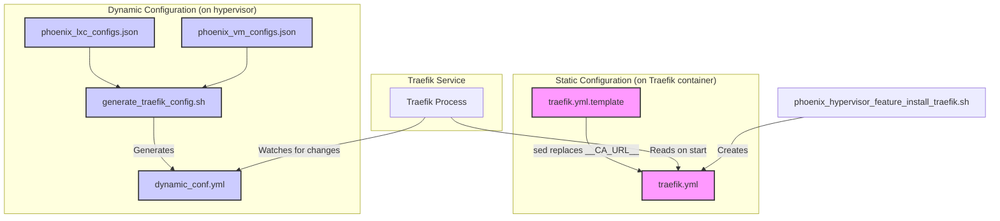

# Traefik Configuration Workflow

This document outlines the automated workflow for generating and managing Traefik configurations within the Phoenix Hypervisor environment.

## Overview

The Traefik configuration is split into two key parts:

1.  **Static Configuration (`traefik.yml`):** Defines the core server settings, such as entrypoints, certificate resolvers, and providers. This file is generated once during the Traefik installation.
2.  **Dynamic Configuration (`dynamic_conf.yml`):** Defines the routing rules (routers and services) for your applications. This file is dynamically updated whenever you add, remove, or change a service.

## Workflow Diagram

The following diagram illustrates the end-to-end configuration workflow:

## Key Scripts and Files

*   **`phoenix_hypervisor_feature_install_traefik.sh`:** This script is responsible for installing Traefik and generating the static `traefik.yml` configuration from the `traefik.yml.template`.
*   **`generate_traefik_config.sh`:** This script is the source of truth for your dynamic routing rules. It reads the `phoenix_lxc_configs.json` and `phoenix_vm_configs.json` files and generates the `dynamic_conf.yml` file.
*   **`traefik.yml.template`:** The template for the static configuration. It contains placeholders that are replaced by the installation script.
*   **`dynamic_conf.yml`:** The dynamic configuration file that is watched by Traefik for changes. **This file should not be manually edited**, as it is overwritten by the `generate_traefik_config.sh` script.

## Dual-Horizon DNS and ACME

The system is designed to handle both internal and external services securely:

*   **Internal Services:** Use the `internal-resolver`, which leverages the `tlsChallenge` with your internal Step-CA to issue certificates for the `internal.thinkheads.ai` domain.
*   **External Services:** Use the `external-resolver`, which leverages the `httpChallenge` to issue certificates for your public-facing domains.

This separation ensures a robust and secure certificate management strategy for all of your services.