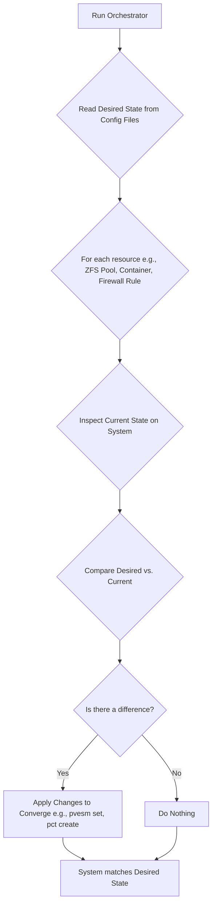

# Unified Phoenix Hypervisor Strategy v2.0

## 1. Executive Summary

The Phoenix Hypervisor is the central infrastructure supporting Thinkheads.AI's mission to innovate and showcase a diverse portfolio of AI-powered projects. To ensure the long-term stability, scalability, and maintainability of this critical platform, this document outlines the strategic transition from an imperative, script-driven system to a fully **declarative, convergent state engine**. This evolution aligns with modern Infrastructure-as-Code (IaC) principles and positions the Phoenix Hypervisor as a resilient, predictable, and auditable foundation for all future development.

## 2. Strategic Importance and Vision

The Phoenix Hypervisor's robust capabilities are paramount to Thinkheads.AI's success. It enables the execution of complex AI/ML/DL projects, including LLM inference, image processing, and isolated development environments.

### 2.1. Core Workloads
*   **LLM Training and Inference**: Running large language models (LLMs) for various sub-products.
*   **Image Processing**: Handling AI-powered image generation and manipulation tasks.
*   **Development Environments**: Providing isolated and powerful environments for interactive ML development.

### 2.2. Hardware Foundation
*   **CPU**: AMD 7700
*   **RAM**: 96 GB DDR5
*   **GPUs**: Dual RTX 5060 Ti
*   **Storage**: NVMe

## 3. The Declarative State Model: The Core Technical Strategy

Our core technical strategy is the adoption of a declarative model for all aspects of the hypervisor and its resources. This addresses the brittleness and lack of idempotency inherent in the previous imperative scripting model.

### 3.1. Core Principles

*   **Single Source of Truth**: The `phoenix_hypervisor_config.json` and `phoenix_lxc_configs.json` files are the definitive source of truth for the entire system's desired state.
*   **Stateless Execution**: The orchestrator itself is stateless. It does not retain knowledge of past executions.
*   **Idempotent Convergence**: The orchestrator's primary function is to converge the *current state* of the system with the *desired state* defined in the configuration.

### 3.2. The Convergent Loop Architectural Model

The new model is based on a continuous "Inspect, Compare, Converge" loop that is applied to every resource managed by the orchestrator.

## 4. Benefits of the Declarative Strategy

*   **Reliability**: The system becomes self-healing. Configuration drift is automatically detected and corrected.
*   **Predictability**: The state of the system is guaranteed to match the configuration files.
*   **Maintainability**: Changes are made by modifying the source of truth (the JSON files), not by writing complex imperative scripts.
*   **Idempotency**: The orchestrator can be run safely at any time, as it will only make changes when necessary.

## 5. Phased Rollout

The transition to a fully declarative model will be a phased process:

1.  **Phase 1 (Complete)**: Refactor the `hypervisor_feature_setup_zfs.sh` script to be fully convergent. This serves as the blueprint.
2.  **Phase 2**: Apply the same convergent logic to other hypervisor setup scripts (NFS, Samba, NVIDIA, etc.).
3.  **Phase 3**: Refactor the container orchestration logic to be fully declarative, managing the entire container lifecycle.
4.  **Phase 4**: Centralize the state management logic into the main orchestrator, turning it into a true master state engine.

## 6. Conclusion

By executing this strategy, we will transform the Phoenix Orchestrator into a modern, robust, and reliable platform that is resilient, scalable, and auditable. This strategic investment in our core infrastructure is essential to achieving our long-term vision of AI-driven innovation.