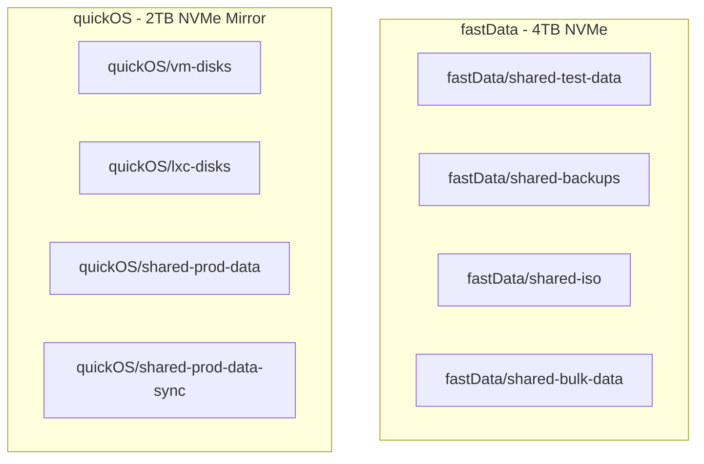

# Revised ZFS Dataset Structure and Configuration Plan

This plan incorporates detailed requirements for ZFS dataset configuration, focusing on performance, data integrity, and NVMe optimization for the `quickOS` and `fastData` pools.

## 1. Proposed ZFS Dataset Structure

## 2. ZFS Dataset Configuration Details

### On `quickOS` Pool (Mirrored 2TB NVMe)

| Dataset | Purpose & Content | Configuration | Mounting Strategy |
| :--- | :--- | :--- | :--- |
| **`quickOS/vm-disks`** | Block storage for VM root disks (OS, binaries). | `recordsize=128K`, `compression=lz4`, `sync=standard`, `quota=800G`. Sub-datasets per VM. | Proxmox block storage (ZFS backend). |
| **`quickOS/lxc-disks`** | Block storage for LXC root disks (OS, binaries). | `recordsize=16K`, `compression=lz4`, `sync=standard`, `quota=600G`. Sub-datasets per LXC. | Proxmox block storage (ZFS backend). |
| **`quickOS/shared-prod-data`** | Shared storage for LLM models, application data (non-database). | `recordsize=128K`, `compression=lz4`, `sync=standard`, `quota=400G`. | NFS (`noatime`, `async`) for VMs, bind-mount (`discard`, `noatime`) for LXCs. |
| **`quickOS/shared-prod-data-sync`** | Shared storage for databases requiring synchronous writes. | `recordsize=16K`, `compression=lz4`, `sync=always`, `quota=100G`. | NFS (`sync`, `noatime`) for VMs, bind-mount (`discard`, `noatime`) for LXCs. |

### On `fastData` Pool (Single 4TB NVMe)

| Dataset | Purpose & Content | Configuration | Mounting Strategy |
| :--- | :--- | :--- | :--- |
| **`fastData/shared-test-data`** | Test environment storage, cloned from production data. | `recordsize=128K` or `16K`, `compression=lz4`, `sync=standard`, `quota=500G`. | NFS (`noatime`, `async`) for VMs, bind-mount (`discard`, `noatime`) for LXCs. |
| **`fastData/shared-backups`** | Proxmox backups and snapshots of production data. | `recordsize=1M`, `compression=zstd`, `sync=standard`, `quota=2T`. | Proxmox backup storage. |
| **`fastData/shared-iso`** | Storage for ISO images. | `recordsize=1M`, `compression=lz4`, `sync=standard`, `quota=100G`. | Proxmox ISO storage. |
| **`fastData/shared-bulk-data`** | General-purpose storage for large files (media, logs). | `recordsize=1M`, `compression=lz4`, `sync=standard`, `quota=1.4T`. | NFS (`noatime`, `async`) for VMs, bind-mount (`discard`, `noatime`) for LXCs. |

## 3. Additional Requirements: NVMe Optimization

-   **TRIM**: `autotrim=on` will be set on both pools to maintain NVMe performance and lifespan.
-   **Write Amplification**:
    -   `lz4` and `zstd` compression will be used to reduce the amount of data written to the drives.
    -   Synchronous writes are isolated to the `quickOS/shared-prod-data-sync` dataset to minimize wear.
-   **Monitoring**: NVMe wear will be monitored using `smartctl`.
-   **Firmware**: It is recommended to ensure NVMe firmware is up-to-date.

## 4. Implementation Plan

1.  **Define Datasets in `hypervisor_feature_setup_zfs.sh`**: The ZFS pools and datasets are now defined as shell arrays directly within the `hypervisor_feature_setup_zfs.sh` script.
2.  **Execute ZFS Setup Script**: Run the `hypervisor_feature_setup_zfs.sh` script to create the pools and datasets.
3.  **Configure Proxmox Storage**: The script also adds the datasets as storage resources in Proxmox.
4.  **Configure Mounts and Permissions**: Set up NFS exports and bind mounts for VMs and LXCs, and configure permissions as required.

This revised plan provides a solid foundation for a high-performance, reliable, and efficient storage architecture.