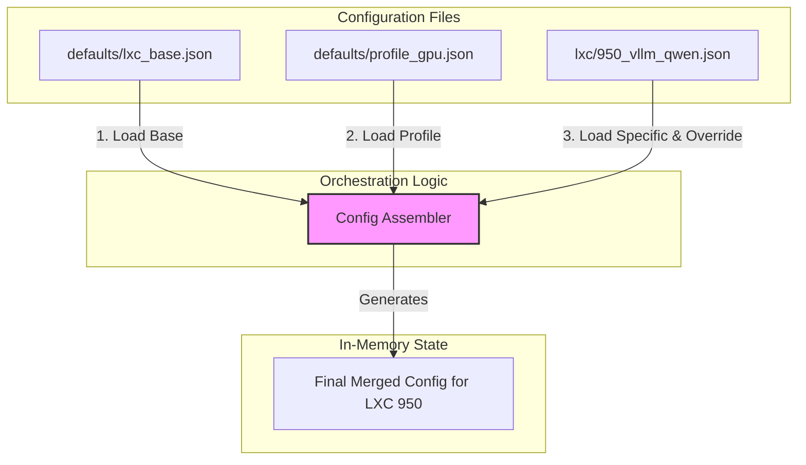

# Proposal: Evolving to a Modular Configuration Model

## 1. Introduction

The current configuration management for the Phoenix Hypervisor, centered around `phoenix_lxc_configs.json`, has served us well. However, as the number of services grows, this monolithic file presents challenges in maintainability, readability, and collaboration.

This document proposes a transition to a modular, directory-based configuration structure. This evolution will enhance our ability to manage the system declaratively while making it more scalable and less prone to error.

**Note:** This proposal was archived and superseded by the dispatcher-manager architecture, which addressed the core issues of maintainability and scalability by refactoring the orchestration logic rather than the configuration structure.

## 2. Current State Analysis

**Architecture:** A single, large JSON file (`phoenix_lxc_configs.json`) defines all LXC containers.

**Strengths:**
*   **Declarative:** Provides a single source of truth.
*   **Comprehensive:** Captures all necessary configuration details.

**Weaknesses:**
*   **Maintainability:** The file is becoming unwieldy, making it difficult to find and modify specific container configurations.
*   **Readability:** The sheer size of the file makes it hard to get a quick overview of a single service's configuration.
*   **Collaboration:** High potential for merge conflicts when multiple developers work on different containers simultaneously.
*   **Repetition:** Common configuration patterns (e.g., for GPU workloads, web services) are repeated across multiple container definitions.

## 3. Proposed Architecture: Modular & Hierarchical

I propose breaking the monolithic `phoenix_lxc_configs.json` into a hierarchical directory structure.

**Proposed File Structure:**

```
/etc/phoenix_hypervisor/
|-- conf.d/
|   |-- defaults/
|   |   |-- lxc_base.json         # Base defaults for all containers
|   |   |-- profile_gpu.json      # Reusable profile for GPU-enabled containers
|   |   |-- profile_docker.json   # Reusable profile for Docker containers
|   |
|   |-- lxc/
|   |   |-- 900_template_base.json
|   |   |-- 901_template_gpu.json
|   |   |-- 950_vllm_qwen.json
|   |   |-- 951_vllm_embed.json
|   |   |-- ... (one file per container)
|
|-- phoenix_hypervisor_config.json  # Unchanged
|-- phoenix_vm_configs.json         # Unchanged
```

### 3.1. The Merging Logic

The `phoenix_orchestrator.sh` script would be updated to dynamically build the final configuration for a given container by merging these files in a specific order:

1.  **Load Base Defaults:** Start with `defaults/lxc_base.json`.
2.  **Load Profiles:** If the container's config specifies profiles (e.g., `["gpu", "docker"]`), merge `profile_gpu.json` and `profile_docker.json` on top.
3.  **Load Final Config:** Finally, merge the container-specific file (e.g., `lxc/950_vllm_qwen.json`) on top, which will contain the final overrides and unique settings.

This creates a powerful, layered configuration system.

### 3.2. "After" Architecture Diagram

This diagram illustrates the new configuration assembly process.



## 4. Goals and Gains

### Goals

*   **Improve Maintainability:** Make configuration changes easier and safer.
*   **Increase Modularity:** Decouple container definitions from each other.
*   **Reduce Redundancy:** Adhere to the DRY (Don't Repeat Yourself) principle.
*   **Enhance Collaboration:** Minimize the likelihood of merge conflicts.

### Gains

*   **Clarity:** The configuration for a single container is isolated and easy to understand.
*   **Scalability:** Adding new containers is a matter of adding a new file, not modifying a large, shared one.
*   **Flexibility:** Reusable profiles make it simple to stamp out new containers with common characteristics.
*   **Robustness:** The merge logic can include strict validation at each step, catching errors early.

## 5. Next Steps

This proposal was not implemented. The `phoenix_orchestrator.sh` script was refactored into the `phoenix` CLI with a dispatcher-manager architecture, which addressed the project's scalability and maintainability goals.