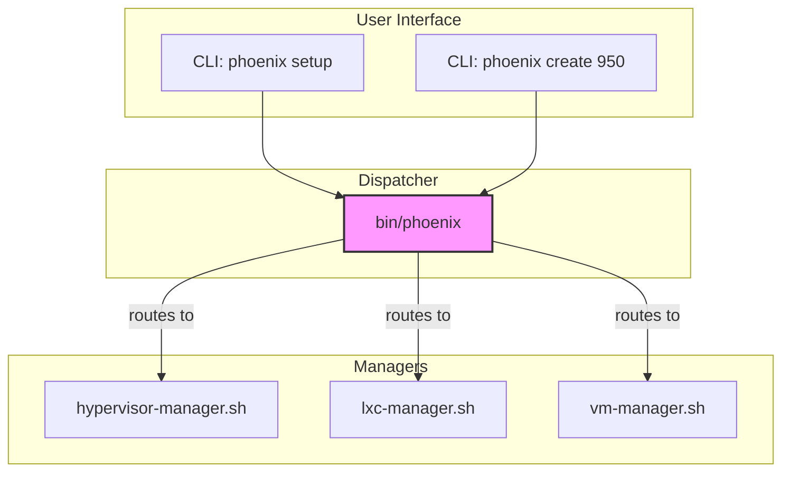

# Proposal: Refactoring to a Modular Orchestrator

## 1. Introduction

The `phoenix_orchestrator.sh` script was instrumental in automating the Phoenix Hypervisor. However, its monolithic design accumulated significant technical debt. To ensure the long-term health and scalability of our automation, the orchestrator was refactored into a more modular and maintainable architecture.

This document proposed a shift from a single, large bash script to a dispatcher-manager architecture.

## 2. Current State Analysis

**Architecture:** A single, 1300+ line bash script (`phoenix_orchestrator.sh`) that contained all logic for hypervisor setup, LXC/VM lifecycle management, feature installation, and more.

**Strengths:**
*   **Functional:** It successfully orchestrated the entire system.
*   **Idempotent:** The core state machine logic was sound.

**Weaknesses:**
*   **Maintainability:** The script was difficult to navigate and modify. A small change could have unintended consequences.
*   **Testability:** Unit testing a large bash script is notoriously difficult, leading to a reliance on slow, end-to-end integration tests.
*   **Extensibility:** Adding new functionality was complex and risky.

## 3. Implemented Architecture: Dispatcher-Manager

The orchestrator was refactored into a `phoenix` CLI that acts as a dispatcher, routing commands to specialized manager scripts.

**Structure:**

*   **Dispatcher (`bin/phoenix`):**
    *   Handles command-line argument parsing for a verb-first command structure.
    *   Determines the resource type (hypervisor, LXC, VM) and routes the command to the appropriate manager.

*   **Managers (`bin/managers/*.sh`):**
    *   Each manager is responsible for a specific domain of functionality.
    *   `hypervisor-manager.sh`: Handles all hypervisor setup and configuration.
    *   `lxc-manager.sh`: Handles all `pct` commands and LXC lifecycle management.
    *   `vm-manager.sh`: Handles all `qm` commands and VM lifecycle management.

### 3.1. "After" Architecture Diagram

This diagram illustrates the implemented dispatcher-manager architecture.

## 4. Goals and Gains

### Goals

*   **Decouple Logic:** Separate the core orchestration flow from the implementation details of specific tasks.
*   **Improve Testability:** Enable unit testing for individual manager scripts.
*   **Enhance Extensibility:** Make it simple to add new functionality by modifying or adding manager scripts.
*   **Increase Robustness:** Leverage a clear separation of concerns for better error handling and logging.

### Gains

*   **Maintainability:** The codebase is cleaner, more organized, and easier to reason about.
*   **Faster Development:** Changes can be made to individual managers with more confidence.
*   **Improved Reliability:** The modular design reduces the risk of unintended side effects.
*   **Future-Proofing:** The architecture makes it easier to adapt to new technologies and requirements.

## 5. Next Steps

This project has been successfully completed. The `phoenix` CLI and its dispatcher-manager architecture are now the standard for all orchestration tasks.