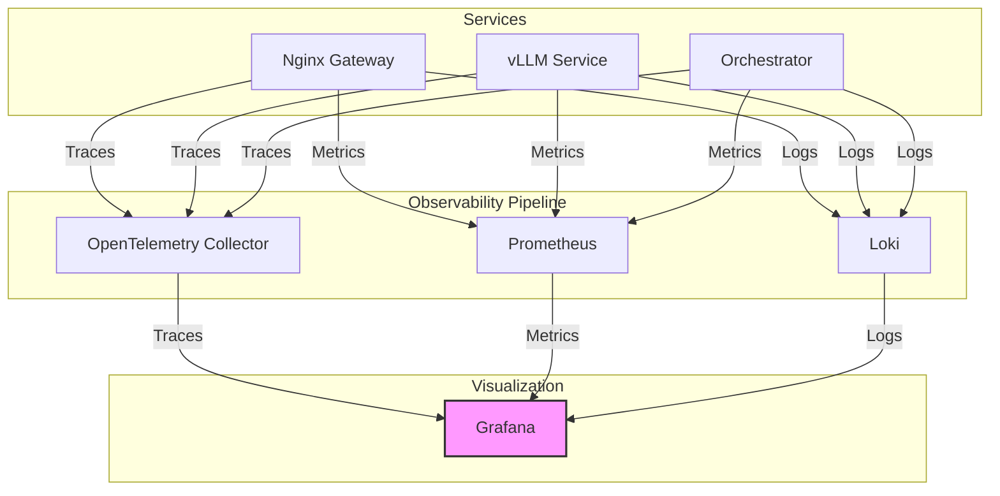

# Proposal: Enhancing System Observability

## 1. Introduction

A system that is not well-observed is a black box. While our current monitoring stack provides valuable metrics, we can significantly improve our ability to diagnose and debug issues by enhancing our logging and introducing distributed tracing.

This document proposes a two-pronged approach to improving observability:
1.  **Standardize on Structured Logging:** Move from plain-text logs to a machine-readable format like JSON.
2.  **Introduce Distributed Tracing:** Implement OpenTelemetry to trace requests as they flow through our distributed system.

## 2. Current State Analysis

**Architecture:** A dedicated monitoring container (`lxc-960`) runs Prometheus for metrics collection and Grafana for visualization. Logging is ad-hoc and unstructured.

**Strengths:**
*   **Metrics Foundation:** We have a solid foundation for collecting and visualizing time-series data.

**Weaknesses:**
*   **Inconsistent Logging:** Logs are unstructured and vary between components, making them difficult to parse, search, and correlate.
*   **Lack of Correlation:** It is difficult to trace a single request as it passes from the Nginx gateway to a backend service like vLLM. This makes debugging complex interactions challenging.
*   **Reactive Monitoring:** We primarily rely on metrics to tell us when something is wrong, but we lack the detailed context to quickly understand *why*.

## 3. Proposed Architecture: The Three Pillars of Observability

I propose we formally adopt the "three pillars of observability": Logs, Metrics, and Traces.

### 3.1. Pillar 1: Structured Logs

*   **Proposal:** Mandate that all components, including the orchestration engine and our custom application scripts, output logs in a structured JSON format.
*   **Implementation:** We can use a lightweight logging library in our new Python-based orchestrator and a simple shell function for our bash scripts to ensure consistency.
*   **Gains:**
    *   **Machine-Readable:** Logs can be easily ingested, parsed, and indexed by a log aggregation tool (like Loki, which integrates well with Grafana).
    *   **Rich Context:** We can include valuable context in every log message, such as the container ID, application name, and a unique request ID.

### 3.2. Pillar 2: Metrics (Existing)

*   **Proposal:** Continue to leverage our existing Prometheus and Grafana stack. We will expand our custom metrics as we refactor our orchestrator and services.
*   **Gains:** We will build upon our existing strength in this area.

### 3.3. Pillar 3: Distributed Tracing

*   **Proposal:** Introduce OpenTelemetry, the industry standard for distributed tracing.
*   **Implementation:**
    1.  Deploy the OpenTelemetry Collector as a new service.
    2.  Instrument our key services (Nginx, vLLM, etc.) to generate and propagate trace information. Nginx has native support, and we can use OpenTelemetry libraries for our Python-based services.
    3.  Configure the collector to send trace data to a backend like Jaeger or Tempo (which also integrates with Grafana).
*   **Gains:**
    *   **Request Lifecycle Visibility:** We can visualize the entire lifecycle of a request, from the gateway to the database and back, identifying bottlenecks and errors along the way.
    *   **Root Cause Analysis:** Drastically simplifies the process of finding the root cause of complex, multi-service failures.

### 3.4. "After" Architecture Diagram

This diagram illustrates the flow of observability data in the proposed architecture.

## 4. Goals and Gains

### Goals

*   **Achieve Holistic Observability:** Gain a complete and correlated view of the system's behavior.
*   **Reduce Mean Time to Resolution (MTTR):** Diagnose and fix problems faster.
*   **Proactive Issue Detection:** Identify potential problems before they impact users.

### Gains

*   **Deeper Insights:** Understand not just *what* is happening, but *why*.
*   **Improved Developer Experience:** Make debugging a more efficient and less frustrating process.
*   **Enhanced Reliability:** A more observable system is a more reliable system.

## 5. Next Steps

If this proposal is approved, the implementation can be phased:

1.  **Phase 1 (Structured Logging):** Begin by implementing structured logging in the new orchestration engine and a few key scripts.
2.  **Phase 2 (Log Aggregation):** Deploy Loki in the monitoring stack and configure it to ingest logs.
3.  **Phase 3 (Tracing):** Deploy the OpenTelemetry Collector and instrument the Nginx gateway as an initial proof-of-concept.