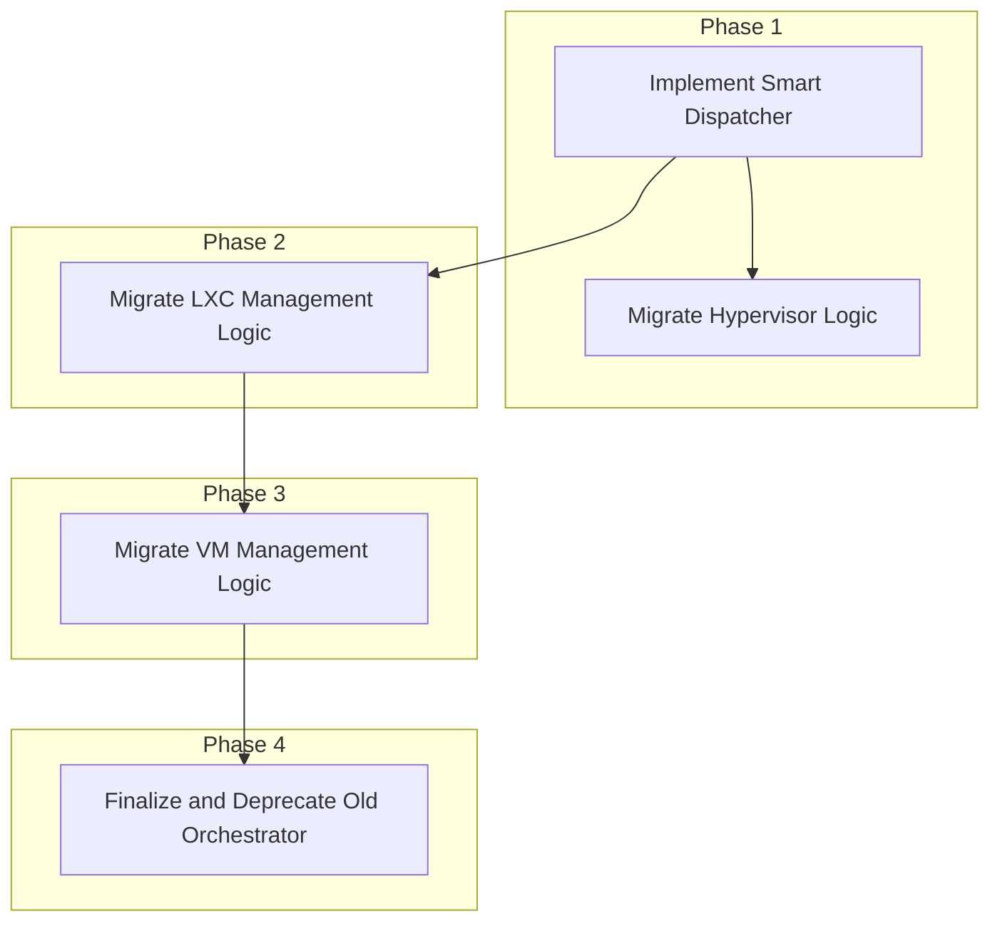

# Orchestrator Refactor Implementation Plan

## 1. Introduction

This document provides a detailed, phased implementation plan for refactoring the `phoenix_orchestrator.sh` script. The goal was to transition from a monolithic script with a complex command structure to a modular, verb-first CLI that is intuitive, maintainable, and extensible. This plan was based on the `unified_cli_refactor_proposal.md` and incorporated feedback from the initial review.

## 2. Phased Implementation Approach

The refactoring was executed in four distinct phases to minimize disruption and allow for iterative testing and validation.

### Phase 1: Smart Dispatcher and Hypervisor Logic (Completed)

*   **Goal:** Establish the new `phoenix` CLI and migrate the hypervisor setup functionality.
*   **Outcome:** The `bin/phoenix` dispatcher and `bin/managers/hypervisor-manager.sh` were created and validated. The `phoenix setup` command is fully functional.

### Phase 2: LXC Management Logic (Completed)

*   **Goal:** Migrate all LXC-related functionality to the new architecture.
*   **Outcome:** The `bin/managers/lxc-manager.sh` script was created, and all LXC-related commands are now routed through the `phoenix` CLI. Dependency resolution and execution ordering are fully implemented.

### Phase 3: VM Management Logic (Completed)

*   **Goal:** Migrate all VM-related functionality to the new architecture.
*   **Outcome:** The `bin/managers/vm-manager.sh` script was created, and all VM-related commands are now handled by the `phoenix` CLI, providing feature parity with LXC management.

### Phase 4: Finalization and Deprecation (Completed)

*   **Goal:** Complete the transition to the new orchestrator and remove the old script.
*   **Outcome:** All documentation has been updated to reflect the new CLI. The old `phoenix_orchestrator.sh` script has been removed from the repository.

## 3. Error Handling, Idempotency, and Logging

### Error Handling

*   The `phoenix` dispatcher is responsible for validating top-level arguments and providing clear, user-friendly error messages.
*   Each manager script is responsible for its own internal error handling and exits with a non-zero status code on failure.
*   The dispatcher captures the exit code from the manager scripts and terminates the execution if a step fails.

### Idempotency

*   All manager scripts are designed to be idempotent. For example, if a `create` command is run for a container that already exists, the script confirms that the container's configuration matches the desired state and does not attempt to recreate it.

### Logging

*   All scripts use the `phoenix_hypervisor_common_utils.sh` library for consistent logging.
*   The `phoenix` dispatcher logs the high-level actions being performed to `/var/log/phoenix_hypervisor/phoenix_cli.log`.
*   Each manager script logs the detailed steps it is taking to its own log file (e.g., `/var/log/phoenix_hypervisor/lxc-manager.log`).

## 4. Project Completion

This project is now complete. The new `phoenix` CLI is the standard for all orchestration tasks within the Phoenix Hypervisor ecosystem.