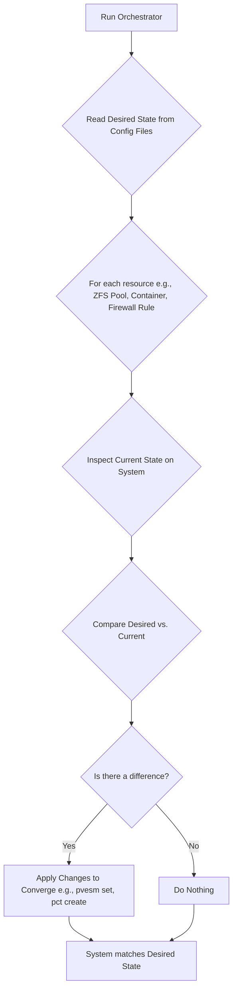
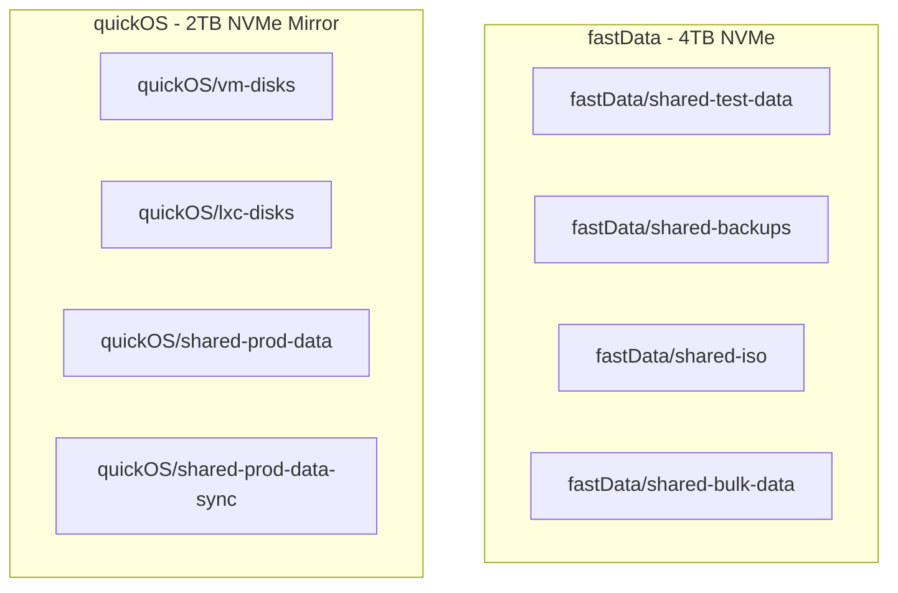

# Unified Phoenix Hypervisor Strategy v2.0

## 1. Executive Summary

The Phoenix Hypervisor is the central infrastructure supporting Thinkheads.AI's mission to innovate and showcase a diverse portfolio of AI-powered projects. To ensure the long-term stability, scalability, and maintainability of this critical platform, this document outlines the strategic transition from an imperative, script-driven system to a fully **declarative, convergent state engine**. This evolution aligns with modern Infrastructure-as-Code (IaC) principles and positions the Phoenix Hypervisor as a resilient, predictable, and auditable foundation for all future development.

## 2. Strategic Importance and Vision

The Phoenix Hypervisor's robust capabilities are paramount to Thinkheads.AI's success. It enables the execution of complex AI/ML/DL projects, including LLM inference, image processing, and isolated development environments.

### 2.1. Core Workloads
*   **LLM Training and Inference**: Running large language models (LLMs) for various sub-products.
*   **Image Processing**: Handling AI-powered image generation and manipulation tasks.
*   **Development Environments**: Providing isolated and powerful environments for interactive ML development.

### 2.2. Hardware Foundation
*   **CPU**: AMD 7700
*   **RAM**: 96 GB DDR5
*   **GPUs**: Dual RTX 5060 Ti
*   **Storage**: NVMe

## 3. The Declarative State Model: The Core Technical Strategy

Our core technical strategy is the adoption of a declarative model for all aspects of the hypervisor and its resources. This addresses the brittleness and lack of idempotency inherent in the previous imperative scripting model.

### 3.1. Core Principles

*   **Single Source of Truth**: The `phoenix_hypervisor_config.json` and `phoenix_lxc_configs.json` files are the definitive source of truth for the entire system's desired state.
*   **Stateless Execution**: The orchestrator itself is stateless. It does not retain knowledge of past executions.
*   **Idempotent Convergence**: The orchestrator's primary function is to converge the *current state* of the system with the *desired state* defined in the configuration.

### 3.2. The Convergent Loop Architectural Model

The new model is based on a continuous "Inspect, Compare, Converge" loop that is applied to every resource managed by the orchestrator.



## 4. Benefits of the Declarative Strategy

*   **Reliability**: The system becomes self-healing. Configuration drift is automatically detected and corrected.
*   **Predictability**: The state of the system is guaranteed to match the configuration files.
*   **Maintainability**: Changes are made by modifying the source of truth (the JSON files), not by writing complex imperative scripts.
*   **Idempotency**: The orchestrator can be run safely at any time, as it will only make changes when necessary.

## 5. Phased Rollout

The transition to a fully declarative model will be a phased process:

1.  **Phase 1 (Complete)**: Refactor the `hypervisor_feature_setup_zfs.sh` script to be fully convergent. This serves as the blueprint.
2.  **Phase 2**: Apply the same convergent logic to other hypervisor setup scripts (NFS, Samba, NVIDIA, etc.).
3.  **Phase 3**: Refactor the container orchestration logic to be fully declarative, managing the entire container lifecycle.
4.  **Phase 4**: Centralize the state management logic into the main orchestrator, turning it into a true master state engine.

## 6. Conclusion

By executing this strategy, we will transform the Phoenix Orchestrator into a modern, robust, and reliable platform that is resilient, scalable, and auditable. This strategic investment in our core infrastructure is essential to achieving our long-term vision of AI-driven innovation.

---

## 7. Core System Implementation Plans

This section details the implementation plans for the core components and features of the Phoenix Hypervisor.

### 7.1. ZFS Dataset Structure and Configuration

This plan incorporates detailed requirements for ZFS dataset configuration, focusing on performance, data integrity, and NVMe optimization for the `quickOS` and `fastData` pools. For a comprehensive overview of the entire storage architecture, please refer to the **[Phoenix Hypervisor Storage Architecture Guide](../00_guides/14_storage_architecture_guide.md)**.

#### 7.1.1. Proposed ZFS Dataset Structure



#### 7.1.2. ZFS Dataset Configuration Details

**On `quickOS` Pool (Mirrored 2TB NVMe)**

| Dataset | Purpose & Content | Configuration | Mounting Strategy |
| :--- | :--- | :--- | :--- |
| **`quickOS/vm-disks`** | Block storage for VM root disks (OS, binaries). | `recordsize=128K`, `compression=lz4`, `sync=standard`, `quota=800G`. Sub-datasets per VM. | Proxmox block storage (ZFS backend). |
| **`quickOS/lxc-disks`** | Block storage for LXC root disks (OS, binaries). | `recordsize=16K`, `compression=lz4`, `sync=standard`, `quota=600G`. Sub-datasets per LXC. | Proxmox block storage (ZFS backend). |
| **`quickOS/shared-prod-data`** | Shared storage for LLM models, application data (non-database). | `recordsize=128K`, `compression=lz4`, `sync=standard`, `quota=400G`. | NFS (`noatime`, `async`) for VMs, bind-mount (`discard`, `noatime`) for LXCs. |
| **`quickOS/shared-prod-data-sync`** | Shared storage for databases requiring synchronous writes. | `recordsize=16K`, `compression=lz4`, `sync=always`, `quota=100G`. | NFS (`sync`, `noatime`) for VMs, bind-mount (`discard`, `noatime`) for LXCs. |

**On `fastData` Pool (Single 4TB NVMe)**

| Dataset | Purpose & Content | Configuration | Mounting Strategy |
| :--- | :--- | :--- | :--- |
| **`fastData/shared-test-data`** | Test environment storage, cloned from production data. | `recordsize=128K` or `16K`, `compression=lz4`, `sync=standard`, `quota=500G`. | NFS (`noatime`, `async`) for VMs, bind-mount (`discard`, `noatime`) for LXCs. |
| **`fastData/shared-backups`** | Proxmox backups and snapshots of production data. | `recordsize=1M`, `compression=zstd`, `sync=standard`, `quota=2T`. | Proxmox backup storage. |
| **`fastData/shared-iso`** | Storage for ISO images. | `recordsize=1M`, `compression=lz4`, `sync=standard`, `quota=100G`. | Proxmox ISO storage. |
| **`fastData/shared-bulk-data`** | General-purpose storage for large files (media, logs). | `recordsize=1M`, `compression=lz4`, `sync=standard`, `quota=1.4T`. | NFS (`noatime`, `async`) for VMs, bind-mount (`discard`, `noatime`) for LXCs. |

#### 7.1.3. NVMe Optimization

*   **TRIM**: `autotrim=on` will be set on both pools to maintain NVMe performance and lifespan.
*   **Write Amplification**:
    *   `lz4` and `zstd` compression will be used to reduce the amount of data written to the drives.
    *   Synchronous writes are isolated to the `quickOS/shared-prod-data-sync` dataset to minimize wear.
*   **Monitoring**: NVMe wear will be monitored using `smartctl`.
*   **Firmware**: It is recommended to ensure NVMe firmware is up-to-date.

### 7.2. Docker in Unprivileged LXC Implementation

This plan provides a step-by-step guide for implementing the Docker in Unprivileged LXC Remediation Plan.

#### 7.2.1. Implementation Steps

**Step 1: Configure Host AppArmor Tunables**

1.  Modify the AppArmor setup script (`hypervisor_feature_setup_apparmor.sh`) to include the nesting tunable:
    ```bash
    echo 'Adding AppArmor nesting tunable for lxc-phoenix-v2...'
    echo '@{apparmor_nesting_profiles} = lxc-phoenix-v2' > /etc/apparmor.d/tunables/nesting
    ```
2.  Reload the AppArmor service to apply the changes:
    ```bash
    systemctl reload apparmor
    ```

**Step 2: Refine the `lxc-phoenix-v2` AppArmor Profile**

1.  Edit the `lxc-phoenix-v2` profile and add the following rules to allow `fuse-overlayfs` operations:
    ```
    # Allow fuse-overlayfs mounts
    mount fstype=fuse.fuse-overlayfs -> /var/lib/docker/fuse-overlayfs/**,
    allow /dev/fuse r,
    allow /sys/fs/fuse/connections r,
    ```
2.  Deploy the updated profile and reload AppArmor.

**Step 3: Optimize the Docker Installation Script**

1.  Edit the `phoenix_hypervisor_feature_install_docker.sh` script to:
    *   Install `fuse-overlayfs`.
    *   Create `/etc/docker/daemon.json` with the `fuse-overlayfs` storage driver.
    *   Restart the Docker service.

### 7.3. Snapshot and Boot Order Enhancements

This section outlines the new snapshot and boot order features that have been added to the Phoenix Hypervisor orchestration system.

#### 7.3.1. Snapshotting

*   **`final-form` Snapshot:** A snapshot named `final-form` is now automatically created for every container at the end of its orchestration process. This snapshot represents the fully provisioned state of the container and is used for cloning new containers from templates.

A new `reconfigure` command has been added to the `phoenix` CLI to allow restoring a container to its `final-form` state.

#### 7.3.2. Boot Order

The following parameters have been added to the `phoenix_lxc_configs.json` file to control the boot sequence of the containers:

*   `start_at_boot`: A boolean value that determines whether the container should be started at boot time.
*   `boot_order`: An integer that defines the startup order of the containers.
*   `boot_delay`: An integer that specifies the delay in seconds before the container is started.

---

### 7.4. LXC Container Implementation Plans

This section provides detailed implementation plans for specific LXC containers within the Phoenix Hypervisor ecosystem.

#### 7.4.1. LXC 951: vllm-granite-embed

This plan outlines the deployment, refactoring, and enhancement of LXC container 951, which is dedicated to serving the `ibm-granite/granite-embedding-english-r2` model.

**Deployment and Refactoring:**

*   **Declarative Configuration:** The deployment process has been refactored to use the new `vllm_engine_config` object, and the `phoenix_hypervisor_lxc_vllm.sh` script now dynamically generates the systemd service.

**Enhancement Plan: Microservices Architecture**

To enhance responsiveness and context-checking, the single-container architecture will be evolved into a microservices-based approach with the following components:

*   **API Gateway:** A single entry point for all incoming requests.
*   **Load Balancer:** Distributes traffic across multiple service instances.
*   **Request Queue:** Manages traffic bursts and decouples request ingestion from processing.
*   **Context Validation Service:** A new microservice to validate the semantic relevance of input data.
*   **Auto-scaling Group of vLLM Instances:** A pool of `lxc 951` containers that can be automatically scaled.

#### 7.4.2. LXC 101: api-gateway-lxc

This plan details the transformation of LXC container 101 into a dedicated Nginx reverse proxy and API gateway.

*   **Core Functionality:** The container is provisioned with Nginx and configured to act as a reverse proxy with caching, load balancing, and SSL/TLS termination.
*   **Security Hardening:** The implementation includes robust security measures, such as rate limiting, security headers, and the integration of ModSecurity (WAF) and Fail2ban.

#### 7.4.3. LXC 955: Ollama Integration

This plan outlines the complete integration and operationalization of the Ollama service within LXC container 955.

*   **Service Management:** A `systemd` service is created to ensure the Ollama process starts automatically on boot and is managed consistently.
*   **Nginx Reverse Proxy:** The Ollama API is securely exposed to the host network via a reverse proxy configuration in the `api-gateway-lxc` (101).

#### 7.4.4. LXC Embedding Setup with Qdrant and vLLM

This plan details the setup for a complete semantic search solution, leveraging high-quality embeddings.

*   **Core Components:**
    *   **vLLM:** Serves a high-performance embedding model, configured declaratively via the `vllm_engine_config` object.
    *   **Qdrant:** Runs in a separate LXC container to store and retrieve embeddings.
    *   **Roocode:** A Python-based application that processes documents, generates embeddings, and interacts with Qdrant.
*   **Implementation:** The plan provides detailed configuration for vLLM, a setup script for the Qdrant LXC container, and a comprehensive Python integration script for `roocode`.