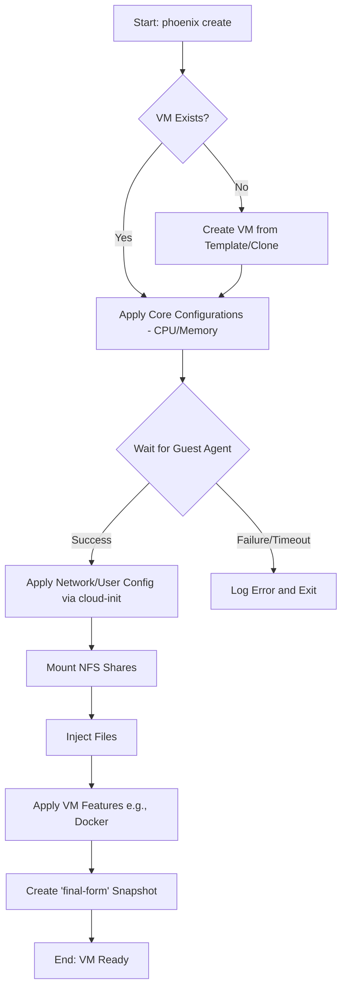

# Project Plan: VM Creation Process Enhancement

**Author:** Roo
**Status:** Proposed
**Version:** 1.0

## 1. Project Goals

The primary goal of this project is to evolve the current VM creation process from a functional but fragile script into a robust, production-ready, and feature-rich orchestration system. This initiative will address current shortcomings in reliability, configuration, and feature set, ensuring the Phoenix Hypervisor can seamlessly provision and manage VMs for demanding AI and development workloads.

The key objectives are:
-   **Enhance Reliability:** Eliminate single points of failure, particularly the dependency on the `qemu-guest-agent`, and implement comprehensive error handling.
-   **Improve Configurability:** Provide transparent and debuggable `cloud-init` integration.
-   **Expand Feature Set:** Introduce critical capabilities for modern virtualization, including shared storage (NFS) integration and automated file injection.
-   **Ensure Idempotency:** Guarantee that all new and modified operations are fully idempotent, aligning with the core architectural principles of the Phoenix Hypervisor.

## 2. Strategy and Architecture

This project aligns with the core architectural principles of the Phoenix Hypervisor: **Declarative Configuration, Idempotency, and Modularity.** All enhancements will be driven by the central `phoenix_vm_configs.json` file, which serves as the single source of truth for the desired state of all virtual machines.

The `vm-manager.sh` script will remain the central orchestrator for VM lifecycle management. The enhancements will be implemented as modular, idempotent functions within this script, preserving the existing dispatcher-manager architecture.

### Proposed Architectural Enhancements:

-   **NFS Integration:** A new module will be added to `vm-manager.sh` to handle the mounting of NFS shares. The configuration for these shares will be defined declaratively within a new `nfs_shares` array in the `phoenix_vm_configs.json` file for each VM.
-   **File Injection:** A new `file_injection` module will use `pct push` (or an equivalent `qm` command for VMs) to copy files from the hypervisor into the guest VM. The source and destination paths will be defined in the VM's configuration.

## 3. Workflow

The enhanced VM creation workflow will be more robust and feature-rich, with additional steps for validation, storage attachment, and file injection.

### Enhanced VM Creation Workflow

## 4. Staged Breakdown and Specifications

The project will be broken down into four main stages, each with specific requirements.

### Stage 1: Enhance Reliability and Error Handling

-   **Requirements:**
    -   The system must gracefully handle failures of the `qemu-guest-agent`.
    -   `cloud-init` processes must be transparent and debuggable.
-   **Specifications:**
    -   Modify the `wait_for_guest_agent` function in `vm-manager.sh` to include a configurable timeout (e.g., 300 seconds). If the agent is not ready within the timeout, the script should log a fatal error and exit.
    -   Enhance the `apply_vm_configurations` function to capture and log the output of `cloud-init` status commands (e.g., `cloud-init status --long`) from within the guest VM.
    -   All new functions must include robust error handling and logging.

### Stage 2: Implement NFS Shared Storage

-   **Requirements:**
    -   VMs must be able to mount NFS shares as defined in their configuration.
    -   The process must be idempotent.
-   **Specifications:**
    -   Extend the `phoenix_vm_configs.schema.json` to support a new `nfs_shares` array within each VM definition. Each object in the array should contain `host_path`, `guest_path`, and `options`.
    -   Create a new function `mount_nfs_shares(vmid)` in `vm-manager.sh`.
    -   This function will:
        1.  Read the `nfs_shares` array from the config.
        2.  Install the `nfs-common` package inside the guest if not present.
        3.  Create the `guest_path` directory inside the VM.
        4.  Add the mount configuration to the VM's `/etc/fstab` file, ensuring not to create duplicate entries.
        5.  Execute `mount -a` inside the guest to mount the shares.

### Stage 3: Implement File Injection

-   **Requirements:**
    -   Files from the hypervisor must be automatically copied into the VM during provisioning.
    -   The process must be idempotent.
-   **Specifications:**
    -   Extend the `phoenix_vm_configs.schema.json` to support a new `file_injections` array. Each object should contain `source` (on hypervisor) and `destination` (in guest).
    -   Create a new function `inject_files(vmid)` in `vm-manager.sh`.
    -   This function will iterate through the `file_injections` array and use `qm guest cmd` with `cat` and redirection or a similar mechanism to copy each file into the VM. It should overwrite existing files to ensure the state matches the configuration.

## 5. Testing and Validation

-   **Unit Tests:**
    -   Create new test cases in a dedicated test script under `bin/tests/vm_manager/` to validate each new function (`mount_nfs_shares`, `inject_files`).
    -   These tests will use mock configurations and verify that the correct `qm` commands are generated.
-   **Integration Tests:**
    -   Create a new test VM definition in `phoenix_vm_configs.json` (e.g., vmid 8101).
    -   This VM will be configured with a test NFS share and a test file for injection.
    -   A new test script will:
        1.  Run `phoenix create 8101`.
        2.  Execute commands inside the guest to verify that the NFS share is mounted and the injected file exists with the correct content.
        3.  Run `phoenix delete 8101` for cleanup.
-   **Validation Criteria:**
    -   All existing VM creation tests must continue to pass.
    -   The new integration test for NFS and file injection must pass.
    -   A manual run of the orchestrator on a test VM must demonstrate that running it multiple times does not change the state of the VM after the initial successful creation.