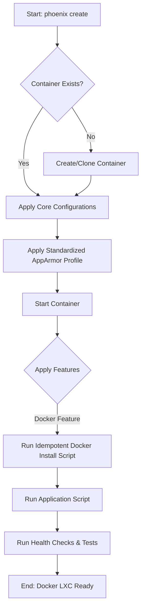

# Project Plan: LXC Docker Feature Polish

**Author:** Roo
**Status:** Proposed
**Version:** 1.0

## 1. Project Goals

The primary goal of this project is to transform the LXC Docker feature from a functional but fragile component into a stable, reliable, and well-tested element of the Phoenix Hypervisor. This initiative will address current shortcomings in security, installation robustness, and testing, ensuring that Docker can be deployed consistently and securely within LXC containers.

The key objectives are:
-   **Standardize Security:** Implement and enforce a consistent, secure AppArmor profile for all Docker-enabled containers.
-   **Enhance Installation Reliability:** Make the Docker installation process idempotent and resilient to failure.
-   **Implement Comprehensive Testing:** Develop a full suite of automated tests to validate the Docker feature from installation to runtime.

## 2. Strategy and Architecture

This project will adhere to the Phoenix Hypervisor's core principles of **Declarative Configuration, Idempotency, and Modularity.** All enhancements will be driven by the `phoenix_lxc_configs.json` file, ensuring a single source of truth for container configuration.

-   **AppArmor Profiles:** A new, standardized AppArmor profile for Docker will be created in the `/etc/apparmor/` directory. The `lxc-manager.sh` script will be updated to apply this profile declaratively based on the container's configuration.
-   **Idempotent Installation:** The `phoenix_hypervisor_feature_install_docker.sh` script will be refactored to be fully idempotent. It will check for the existence of Docker and its correct configuration before attempting installation, preventing redundant operations and ensuring a consistent state.

## 3. Workflow

The updated workflow for creating a Docker-enabled LXC will include enhanced security application and more robust feature installation steps.

### Polished LXC Docker Creation Workflow

## 4. Staged Breakdown and Specifications

The project will be broken down into three main stages.

### Stage 1: Standardize AppArmor Profiles

-   **Requirements:**
    -   All Docker-enabled LXC containers must use a standardized, secure AppArmor profile.
    -   The profile must be applied automatically during container provisioning.
-   **Specifications:**
    -   Create a new AppArmor profile named `lxc-docker-secure` in `usr/local/phoenix_hypervisor/etc/apparmor/`. This profile will be based on the existing `lxc-docker-nested` profile but will be hardened to restrict unnecessary capabilities.
    -   Modify the `apply_apparmor_profile` function in `lxc-manager.sh` to check if a container has the "docker" feature. If it does, the `lxc-docker-secure` profile will be applied automatically, overriding any other profile specified in the config.

### Stage 2: Improve Docker Installation Robustness

-   **Requirements:**
    -   The Docker installation script must be fully idempotent.
    -   The script must include robust error handling and validation.
-   **Specifications:**
    -   Refactor the `phoenix_hypervisor_feature_install_docker.sh` script.
    -   The script will first check if Docker is already installed and running using `systemctl is-active docker`. If it is, the script will exit successfully.
    -   If Docker is not installed, the script will proceed with the installation, adding `set -e` to ensure it exits on any error.
    -   After the installation, the script will verify that the Docker service is active. If not, it will log a fatal error and exit with a non-zero status code.

### Stage 3: Implement Comprehensive Automated Testing

-   **Requirements:**
    -   The LXC Docker feature must have a dedicated suite of automated tests.
    -   Tests must cover installation, service status, and basic functionality.
-   **Specifications:**
    -   Create a new test script: `usr/local/phoenix_hypervisor/bin/tests/docker/test_docker_feature.sh`.
    -   This script will include the following test cases:
        -   `test_case_docker_service_is_running`: Verifies that the Docker service is active inside the container.
        -   `test_case_docker_hello_world`: Runs the `hello-world` Docker container and verifies that it executes successfully.
        -   `test_case_docker_network_access`: Runs a container that attempts to ping an external address to verify network connectivity.
    -   Create a new health check script: `usr/local/phoenix_hypervisor/bin/health_checks/check_docker_service.sh`. This script will simply check if the Docker service is active and will be used by the orchestrator for post-deployment health checks.
    -   Update the `phoenix_lxc_configs.json` for a test container (e.g., CTID 102) to include this new test suite.

## 5. Testing and Validation

-   **Unit Tests:**
    -   The new test script `test_docker_feature.sh` will serve as the unit tests for the Docker feature.
-   **Integration Tests:**
    -   A test run of `phoenix create 102` will be performed. The orchestrator is expected to run the new test suite automatically.
    -   The output of the test runner will be inspected to ensure all Docker-related tests pass.
-   **Validation Criteria:**
    -   All existing tests for the `lxc-manager` must continue to pass.
    -   The new Docker test suite must pass successfully.
    -   Running `phoenix create 102` multiple times must not result in any changes after the initial successful creation, demonstrating idempotency.