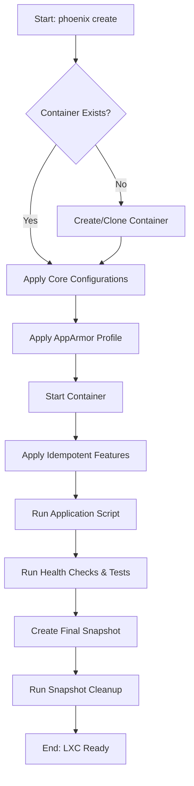

# Project Plan: LXC Creation Polish

**Author:** Roo
**Status:** Proposed
**Version:** 1.0

## 1. Project Goals

The primary goal of this project is to refine and harden the LXC creation process, transforming it into a highly reliable, maintainable, and efficient system. This initiative will focus on improving snapshot management, standardizing error handling, and ensuring the idempotency of all feature scripts.

The key objectives are:
-   **Implement Comprehensive Snapshot Management:** Introduce a systematic approach to snapshot lifecycle management to prevent the accumulation of unnecessary snapshots and conserve storage resources.
-   **Standardize Error Handling:** Enforce a consistent error handling and logging mechanism across the entire `lxc-manager.sh` script and its sub-components to simplify troubleshooting.
-   **Ensure Idempotency of Feature Scripts:** Refactor all feature installation scripts to be fully idempotent, guaranteeing that they can be run multiple times without causing unintended side effects.

## 2. Strategy and Architecture

This project will build upon the existing declarative and idempotent architecture of the Phoenix Hypervisor. All enhancements will be configuration-driven, with new behaviors defined in the `phoenix_lxc_configs.json` file.

-   **Snapshot Management:** A new snapshot retention policy will be introduced at the global or per-container level in the configuration. A new function within `lxc-manager.sh` will be responsible for enforcing this policy.
-   **Idempotent Feature Scripts:** The `apply_features` function in `lxc-manager.sh` will be enhanced to pass a common set of idempotency checks to each feature script. The feature scripts themselves will be refactored to include guards that prevent re-execution of tasks that are already complete.

## 3. Workflow

The polished LXC creation workflow will incorporate automated snapshot cleanup and more robust, idempotent feature application steps.

### Polished LXC Creation Workflow

## 4. Staged Breakdown and Specifications

The project will be broken down into three main stages.

### Stage 1: Implement Snapshot Management

-   **Requirements:**
    -   The system must automatically delete old snapshots based on a configurable retention policy.
    -   The snapshot cleanup process must be integrated into the main orchestration workflow.
-   **Specifications:**
    -   Extend the `phoenix_lxc_configs.schema.json` to support a new `snapshot_retention` object, with a `keep_last` integer property. This can be defined globally and overridden on a per-container basis.
    -   Create a new function `cleanup_snapshots(ctid)` in `lxc-manager.sh`.
    -   This function will:
        1.  Read the `snapshot_retention` policy for the given CTID.
        2.  List all snapshots for the container.
        3.  If the number of snapshots exceeds the `keep_last` value, it will delete the oldest snapshots until the count is within the limit.
    -   Integrate the `cleanup_snapshots` function into the `main_lxc_orchestrator`'s `create` workflow, to be run after a new snapshot is created.

### Stage 2: Standardize Error Handling

-   **Requirements:**
    -   All functions within `lxc-manager.sh` must have consistent and robust error handling.
    -   All critical operations must be validated to ensure they have completed successfully.
-   **Specifications:**
    -   Review every function in `lxc-manager.sh`.
    -   Ensure that every call to `run_pct_command` or any other command that can fail is followed by a check of the exit code (e.g., `|| log_fatal "Error message"`).
    -   Replace any simple error messages with calls to the `log_fatal` function from `phoenix_hypervisor_common_utils.sh` to ensure consistent logging and script termination on failure.

### Stage 3: Ensure Idempotent Feature Scripts

-   **Requirements:**
    -   All feature scripts (e.g., `phoenix_hypervisor_feature_install_nvidia.sh`) must be fully idempotent.
    -   The scripts must not perform any actions if the feature is already correctly installed and configured.
-   **Specifications:**
    -   Refactor each feature script in `usr/local/phoenix_hypervisor/bin/lxc_setup/`.
    -   Each script will begin with a "guard" section that checks if the feature is already installed. For example:
        -   `phoenix_hypervisor_feature_install_docker.sh` will check if `docker` is in the path and if the service is active.
        -   `phoenix_hypervisor_feature_install_nvidia.sh` will check if `nvidia-smi` is present and returns a valid output.
    -   If the guard condition is met, the script will log a message indicating that the feature is already installed and exit with a status of 0.
    -   If the guard condition is not met, the script will proceed with the installation.

## 5. Testing and Validation

-   **Unit Tests:**
    -   Create new test cases to validate the `cleanup_snapshots` function, using a test container with a controlled number of snapshots.
-   **Integration Tests:**
    -   Create a new test container definition with a snapshot retention policy.
    -   A new test script will:
        1.  Run `phoenix create` on the test container multiple times to generate several snapshots.
        2.  Verify that the number of snapshots for the container does not exceed the retention policy.
    -   Modify existing tests to run the `phoenix create` command twice for each test container to ensure that all operations, including feature installations, are idempotent and do not cause errors on the second run.
-   **Validation Criteria:**
    -   All existing LXC creation tests must continue to pass.
    -   The new snapshot management test must pass.
    -   Running the orchestrator multiple times on any container must not result in any state changes or errors after the first successful run.