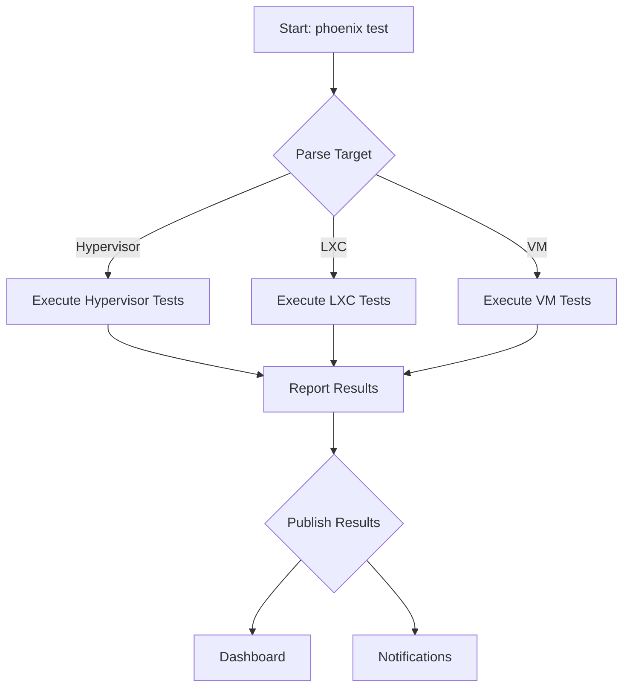

# Project Plan: Testing and Health Check Platform Polish

**Author:** Roo
**Status:** Proposed
**Version:** 1.0

## 1. Project Goals

The primary goal of this project is to elevate the testing and health check platform from a basic framework into a comprehensive, robust, and centralized quality assurance system. This initiative will focus on expanding test and health check coverage, implementing a centralized test runner, and ensuring that the platform is fully integrated into the orchestration workflow.

The key objectives are:
-   **Achieve Complete Health Check Coverage:** Implement a comprehensive suite of health checks for all critical components of the Phoenix Hypervisor.
-   **Expand Test Case Coverage:** Develop a rich set of test cases that provide thorough coverage for all features and functionalities.
-   **Implement a Centralized Test Runner:** Create a single, unified test runner that can execute all tests and present the results in a clear and consistent format.

## 2. Strategy and Architecture

This project will build upon the existing declarative testing framework, with tests and health checks defined in the `phoenix_lxc_configs.json` and `phoenix_hypervisor_config.json` files.

-   **Centralized Test Runner:** A new, top-level `test_runner.sh` script will be created in the `bin/tests/` directory. This script will be responsible for discovering and executing all test suites, including those for the hypervisor, LXC manager, and VM manager.
-   **Declarative Health Checks:** The health check system will be enhanced to support a wider range of check types, including service status, port availability, and custom script execution.

## 3. Workflow

The polished testing and health check workflow will be fully automated and integrated into the main orchestration process.

### Polished Testing and Health Check Workflow

## 4. Staged Breakdown and Specifications

The project will be broken down into three main stages.

### Stage 1: Implement Missing Health Checks

-   **Requirements:**
    -   The platform must include health checks for all critical components.
    -   Health checks must be executable on demand.
-   **Specifications:**
    -   Create a new health check script for the Docker service: `usr/local/phoenix_hypervisor/bin/health_checks/check_docker_service.sh`. This script will use `systemctl is-active docker` to verify that the Docker service is running.
    -   Create new health checks for all other critical components, including `ollama`, `portainer`, and `vllm`.
    -   Update the `phoenix_lxc_configs.json` file to include the new health checks for the relevant containers.

### Stage 2: Expand Test Case Coverage

-   **Requirements:**
    -   The platform must include a comprehensive suite of test cases for all features.
    -   Test cases must be organized into logical suites.
-   **Specifications:**
    -   Create new test suites for all features, including `docker`, `nvidia`, `ollama`, `portainer`, and `vllm`.
    -   Each test suite will include a set of test cases that verify the functionality of the feature. For example, the Docker test suite will include test cases for running a container, inspecting a container, and deleting a container.
    -   Update the `phoenix_lxc_configs.json` file to include the new test suites for the relevant containers.

### Stage 3: Develop a Centralized Test Runner

-   **Requirements:**
    -   The platform must include a centralized test runner that can execute all tests.
    -   The test runner must report the results in a clear and consistent format.
-   **Specifications:**
    -   Create a new, top-level `test_runner.sh` script in the `bin/tests/` directory.
    -   This script will be responsible for discovering and executing all test suites, including those for the hypervisor, LXC manager, and VM manager.
    -   The script will report the results in a clear and consistent format, including the number of tests passed, the number of tests failed, and the total number of tests.
    -   The script will exit with a non-zero status code if any tests fail.

## 5. Testing and Validation

-   **Unit Tests:**
    -   The new test suites will serve as the unit tests for the features.
-   **Integration Tests:**
    -   A test run of the new, centralized test runner will be performed. The test runner is expected to execute all test suites and report the results.
    -   The output of the test runner will be inspected to ensure that all tests pass.
-   **Validation Criteria:**
    -   All existing tests must continue to pass.
    -   The new test suites must pass successfully.
    -   The new, centralized test runner must execute all tests and report the results correctly.