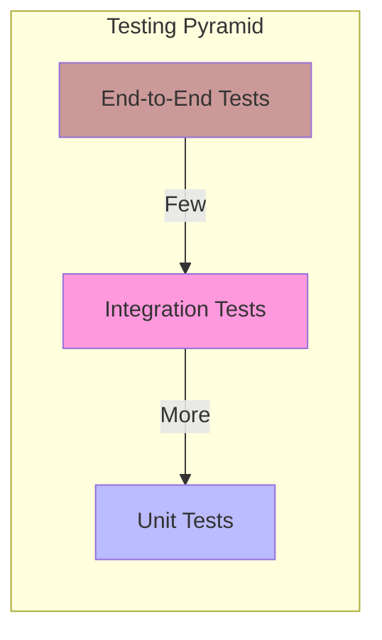

# Proposal: A Multi-Layered Testing & Validation Strategy

## 1. Introduction

To ensure the continued stability and reliability of the Phoenix Hypervisor, we must evolve our testing strategy. While the current post-deployment validation is valuable, a more comprehensive, multi-layered approach will allow us to catch bugs earlier, prevent regressions, and deploy changes with greater confidence.

This document proposes a formal, three-tiered testing strategy: Unit, Integration, and End-to-End (E2E).

## 2. Current State Analysis

**Architecture:** Testing is primarily handled by a `test_runner.sh` script that executes post-deployment validation checks. These are essentially a form of integration or health check.

**Strengths:**
*   **Provides a basic safety net:** Confirms that services are running after deployment.

**Weaknesses:**
*   **Limited Scope:** Does not test the orchestration logic itself, only the result.
*   **Slow Feedback Loop:** Tests are only run after a full deployment, which can be time-consuming.
*   **Lack of Granularity:** A failing test indicates a problem but may not pinpoint the root cause.
*   **Difficult to Test Edge Cases:** The current framework is not well-suited for testing complex scenarios or failure modes.

## 3. Proposed Architecture: The Testing Pyramid

I propose adopting the "testing pyramid" model, which emphasizes a healthy balance of different types of tests.

### 3.1. Unit Tests (Foundation)

*   **Focus:** Test individual functions and classes in isolation.
*   **Implementation:** With the proposed move to a Python-based orchestrator, we can use standard frameworks like `pytest` to write fast, focused unit tests for our plugins.
*   **Example:** A unit test for the `lxc.py` plugin could mock the `pct` command and verify that the plugin generates the correct command-line arguments based on a given configuration.
*   **Gain:** Extremely fast feedback, precise error isolation, and the ability to test edge cases and error conditions easily.

### 3.2. Integration Tests (Middle Layer)

*   **Focus:** Test the interaction between different components of the system.
*   **Implementation:** We will expand our existing `test_runner.sh` framework to create more sophisticated integration tests. These will be managed by the new orchestration engine's `validation.py` plugin.
*   **Example:** An integration test for the vLLM service could deploy the container, send a request to its API endpoint, and verify that the response is valid.
*   **Gain:** Confidence that our services can communicate with each other and with external systems correctly.

### 3.3. End-to-End (E2E) Tests (Top Layer)

*   **Focus:** Test the entire system from the user's perspective.
*   **Implementation:** These will be high-level scripts that simulate a complete user workflow.
*   **Example:** An E2E test could trigger the full orchestration of a new vLLM container, from creation to health check, and then query the Nginx gateway to ensure the service is accessible from the outside world.
*   **Gain:** The ultimate assurance that the system as a whole is functioning as expected.

## 4. Goals and Gains

### Goals

*   **Increase Code Quality:** Catch bugs early and prevent regressions.
*   **Improve Developer Confidence:** Allow developers to make changes with the assurance that they haven't broken anything.
*   **Automate Quality Assurance:** Integrate testing directly into the development and deployment workflow.
*   **Provide a Safety Net:** Ensure that the system remains stable and reliable as it evolves.

### Gains

*   **Faster Feedback Loop:** Unit tests provide immediate feedback, reducing debugging time.
*   **Higher Reliability:** A comprehensive test suite leads to a more robust and dependable system.
*   **Better Documentation:** Well-written tests serve as executable documentation for the system's behavior.
*   **Safer Refactoring:** The test suite provides the confidence needed to make significant architectural improvements, like the proposed orchestrator refactor.

## 5. Next Steps

If this proposal is approved, the implementation will be phased:

1.  **Phase 1 (Unit Tests):** As part of the orchestrator refactor, establish a `pytest` framework and require unit tests for all new and migrated plugins.
2.  **Phase 2 (Integration Tests):** Expand the existing test suites with more comprehensive integration tests for our key services.
3.  **Phase 3 (E2E Tests):** Develop a small number of critical E2E tests that cover our most important user workflows.