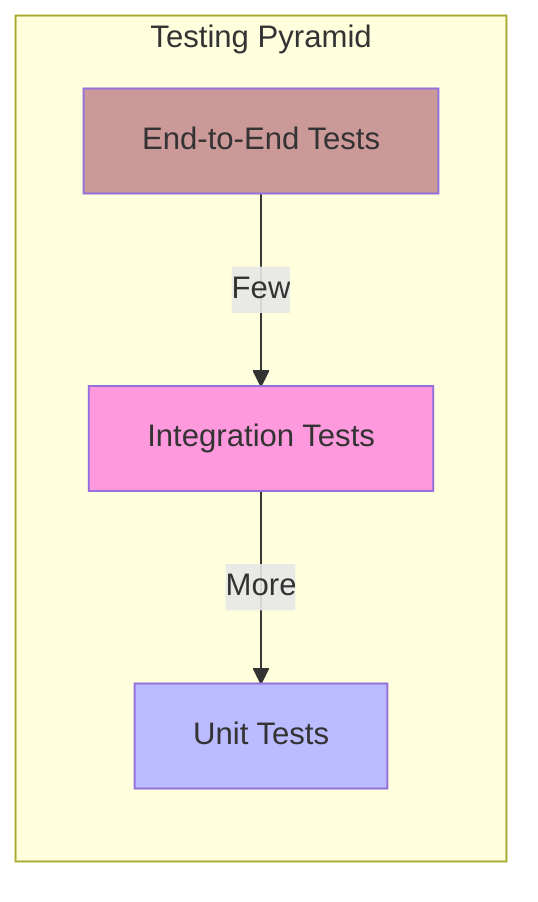

# Unified Quality Assurance and Testing Guide

This document provides a comprehensive overview of the quality assurance, testing, and verification strategies for the Phoenix Hypervisor project. It is the single source of truth for ensuring the stability, reliability, and correctness of the entire ecosystem.

## 1. QA Strategy & Principles

Our quality assurance strategy is built upon the same core principles that guide the architecture of the Phoenix Hypervisor itself.

### 1.1. Declarative Testing

Just as we define the desired state of our infrastructure in configuration files, we also define our tests declaratively. The `tests` objects within [`phoenix_hypervisor_config.json`](/usr/local/phoenix_hypervisor/etc/phoenix_hypervisor_config.json:211) and [`phoenix_lxc_configs.json`](/usr/local/phoenix_hypervisor/etc/phoenix_lxc_configs.json:102) define the health checks and integration tests to be run for the hypervisor and for each container, respectively. This approach ensures that our testing strategy is version-controlled, transparent, and tightly integrated with the infrastructure it validates.

### 1.2. Idempotency

All tests are designed to be idempotent, meaning they can be run multiple times without changing the outcome or the state of the system. This allows for safe and repeatable test execution, which is critical for automation and continuous integration.

### 1.3. The Testing Pyramid

We follow the "testing pyramid" model to ensure a balanced and efficient testing strategy. This model prioritizes a large base of fast, isolated unit tests, a smaller layer of integration tests, and a minimal number of comprehensive end-to-end tests.



## 2. Testing Framework

The testing framework is designed to be modular and extensible, mirroring the dispatcher-manager architecture of the `phoenix` CLI.

### 2.1. Test Runners

The core of the framework consists of a set of test runners located in [`/usr/local/phoenix_hypervisor/bin/tests/`](/usr/local/phoenix_hypervisor/bin/tests/). These runners are responsible for executing the tests defined in the configuration files.

*   [`hypervisor_test_runner.sh`](/usr/local/phoenix_hypervisor/bin/tests/hypervisor_test_runner.sh): Executes tests for the hypervisor itself.
*   [`test_runner.sh`](/usr/local/phoenix_hypervisor/bin/tests/test_runner.sh): Executes tests for LXC containers and VMs.

### 2.2. Configuration-Driven Tests

The tests to be executed are defined in the `tests` objects in the JSON configuration files. This allows us to easily add, remove, or modify tests without changing the test runner scripts.

**Example from `phoenix_lxc_configs.json`:**
```json
"tests": {
    "health_checks": [
        {
            "name": "Check Docker Service",
            "type": "script",
            "path": "docker/check_docker_service.sh"
        }
    ],
    "integration_tests": [
        {
            "name": "Test Docker Hello World",
            "type": "script",
            "path": "docker/test_docker_hello_world.sh"
        }
    ]
}
```

## 3. Test Execution

All tests can be executed via the `phoenix` CLI.

### 3.1. Running All Tests

To run all tests for the entire environment, use the `test` command:

```bash
phoenix test
```

### 3.2. Running Tests for a Specific Guest

To run tests for a specific LXC container or VM, provide the guest ID:

```bash
phoenix test 950
```

### 3.3. Interpreting Results

The test runner will output the results of each test, indicating whether it passed or failed. A summary will be provided at the end of the test run.

## 4. Writing Tests

Adding new tests to the framework is a straightforward process.

1.  **Create a new test script:** The script should be placed in the appropriate subdirectory of [`/usr/local/phoenix_hypervisor/bin/tests/`](/usr/local/phoenix_hypervisor/bin/tests/). The script should exit with a status code of 0 for success and a non-zero status code for failure.
2.  **Define the test in the configuration:** Add a new entry to the `tests` object in the relevant JSON configuration file, specifying the name, type, and path of the new test script.

## 5. Health Checks & Verification

In addition to the formal testing framework, we employ a set of health checks and verification procedures to ensure the ongoing stability of the system.

### 5.1. Container-Specific Health Checks

Many of the LXC containers have specific health checks defined in their configuration. These are typically simple scripts that verify the status of a service or the accessibility of an endpoint.

**Example: Qdrant Health Check**
The health of the Qdrant service is checked by sending a `curl` request to `http://localhost:6333`. A successful request will return a JSON response containing the service title and version.

### 5.2. Service Verification Procedures

For services that do not have automated health checks, the following manual verification procedures can be used.

| Container | Service | Verification Method |
| :--- | :--- | :--- |
| 950, 951 | vLLM API Server | `curl http://localhost:8000/v1/models` |
| 953 | Nginx | `systemctl is-active --quiet nginx` |
| 952 | Qdrant | `curl http://localhost:6333` |
