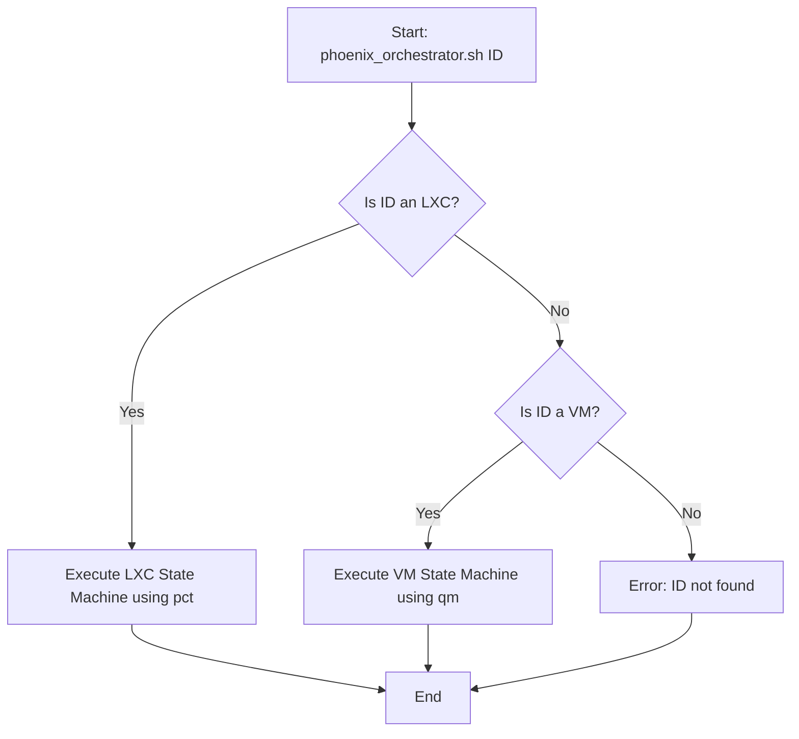

# Architectural Summary: VM Integration with Phoenix Hypervisor

## 1. Overview of Existing Phoenix Hypervisor Architecture

The `phoenix_hypervisor` is a mature, declarative system for managing virtualized infrastructure on Proxmox. Its architecture is defined by the following core principles, which will be maintained and extended for VM management:

-   **Declarative Configuration:** A single source of truth for system state is maintained in JSON files (`phoenix_hypervisor_config.json` for global settings, `phoenix_lxc_configs.json` for container specifics).
-   **Idempotent Orchestration:** The central `phoenix_orchestrator.sh` script is designed to be stateless and can be run multiple times without causing unintended side effects, ensuring a predictable and resilient workflow.
-   **Modularity:** Functionality is encapsulated in small, single-purpose "feature" scripts, promoting reusability and extensibility.
-   **Hierarchical Templating:** A snapshot-based templating system allows for efficient and consistent creation of new LXC containers.

The current orchestration flow for LXC containers is a well-defined state machine that handles creation, configuration, feature installation, and snapshotting.

## 2. Proposed Architectural Integration for VM Creation

The integration of VM creation will be a natural extension of the existing architecture, designed to provide a completely unified user experience. From the user's perspective, orchestrating a VM will be identical to orchestrating an LXC container.

### 2.1. Unified Configuration Strategy

To maintain architectural simplicity and a single source of truth, we will **not** create a new configuration file. Instead, we will enhance the existing configuration files:

-   **`phoenix_hypervisor_config.json`:** This file will be the definitive location for all VM definitions. The existing `vms` array will be formalized with a comprehensive JSON schema. This centralizes hypervisor-level resources (VMs) in the hypervisor-level configuration. Key properties will include:
    -   `vmid`: A unique numeric ID for the VM.
    -   `name`: A unique friendly name for the VM.
    -   `os_type`: (e.g., `ubuntu`, `windows`).
    -   `cores`, `memory_mb`, `disk_size_gb`: Core resource allocation.
    -   `template_image`: The base disk image or ISO to clone from.
    -   `cloud_init`: Configuration for automated setup.
    -   `features`: An array of feature scripts to apply post-creation.
-   **`phoenix_lxc_configs.json`:** This file will remain dedicated exclusively to LXC container definitions. This maintains a clear separation between container-specific parameters (e.g., `unprivileged`, `lxc_options`) and VM parameters.

### 2.2. Unified Orchestrator Experience

The `phoenix_orchestrator.sh` script will be refactored to provide a single, unified command structure for both LXC containers and VMs.

-   **Unified Command:** The user will invoke the orchestrator using a single syntax: `phoenix_orchestrator.sh <ID>`. The separate `--create-vm` flags will be deprecated and removed.
-   **Internal Logic Branching:** The orchestrator will be responsible for determining the resource type associated with the given `<ID>`. It will first check the `phoenix_lxc_configs.json` for a matching CTID. If not found, it will check the `vms` array in `phoenix_hypervisor_config.json` for a matching `vmid`. Based on the resource type, it will then branch its internal logic to call the appropriate backend tools (`pct` for LXC, `qm` for VMs).

This approach creates a seamless user experience, as illustrated in the revised workflow diagram:

### 2.3. Dependencies and Interfaces

-   **Proxmox API / `qm` CLI:** This will be the primary interface for all VM lifecycle operations. The orchestrator will abstract the complexities of the `qm` commands.
-   **Cloud-Init:** This will be a critical dependency for the automated configuration of new VMs. The orchestrator will be responsible for generating and applying the necessary cloud-init configurations (user data, network config).
-   **QEMU Guest Agent:** For post-creation feature application and health checks, the QEMU Guest Agent will be the preferred interface. This will require that base VM templates have the agent pre-installed.
-   **Storage and Networking:** The VM creation process will interface directly with the ZFS storage pools and `vmbr0` network bridge defined in `phoenix_hypervisor_config.json`.

### 2.4. Technical Alignment

This integration plan is fully aligned with the existing technical strategy of the `phoenix_hypervisor` project.

-   **Unified Tooling:** By extending the existing orchestrator, we avoid introducing new tools or workflows, maintaining a single point of entry for all infrastructure management.
-   **Declarative Approach:** The reliance on JSON configuration for VMs ensures that the entire system state remains version-controllable and auditable.
-   **Scalability:** The use of templates and a modular feature system for VMs will allow the platform to scale to support a large number of diverse virtual machines with the same efficiency as the current LXC implementation.

By following this architectural plan, we can seamlessly integrate VM creation capabilities into the Phoenix ecosystem, significantly enhancing its power and flexibility while preserving the elegance and robustness of its original design.