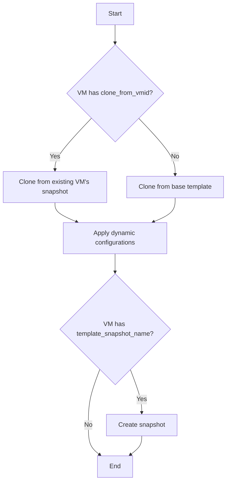

# Phase 2 Key Considerations for VM Creation

## 1. Introduction

This document provides a detailed analysis of the key technical and architectural challenges for Phase 2 of the VM creation initiative. The goal is to propose specific implementation strategies for dynamic Cloud-Init configuration, VM templating, and a feature script framework to ensure a robust and scalable solution.

## 2. Dynamic Cloud-Init Strategy

### 2.1. Current State

The Phase 1 implementation uses a static `user-data` file with a simple hostname substitution. This is insufficient for managing unique network configurations, SSH keys, or user credentials.

### 2.2. Proposed Mechanism

We will adopt a template-based approach for generating `user-data` and `network-config` files dynamically.

1.  **Template Files:** We will create two new template files in `/usr/local/phoenix_hypervisor/etc/cloud-init/`:
    *   `user-data.template.yml`
    *   `network-config.template.yml`

    These files will contain placeholders for dynamic values (e.g., `__HOSTNAME__`, `__SSH_PUBLIC_KEY__`, `__IPV4_ADDRESS__`).

2.  **Orchestrator Logic:** The `phoenix_orchestrator.sh` script will be enhanced to:
    *   Read the specific VM's configuration from `phoenix_hypervisor_config.json`.
    *   Use `sed` or a similar tool to replace the placeholders in the template files with the values from the JSON configuration.
    *   Generate two final files: `user-data-<VMID>.yml` and `network-config-<VMID>.yml` in a temporary location (e.g., `/tmp`).
    *   Use the `qm set` command with the `--cicustom` flag to apply both configurations to the VM. The command will look like this:
        ```bash
        qm set <VMID> --cicustom "user=local:snippets/user-data-<VMID>.yml,network=local:snippets/network-config-<VMID>.yml"
        ```
    *   The generated files will be copied to the Proxmox snippets directory (`/var/lib/vz/snippets`).

### 2.3. JSON Schema Extension

The `vms` array in `phoenix_hypervisor_config.json` will be extended to include new fields for network configuration and user details:

```json
"vms": [
    {
        "vmid": 8001,
        "name": "docker-vm-01",
        "network_config": {
            "ip": "10.0.0.101/24",
            "gw": "10.0.0.1"
        },
        "user_config": {
            "username": "phoenix_user",
            "password_hash": "...",
            "ssh_public_key": "ssh-rsa AAAA..."
        }
    }
]
```

## 3. VM Templating and Snapshotting Mechanism

### 3.1. Proposed Mechanism

We will leverage Proxmox's built-in templating capabilities and extend the orchestrator to manage cloning from templates and snapshots.

1.  **Base Template:** A base VM (e.g., Ubuntu 24.04) will be created and configured with the QEMU Guest Agent. This VM will then be converted into a Proxmox template.
2.  **Cloning from Template:** The orchestrator will use `qm clone` to create new VMs from this base template. This is the primary mechanism for creating a fresh VM.
3.  **Snapshotting:** We will introduce a `template_snapshot_name` field for VMs, similar to the LXC configuration. If this field is present, the orchestrator will:
    *   Create a snapshot of the VM after the initial provisioning and feature script execution.
    *   This allows for creating "golden images" with pre-installed software.
4.  **Cloning from Snapshot:** A new `clone_from_vmid` field will be added to the VM schema. If this is specified, the orchestrator will clone from the specified VM's snapshot instead of the base template.

### 3.2. Workflow Diagram



## 4. Feature Script Framework Design

### 4.1. Proposed Mechanism

The framework will use the QEMU Guest Agent (`qm guest exec`) to execute scripts inside the VM, ensuring a secure and reliable execution environment.

1.  **Script Execution:** The `phoenix_orchestrator.sh` will use `qm guest exec <VMID> -- /bin/bash -c '<script_content>'` to run scripts.
2.  **Contextualization:** To provide context to the scripts, we will:
    *   Create a temporary JSON file (`/tmp/vm_context.json`) inside the VM containing relevant configuration variables (e.g., IP address, username).
    *   The feature script will read this file to access the necessary context.
3.  **Idempotency:** Feature scripts must be written to be idempotent. This means they can be run multiple times without changing the system's state beyond the initial execution. This will be achieved by:
    *   Checking for the existence of files or packages before installing them.
    *   Using configuration management principles within the scripts.

### 4.2. Script Location

Feature scripts for VMs will be stored in a new directory: `/usr/local/phoenix_hypervisor/bin/vm_features/`.

## 5. Proof-of-Concept: `feature_install_docker.sh`

### 5.1. Script Steps

The `feature_install_docker.sh` script will perform the following actions inside an Ubuntu 24.04 VM:

1.  **Update Package Manager:**
    ```bash
    apt-get update
    ```
2.  **Install Dependencies:**
    ```bash
    apt-get install -y apt-transport-https ca-certificates curl software-properties-common
    ```
3.  **Add Docker's GPG Key:**
    ```bash
    curl -fsSL https://download.docker.com/linux/ubuntu/gpg | gpg --dearmor -o /usr/share/keyrings/docker-archive-keyring.gpg
    ```
4.  **Add Docker Repository:**
    ```bash
    echo "deb [arch=amd64 signed-by=/usr/share/keyrings/docker-archive-keyring.gpg] https://download.docker.com/linux/ubuntu $(lsb_release -cs) stable" | tee /etc/apt/sources.list.d/docker.list > /dev/null
    ```
5.  **Install Docker Engine:**
    ```bash
    apt-get update
    apt-get install -y docker-ce docker-ce-cli containerd.io
    ```
6.  **Enable and Start Docker Service:**
    ```bash
    systemctl enable docker
    systemctl start docker
    ```
7.  **Add User to Docker Group (Optional):**
    *   The script will read the username from the context file (`/tmp/vm_context.json`) and add the user to the `docker` group.
    ```bash
    usermod -aG docker <username>