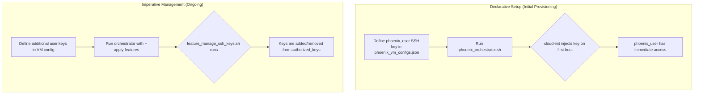

# Project Plan: Unified SSH Management for Phoenix VMs

## 1. Introduction

This document outlines the strategy and implementation plan for a robust, secure, and flexible SSH access management system for all virtual machines provisioned by the Phoenix Orchestrator. This project addresses both the immediate need for reliable diagnostic access and the long-term requirement for scalable user management.

## 2. Core Objectives

*   **Reliable Initial Access:** Ensure that the primary administrative user (`phoenix_user`) can reliably and securely access all newly provisioned VMs using SSH key-based authentication.
*   **Flexible User Management:** Provide a mechanism for administrators to add and remove SSH keys for various users on-demand, without needing to re-provision the VM.
*   **Enhanced Security:** Formalize the process for granting and revoking access, ensuring that our SSH management practices are secure and auditable.
*   **Improved Debugging:** Establish a clear, secure procedure for gaining diagnostic access to VMs that fail during the `cloud-init` process.

## 3. Proposed Architecture

Our architecture will be based on a two-pronged approach that leverages both `cloud-init` for initial, declarative setup and a dedicated feature script for ongoing, imperative management.

## 4. Implementation Plan

### Phase 1: Immediate Debugging and Remediation

This phase is focused on unblocking our current QA process.

*   **Task 1.1: Enable Diagnostic Access**
    *   Temporarily modify the `user-data.template.yml` to add `ssh_pwauth: true`.
    *   **Objective:** Allow password-based SSH login to diagnose the current boot failure.

*   **Task 1.2: Diagnose and Fix Boot Failure**
    *   Re-provision VM 8001 and SSH into it using the configured password.
    *   Analyze the `/var/log/cloud-init.log` and `/var/log/cloud-init-output.log` files to identify the root cause of the failure.
    *   Implement the necessary fix (e.g., correcting the filesystem resize, ensuring network availability).

*   **Task 1.3: Secure the Template**
    *   Once the boot failure is resolved, remove the `ssh_pwauth: true` directive from the `user-data.template.yml` to restore our security posture.

### Phase 2: Strategic SSH Management Feature

This phase will deliver the long-term, flexible SSH management solution.

*   **Task 2.1: Create `feature_manage_ssh_keys.sh`**
    *   Develop a new feature script at `usr/local/phoenix_hypervisor/bin/vm_features/feature_manage_ssh_keys.sh`.
    *   This script will be designed to run inside the VM via the QEMU Guest Agent.
    *   It will read a new section in the `phoenix_vm_configs.json` (e.g., `ssh_users`) and synchronize the `authorized_keys` files for the specified users.

*   **Task 2.2: Update Configuration Schema**
    *   Modify the `phoenix_vm_configs.schema.json` to include the new `ssh_users` array.
    *   This array will contain objects with a `username` and a list of `public_keys`.

*   **Task 2.3: Integrate with Orchestrator**
    *   Ensure that the `apply_vm_features` function in the `phoenix_orchestrator.sh` script correctly calls the new feature script when the `manage_ssh_keys` feature is enabled in the VM's configuration.

*   **Task 2.4: Update Documentation**
    *   Update the main VM guide to document the new SSH management feature, providing clear examples of how to add and remove user keys.

## 5. Conclusion

By executing this two-phase plan, we will not only resolve our immediate debugging challenges but also deliver a strategic enhancement that will significantly improve the security, manageability, and scalability of our Phoenix Hypervisor environment.