# VM Creation and Templating Improvement Plan

This document outlines the plan to enhance the VM creation and templating process for the Phoenix Hypervisor project.

## Current Issues

1.  **Networking Failure:** The template VM (8000) fails to acquire network connectivity, preventing cloud-init from running and the QEMU Guest Agent from starting.
2.  **Cloud-Init State Persistence:** The current workflow does not clear the cloud-init state from the template VM before snapshotting, causing issues with cloned VMs.
3.  **Security Vulnerability:** The configuration uses a placeholder password hash and allows password-based SSH authentication.

## Proposed Plan

### Phase 1: Configuration & Security Hardening

-   **Task 1.1:** Update `phoenix_vm_configs.json` to use DHCP for the template VM (8000) and remove the insecure password hash.
-   **Task 1.2:** Modify `user-data.template.yml` to disable password authentication, enforcing SSH key-only access.
-   **Task 1.3:** Adapt `network-config.template.yml` to support dynamic generation for both DHCP and static IP configurations.

### Phase 2: Orchestration Script Enhancement

-   **Task 2.1:** Enhance `phoenix_orchestrator.sh` to automatically manage the SSH key. The script will check for `/root/.ssh/id_rsa.pub` on the Proxmox host and generate a new key pair if it doesn't exist.
-   **Task 2.2:** Update the script's cloud-init generation logic to read the host's public SSH key and inject it into the user data.
-   **Task 2.3:** Implement a new "template finalization" sequence in the script. This will run only for VMs marked as templates (`is_template: true`).
    -   Start the newly created template VM.
    -   Wait for the QEMU Guest Agent to become responsive.
    -   Execute the `cloud-init clean` commands to prepare it for cloning.
    -   Stop the VM.
    -   Create the final snapshot.
    -   Convert the VM to a Proxmox template.

### Workflow Diagram

```mermaid
graph TD
    subgraph "Phase 1: Template Provisioning (Orchestrator)"
        A[Start Orchestration for Template VMID 8000] --> B{Create VM from Cloud Image};
        B --> C{Generate Cloud-Init Config with DHCP};
        C --> D[Start VM & Run Initial Cloud-Init];
        D --> E{Wait for Guest Agent};
        E --> F[Stop VM];
        F --> G[Clean Cloud-Init State];
        G --> H[Create 'initial' Snapshot];
        H --> I[Convert to Proxmox Template];
    end

    subgraph "Phase 2: VM Cloning (Orchestrator)"
        J[Start Orchestration for New VMID] --> K{Clone from Template VM 8000};
        K --> L{Generate Cloud-Init with Static IP};
        L --> M[Start VM & Run Cloud-Init];
        M --> N{Wait for Guest Agent};
        N --> O[VM Ready];
    end
```

### Phase 3: Execution & Verification

-   Run the orchestrator to create the template VM (8000).
-   Run the orchestrator to create a new VM (8001) from the template.