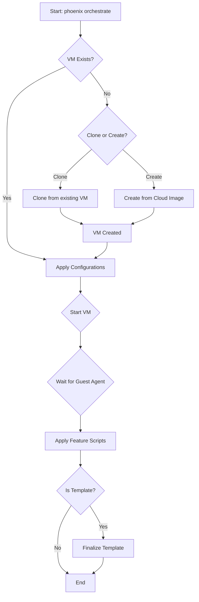

# Unified Guide to VM Creation and Management

This document provides a comprehensive, up-to-date guide to creating and managing Virtual Machines (VMs) within the Phoenix Hypervisor ecosystem. It replaces all previous documentation on this topic and serves as the single source of truth, reflecting the current implementation of the `phoenix` CLI and its declarative, idempotent architecture.
## 1. Architectural Overview

The VM management system is a core component of the Phoenix Hypervisor, designed to provide a seamless, declarative, and idempotent experience. The architecture is centered around a few key principles and components:

-   **Declarative Configuration:** The desired state of all VMs is defined in the `phoenix_vm_configs.json` file. This serves as the single source of truth, allowing for version-controlled and auditable infrastructure.
-   **Dispatcher-Manager Architecture:** The `phoenix` CLI acts as a dispatcher, parsing user commands and routing them to the appropriate manager script. For all VM-related operations, it invokes the `vm-manager.sh` script.
-   **Idempotent State Machine:** The `vm-manager.sh` script functions as a state machine. It reads the desired state from the configuration file and compares it to the current state of the system, only taking the actions necessary to bring the system into alignment. This ensures that the orchestrator can be run multiple times without causing unintended side effects.
-   **Unified User Experience:** From the user's perspective, creating and managing a VM is identical to managing an LXC container. The `phoenix orchestrate <ID>` command works for both, and the dispatcher handles the routing to the correct backend manager.
## 2. Configuration

All VM definitions are stored in `/usr/local/phoenix_hypervisor/etc/phoenix_vm_configs.json`. This file is the single source of truth for the VM orchestrator.

### 2.1. Main Sections

The configuration file has two main sections:

-   `vm_defaults`: This section defines the default settings that will be applied to all VMs unless overridden in their specific configuration.
-   `vms`: This is an array of objects, where each object represents a unique Virtual Machine.

### 2.2. VM Object Schema

Each VM object in the `vms` array can have the following properties:

| Property                 | Type    | Description                                                                                             | Required |
| :----------------------- | :------ | :------------------------------------------------------------------------------------------------------ | :------- |
| `vmid`                   | Integer | The unique numeric ID for the VM.                                                                       | Yes      |
| `name`                   | String  | The friendly name and hostname for the VM.                                                              | Yes      |
| `is_template`            | Boolean | If `true`, the VM will be treated as a template and undergo a finalization process.                     | No       |
| `template_image`         | String  | The name of the cloud image to use for creating the VM (e.g., `noble-server-cloudimg-amd64.img`).         | No       |
| `clone_from_vmid`        | Integer | The VMID of an existing VM to clone from.                                                               | No       |
| `template_snapshot_name` | String  | The name of the snapshot to create after provisioning.                                                  | No       |
| `cores`                  | Integer | The number of CPU cores.                                                                                | No       |
| `memory_mb`              | Integer | The memory allocation in megabytes.                                                                     | No       |
| `disk_size_gb`           | Integer | The size of the root disk in gigabytes.                                                                 | No       |
| `storage_pool`           | String  | The Proxmox storage pool for the root disk.                                                             | No       |
| `network_bridge`         | String  | The network bridge to connect the VM to (e.g., `vmbr0`).                                                | No       |
| `features`               | Array   | A list of feature scripts to apply to the VM.                                                           | No       |
| `network_config`         | Object  | An object containing the network configuration for the VM.                                              | No       |
| `user_config`            | Object  | An object containing the user account configuration for the VM.                                         | No       |

### 2.3. Example Configuration

```json
{
    "vm_defaults": {
        "template": "ubuntu-24.04-standard",
        "cores": 4,
        "memory_mb": 8192,
        "disk_size_gb": 100,
        "storage_pool": "quickOS-vm-disks",
        "network_bridge": "vmbr0"
    },
    "vms": [
        {
            "vmid": 8000,
            "name": "ubuntu-2404-cloud-template",
            "is_template": true,
            "template_image": "noble-server-cloudimg-amd64.img",
            "network_config": {
                "ip": "dhcp"
            },
            "user_config": {
                "username": "phoenix_user"
            }
        },
        {
            "vmid": 8001,
            "name": "docker-vm-01",
            "clone_from_vmid": 8000,
            "features": [
                "docker"
            ],
            "network_config": {
                "ip": "10.0.0.101/24",
                "gw": "10.0.0.1"
            },
            "user_config": {
                "username": "phoenix_user"
            }
        }
    ]
}
```
## 3. Orchestration Workflow

The `vm-manager.sh` script follows a well-defined state machine to ensure that VMs are provisioned in a consistent and idempotent manner. The following diagram illustrates the end-to-end workflow:



### 3.1. Workflow Steps Explained

1.  **VM Existence Check:** The orchestrator first checks if a VM with the specified `vmid` already exists. If it does, it skips the creation steps and proceeds to apply configurations, ensuring idempotency.
2.  **Creation Method:** If the VM does not exist, the orchestrator determines whether to create it from a cloud image (`template_image`) or to clone it from an existing VM (`clone_from_vmid`).
3.  **Apply Configurations:** The script applies all the configurations from the `phoenix_vm_configs.json` file, including CPU, memory, and network settings. This is also where the dynamic Cloud-Init configuration is generated and applied.
4.  **Start VM:** The VM is started.
5.  **Wait for Guest Agent:** The orchestrator waits for the QEMU Guest Agent to become responsive. This is a critical step to ensure that the VM is ready to accept commands before proceeding.
6.  **Apply Features:** If any `features` are defined for the VM, the corresponding scripts are executed inside the VM using the QEMU Guest Agent.
7.  **Template Finalization:** If the VM is marked as `is_template: true`, a finalization process is run, which includes cleaning the cloud-init state and converting the VM into a Proxmox template.
## 4. Key Features

The VM management system includes several advanced features designed to enhance automation, flexibility, and scalability.

### 4.1. Dynamic Cloud-Init Configuration

The orchestrator uses a template-based approach to generate `user-data` for Cloud-Init dynamically.

-   **Templates:** A `user-data.template.yml` file is stored in `/usr/local/phoenix_hypervisor/etc/cloud-init/`.
-   **Dynamic Generation:** The `vm-manager.sh` script reads the VM's configuration and uses `sed` to replace placeholders in the template (e.g., `__HOSTNAME__`, `__USERNAME__`) with the values from `phoenix_vm_configs.json`.
-   **Application:** The dynamically generated `user-data` is applied to the VM using `qm set`, ensuring that each VM is correctly configured on its first boot.

### 4.2. Templating and Cloning

The system leverages Proxmox's built-in templating and cloning capabilities to provide a powerful and flexible provisioning workflow.

-   **Base Templates:** VMs can be created from a base cloud image. The orchestrator will automatically download the image, install the QEMU Guest Agent, and prepare it for use.
-   **Cloning:** New VMs can be cloned from existing ones by specifying the `clone_from_vmid` property. This allows for the rapid creation of identical VMs.
-   **Template Finalization:** By setting `is_template: true`, the orchestrator will perform a finalization process that cleans the cloud-init state and converts the VM into a Proxmox template, making it ready for cloning.

### 4.3. Feature Script Framework

The feature script framework allows for the modular and reusable application of software and configurations to VMs.

-   **Script Location:** Feature scripts are stored in `/usr/local/phoenix_hypervisor/bin/vm_features/`.
-   **Execution:** The `vm-manager.sh` script uses the QEMU Guest Agent (`qm guest exec`) to run the feature scripts inside the VM.
-   **Idempotency:** Feature scripts are designed to be idempotent, meaning they can be run multiple times without causing unintended side effects.
## 5. Usage Guide

All VM lifecycle operations are managed through the `phoenix` CLI.

### 5.1. Create or Update a VM

To create a new VM or update an existing one to match the configuration, use the `orchestrate` command:

```bash
/usr/local/phoenix_hypervisor/bin/phoenix orchestrate <VMID>
```

### 5.2. Start a VM

To start a VM, use the `start` command:

```bash
/usr/local/phoenix_hypervisor/bin/phoenix start <VMID>
```

### 5.3. Stop a VM

To stop a VM, use the `stop` command:

```bash
/usr/local/phoenix_hypervisor/bin/phoenix stop <VMID>
```

### 5.4. Restart a VM

To restart a VM, use the `restart` command:

```bash
/usr/local/phoenix_hypervisor/bin/phoenix restart <VMID>
```

### 5.5. Delete a VM

To permanently delete a VM, use the `delete` command:

```bash
/usr/local/phoenix_hypervisor/bin/phoenix delete <VMID>
```
## 6. Known Issues

### 6.1. QEMU Guest Agent Initialization

-   **Issue:** The QEMU guest agent does not always start automatically on the first boot of a newly created VM. This can cause the `vm-manager.sh` script to time out while waiting for the agent to become responsive.
-   **Workaround:** If the orchestration process fails, manually log in to the VM and start the agent using `sudo systemctl start qemu-guest-agent`. Then, re-run the `phoenix orchestrate <VMID>` command. The second run should succeed.
-   **Status:** An investigation is underway to resolve the root cause of this issue within the cloud-init process.