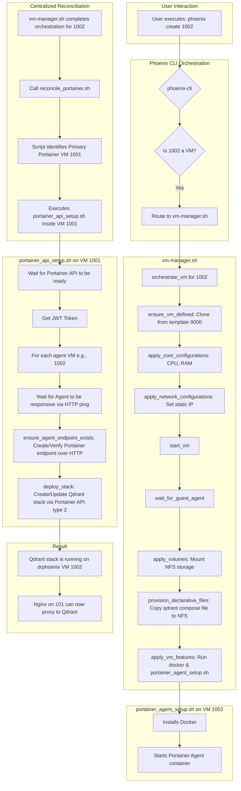

# Thinkheads.AI Documentation

Welcome to the official documentation for the Thinkheads.AI project. This repository contains all of the technical and strategic documentation for the Phoenix Hypervisor, our automated platform for AI/ML/DL development and deployment.

## Project Overview

The Thinkheads.AI project is a comprehensive platform for building, testing, and deploying AI-driven applications. It is built on a foundation of open-source technologies and is designed to be a showcase of modern AI/ML/DL best practices.

## Phoenix Hypervisor

The Phoenix Hypervisor is the core of the Thinkheads.AI project. It is a Proxmox-based virtualization platform that is fully automated and managed by a declarative, configuration-driven orchestration system. The Phoenix Hypervisor is designed to be:

*   **Idempotent:** The orchestration scripts can be run multiple times without changing the result beyond the initial application.
*   **Modular:** The system is composed of a series of modular, single-purpose scripts that are easy to extend and maintain.
*   **Scalable:** The platform is designed to scale to support a growing number of containers and a variety of use cases.
*   **Secure:** The system is secured with a multi-layered security approach that includes AppArmor, firewalls, and unprivileged containers.

## Documentation Structure

The documentation is organized into the following sections:

*   **`00_corporate_strategy`:** High-level corporate strategy documents.
*   **`01_product_and_project_strategy`:** Product and project-level strategy documents.
*   **`02_technical_strategy_and_architecture`:** Detailed technical strategy and architecture documents for the Phoenix Hypervisor.
*   **`03_phoenix_hypervisor_implementation`:** Implementation details and guides for the Phoenix Hypervisor.

## Getting Started

To get started with the Phoenix Hypervisor, please refer to the following documents:

*   **`02_technical_strategy_and_architecture/00_technical_vision.md`:** An overview of the technical vision for the project.
*   **`02_technical_strategy_and_architecture/01_architectural_principles.md`:** The architectural principles that guide the project.
*   **`02_technical_strategy_and_architecture/02_technology_stack.md`:** A detailed breakdown of the technology stack.
*   **`03_phoenix_hypervisor_implementation/00_guides/00_getting_started.md`:** A guide to getting started with the Phoenix Hypervisor.
# Declarative Stack Management Plan

This document outlines the refactored workflow for deploying Docker stacks in a declarative and idempotent manner using the Phoenix Hypervisor system.

## Architecture Diagram

The following Mermaid diagram illustrates the improved orchestration flow, ensuring robust and reliable stack deployment.

## Key Improvements

1.  **Centralized Reconciliation**: The `reconcile_portainer.sh` script is now called as the final step in the `vm-manager.sh`'s `create` workflow. This prevents race conditions by ensuring that the Portainer primary server only attempts to configure agents and stacks *after* they have been fully provisioned.
2.  **Robust API Interaction**: The `portainer_api_setup.sh` script now includes wait/retry loops to confirm that both the Portainer server API (via `localhost`) and the remote agent endpoints (via HTTP ping) are responsive before attempting to communicate with them.
3.  **Corrected Agent Communication**: The system now correctly uses HTTP to communicate with the Portainer agent, resolving the TLS mismatch that was causing endpoint creation to fail.
4.  **Idempotent Operations**: The logic for creating and updating Portainer endpoints and stacks has been improved to be fully idempotent, allowing the `phoenix converge` command to work reliably.
4.  **Clear Separation of Concerns**: The workflow maintains a clear separation of responsibilities, with each script handling a specific part of the process, making the system easier to maintain and debug.