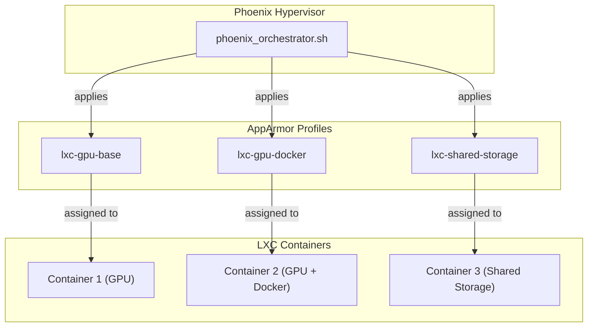

# AppArmor Implementation Analysis Report

## 1. Overview

This report provides a comprehensive analysis of the current AppArmor implementation within the `phoenix_hypervisor` project. The analysis covers the AppArmor-related logic in the `phoenix_orchestrator.sh` script, the AppArmor setup process, and the existing AppArmor profiles.

## 2. Key Findings

### 2.1. AppArmor Orchestration

The `phoenix_orchestrator.sh` script orchestrates the AppArmor setup and configuration through two key functions:

*   **`setup_hypervisor`**: This function executes the `hypervisor_feature_setup_apparmor.sh` script, which deploys all custom AppArmor profiles to the system's `/etc/apparmor.d/` directory.
*   **`apply_configurations`**: This function applies an `apparmor_profile` to each container based on its configuration in the `phoenix_lxc_configs.json` file.

### 2.2. AppArmor Setup

The `hypervisor_feature_setup_apparmor.sh` script is responsible for deploying the custom AppArmor profiles. It copies all profiles from `/usr/local/phoenix_hypervisor/etc/apparmor/` to `/etc/apparmor.d/` and reloads the AppArmor service if any changes are detected.

### 2.3. AppArmor Profiles

The system uses three custom AppArmor profiles:

*   **`lxc-nvidia-gpu-base`**: This profile is designed for LXC containers that require access to NVIDIA GPUs. It includes base container abstractions and allows read/write/map access to NVIDIA device files.
*   **`lxc-nvidia-gpu-docker`**: This profile is designed for LXC containers that require access to both NVIDIA GPUs and Docker. It is not currently used in any of the LXC configurations.
*   **`lxc-phoenix-nvidia-gpu`**: This profile is a more comprehensive profile that includes rules for NVIDIA GPUs, as well as various mount points and device files. It is not currently used in any of the LXC configurations.

### 2.4. Profile Assignment

The `apparmor_profile` is assigned to each container in the `phoenix_lxc_configs.json` file. The following profiles are currently in use:

*   **`lxc-nvidia-gpu-base`**: Assigned to containers that require access to NVIDIA GPUs.
*   **`lxc-nvidia-gpu-docker`**: Assigned to containers that require access to both NVIDIA GPUs and Docker.
*   **`unconfined`**: Assigned to containers that do not require any specific AppArmor restrictions.

## 3. Analysis of the "Major Shift"

The recent "major shift" in AppArmor handling is a proactive effort to replace a suboptimal implementation with a more robust solution that better handles GPU, Docker, and shared storage requirements. The current implementation has the following shortcomings:

*   **Lack of Granularity**: The existing profiles are too broad and do not provide granular control over container permissions.
*   **Inconsistent Profile Usage**: The `lxc-nvidia-gpu-docker` and `lxc-phoenix-nvidia-gpu` profiles are not currently used, which suggests that the AppArmor implementation is not being fully utilized.
*   **No Shared Storage Support**: The existing profiles do not include any rules for shared storage, which is a key requirement for the new AppArmor implementation.

## 4. Strategic Plan

To align the system with the new AppArmor handling procedures, I propose the following strategic plan:

1.  **Develop New AppArmor Profiles**: Create new AppArmor profiles that are tailored to the specific needs of each container. These profiles should be more restrictive than the existing profiles and should include rules for GPU, Docker, and shared storage.
2.  **Implement a Centralized Profile Management System**: To ensure consistency and simplify profile management, I recommend implementing a centralized system for managing AppArmor profiles. This could be a simple Git repository or a more sophisticated system like Ansible or Puppet.
3.  **Update the `phoenix_orchestrator.sh` Script**: The `phoenix_orchestrator.sh` script will need to be updated to support the new AppArmor profiles and the centralized profile management system.
4.  **Test and Deploy**: Once the new AppArmor implementation is in place, it will need to be thoroughly tested to ensure that it is working as expected. After testing, the new implementation can be deployed to the production environment.

## 5. Proposed AppArmor Architecture

I will create a Mermaid diagram to visualize the proposed AppArmor architecture in the next step.
