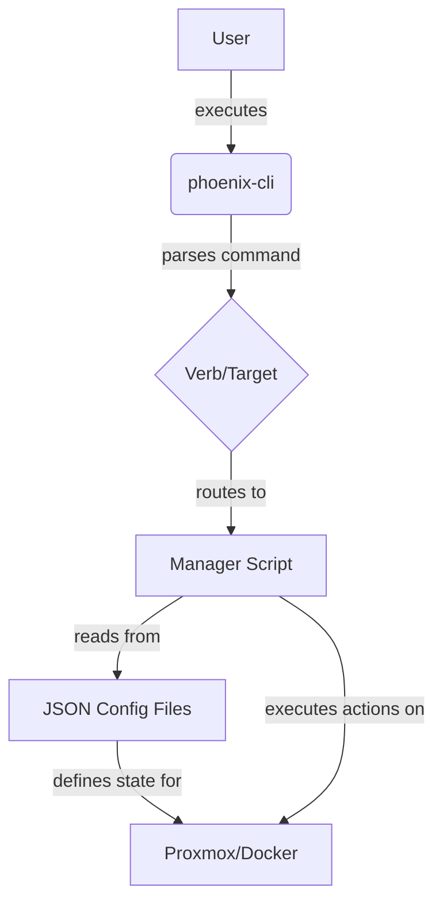

# Phoenix Hypervisor CLI Architecture Overview

This document provides a high-level overview of the Phoenix Hypervisor CLI, detailing how its components interact to manage the hypervisor environment.

## Core Components

The system is comprised of three main types of components:

1.  **Dispatcher (`phoenix-cli`)**: The single entry point for all commands.
2.  **Manager Scripts**: A collection of scripts, each responsible for a specific domain (e.g., LXC, VM, Swarm).
3.  **Configuration Files**: A set of JSON files that define the desired state of the system.

## Workflow

The following diagram illustrates the typical workflow when a command is executed:

1.  A **User** executes a command using the `phoenix-cli` script (e.g., `phoenix create 101`).
2.  The **`phoenix-cli`** script acts as a **dispatcher**. It parses the command to identify the action (verb) and the target (e.g., a VM or LXC ID).
3.  Based on the verb and target, the dispatcher routes the command to the appropriate **Manager Script**. For example, a command targeting an LXC container is routed to `lxc-manager.sh`.
4.  The **Manager Script** reads the relevant **JSON Configuration Files** to get the specific parameters for the target (e.g., memory, CPU, network settings).
5.  The manager script then executes the necessary commands (e.g., `pct`, `qm`, `docker`) to bring the system to the desired state as defined in the configuration files.

This architecture creates a declarative, idempotent system where the JSON files represent the single source of truth for the entire environment.
