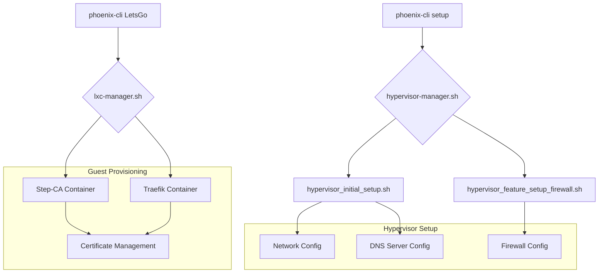

# Phoenix Hypervisor Configuration Summary

This document provides a comprehensive overview of how the `phoenix-cli` tool, through its `setup` and `LetsGo` commands, configures the network, DNS, firewall, and certificate management for the Phoenix Hypervisor environment. The entire process is declarative, idempotent, and driven by a set of central JSON configuration files.

## I. The Orchestration Flow

The orchestration is initiated by the `phoenix-cli` script and follows a clear, logical sequence. The `setup` command configures the hypervisor itself, while the `LetsGo` command provisions and starts the guest containers and VMs.

## II. Network Configuration

-   **Orchestrator:** `hypervisor_initial_setup.sh`
-   **Source of Truth:** `network` object in `phoenix_hypervisor_config.json`
-   **Process:**
    1.  **Static IP:** A static IP address, gateway, and DNS servers are configured for the hypervisor's primary bridge (`vmbr0`).
    2.  **Hostname:** The system's hostname is set.
    3.  **Local DNS:** `/etc/hosts` and `/etc/resolv.conf` are updated to ensure consistent local DNS resolution.

## III. DNS Configuration

-   **Orchestrator:** `hypervisor_feature_setup_dns_server.sh`
-   **Technology:** `dnsmasq` on the Proxmox host.
-   **Process:**
    1.  **Dynamic Configuration:** A `dnsmasq` configuration file is generated dynamically.
    2.  **Record Generation:** DNS records are created by parsing the `dns_records` from both `phoenix_vm_configs.json` and `phoenix_lxc_configs.json`.
    3.  **Service Discovery:** A static record is created for the internal Certificate Authority (`ca.internal.thinkheads.ai`), pointing to the `Step-CA` container.
    4.  **Upstream DNS:** Google's public DNS is used for external queries.

## IV. Firewall Configuration

-   **Orchestrator:** `hypervisor_feature_setup_firewall.sh`
-   **Source of Truth:** `firewall` object in `phoenix_hypervisor_config.json`
-   **Process:**
    1.  **Declarative Ruleset:** A complete firewall ruleset is generated from the `global_firewall_rules` array.
    2.  **Centralized Application:** The generated rules are applied to the Proxmox cluster firewall at `/etc/pve/firewall/cluster.fw`.
    3.  **Service Restart:** The `pve-firewall` service is restarted to apply the new configuration.

## V. Certificate Management

-   **Core Technology:** Smallstep CA, running in a dedicated LXC container (CTID `103`).
-   **Process:**
    1.  **Dedicated CA:** The `Step-CA` container is provisioned to act as the internal Certificate Authority.
    2.  **Shared Storage:** SSL certificates are stored on a shared ZFS volume, which is mounted into containers that require them.
    3.  **Automated Trust:** The `trusted_ca` feature installs the root CA certificate into the trust stores of other containers, enabling seamless and secure inter-service communication.
    4.  **Reverse Proxy Integration:** The `Traefik-Internal` container (CTID `102`) is configured to automatically manage certificates for the internal services it exposes, likely handling issuance and renewal from the `Step-CA`.

This architecture provides a robust, automated, and centrally managed system for configuring the core infrastructure of your hypervisor environment.