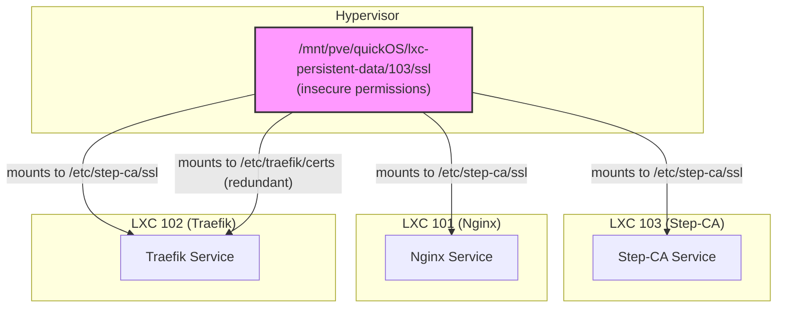

# Step-CA Integration Assessment

## 1. Overview

This document provides a detailed assessment of the current Step-CA integration within the Phoenix Hypervisor environment. The investigation was prompted by concerns about recent changes that have led to issues with permissions and an overly complex folder structure. This assessment identifies the root causes of these issues and lays the groundwork for a remediation plan.

## 2. Core Architectural Issues

The investigation has revealed several core architectural issues that are contributing to the current problems:

### 2.1. Centralized SSL Directory and Tight Coupling

The entire Step-CA integration hinges on a single shared directory on the hypervisor: `/mnt/pve/quickOS/lxc-persistent-data/103/ssl`. This directory is mounted into three different containers (101, 102, and 103), creating a tight coupling that is a single point of failure.

*   **Fragility:** Any issue with this directory, such as incorrect permissions or a failed mount, will cause a cascading failure across all three containers.
*   **Lack of Isolation:** The containers are not properly isolated from each other. A process in one container could potentially interfere with the SSL assets of another.

### 2.2. Insecure File Permissions

The `lxc-manager.sh` script sets the ownership of the shared SSL directory to `nobody:nogroup` and gives read access to all users (`chmod -R a+r`). This is a significant security vulnerability:

*   **Exposure of Sensitive Data:** The CA's private keys, provisioner passwords, and other sensitive materials are exposed to any user or process on the hypervisor that can access the mount point.
*   **Violation of Least Privilege:** This approach violates the principle of least privilege, which dictates that a process should only have access to the resources it absolutely needs.

### 2.3. Redundant and Confusing Configuration

The Traefik container (102) has two mount points for the same shared SSL directory: one at `/etc/step-ca/ssl` and another at `/etc/traefik/certs`. This is unnecessary and adds complexity to the configuration, making it harder to understand and maintain.

## 3. Workflow and Idempotency Issues

The current workflow for certificate management is fragile and not fully idempotent:

*   **Dependency on Startup Order:** The system relies on a specific startup order: the Step-CA container (103) must start first and generate its certificates before the Nginx (101) and Traefik (102) containers can start. This makes the system brittle and difficult to manage.
*   **Lack of Automatic Remediation:** If the CA container is recreated, the other containers will not automatically trust the new CA or obtain new certificates without being manually restarted.

## 4. Mermaid Diagram of Current State

The following diagram illustrates the problematic architecture:

## 5. Conclusion

The current `step-ca` integration is overly complex, insecure, and fragile. The reliance on a single, insecurely permissioned shared directory is the primary source of the issues. The workflow is not robust and lacks the idempotency required for a reliable system.

The next step is to formulate a remediation plan that addresses these core issues.