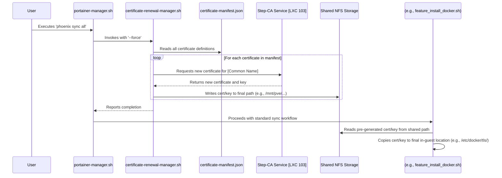

# Certificate Lifecycle Overhaul Plan

This document outlines the plan to refactor the certificate management system within the Phoenix Hypervisor project. The goal is to move from a decentralized, error-prone process to a centralized, idempotent, and manifest-driven workflow.

## Proposed Architecture

The new architecture designates the `certificate-renewal-manager.sh` as the single source of truth for all certificate generation and renewal operations. All other scripts will consume the certificates from a well-defined location on the shared NFS storage.

### Mermaid Diagram: New Certificate Workflow

This diagram illustrates the clear separation of concerns:

*   **`certificate-renewal-manager.sh`**: The single authority for certificate generation.
*   **`certificate-manifest.json`**: The declarative source of truth for all certificates.
*   **NFS Storage**: The central, reliable distribution point for all certificates.
*   **Feature Scripts**: Consumers of the certificates, responsible only for their placement.

This new model will resolve the current race conditions and ensure that certificates are always available when and where they are needed.

## Implementation Plan

This plan is divided into two phases. Phase 1 is the immediate hotfix to get the system operational. Phase 2 is the strategic refactoring to implement the new, centralized architecture.

### Phase 1: Immediate Hotfix

1.  **Apply Tactical Fix to `feature_install_docker.sh`**:
    *   Modify `usr/local/phoenix_hypervisor/bin/vm_features/feature_install_docker.sh`.
    *   After the `step ca certificate` command successfully generates the Docker daemon's TLS certificate to the local `/etc/docker/tls/` directory, add a new block of code.
    *   This new block will copy the `cert.pem`, `key.pem`, and `ca.pem` files from `/etc/docker/tls/` to the shared NFS path at `/mnt/persistent/docker/certs/`.
    *   This will ensure that the `feature_install_docker_proxy.sh` script can find the certificates it needs to proceed.

### Phase 2: Strategic Refactoring

1.  **Modify `portainer-manager.sh`**:
    *   Edit the `sync_all` function in `usr/local/phoenix_hypervisor/bin/managers/portainer-manager.sh`.
    *   Make the very first action in this function a call to the `certificate-renewal-manager.sh` script with the `--force` flag. This ensures that all certificates defined in the manifest are generated and placed in their final destinations *before* any other part of the system needs them.

2.  **Refactor `feature_install_docker.sh`**:
    *   Remove the entire certificate generation block from this script (the `step ca certificate` command and all associated logic).
    *   Also remove the hotfix code added in Phase 1.
    *   Replace this logic with a simple `cp` command that copies the *pre-generated* certificate from the shared NFS path (`/mnt/persistent/docker/certs/server-cert.pem`) to the local in-guest path (`/etc/docker/tls/cert.pem`).

3.  **Refactor All Other Feature Scripts**:
    *   Systematically go through all other feature scripts in `usr/local/phoenix_hypervisor/bin/vm_features/` and `usr/local/phoenix_hypervisor/bin/lxc_setup/`.
    *   Remove any logic that generates certificates.
    *   Replace it with logic that copies the pre-generated certificates from their manifest-defined locations on the shared NFS storage.

4.  **Verify `certificate-renewal-manager.sh`**:
    *   Ensure the `certificate-renewal-manager.sh` is robust and correctly handles all certificate definitions in the manifest, including creating the necessary directory paths.

By executing this plan, we will create a system that is not only functional but also more robust, maintainable, and easier to debug in the future.