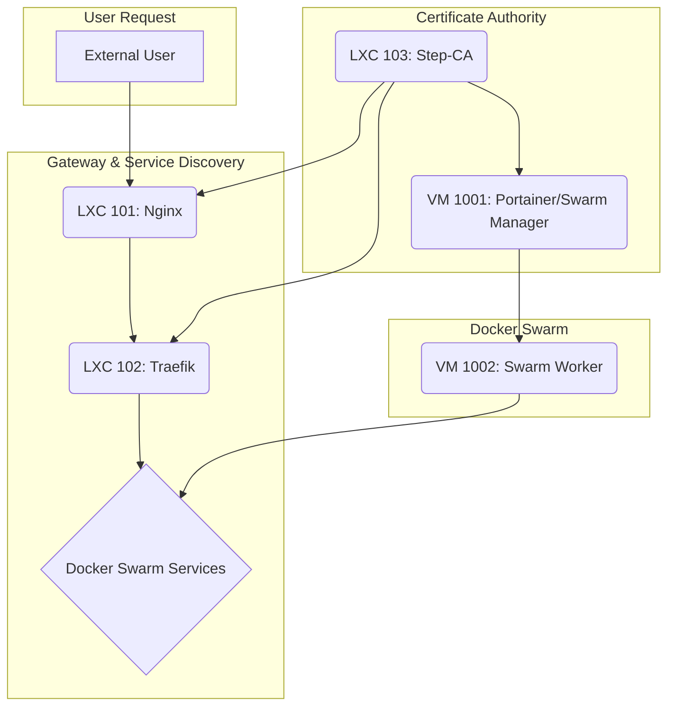

# Phoenix Infrastructure Component Overview

This document outlines the roles and interactions of the core components within the Phoenix Hypervisor infrastructure.

## Core Components

| ID   | Name             | Type | Purpose                               |
| ---- | ---------------- | ---- | ------------------------------------- |
| 101  | Nginx-Phoenix    | LXC  | External gateway and reverse proxy    |
| 102  | Traefik-Internal | LXC  | Internal service discovery and proxy  |
| 103  | Step-CA          | LXC  | Internal Certificate Authority        |
| 1001 | Portainer        | VM   | Docker Swarm manager & Portainer UI   |
| 1002 | drphoenix        | VM   | Docker Swarm worker & Portainer agent |

## Interactions

The components work together to provide a secure, dynamic, and manageable environment for running containerized applications.

1.  **External Traffic**: All incoming traffic first hits **LXC 101 (Nginx)**, which acts as the primary gateway. It handles SSL termination and forwards requests to the internal network.
2.  **Internal Routing**: Nginx forwards requests to **LXC 102 (Traefik)**, which is responsible for dynamic service discovery. Traefik automatically discovers and routes traffic to the appropriate Docker Swarm services.
3.  **Certificate Management**: **LXC 103 (Step-CA)** provides automated TLS certificate management for all internal services, ensuring secure communication throughout the environment.
4.  **Container Orchestration**: **VM 1001 (Portainer)** serves as the Docker Swarm manager, orchestrating the deployment and scaling of services. **VM 1002 (drphoenix)** is a worker node that runs the actual application containers.

In essence, **Phoenix** is a declarative, GitOps-style framework for managing a complete Proxmox-based hypervisor environment, from network and storage configuration to automated deployment of containerized applications.
