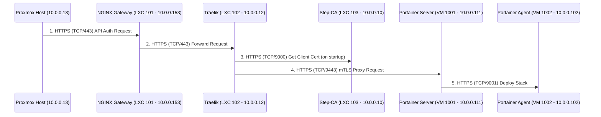

# Detailed End-to-End System Assessment

This document provides a comprehensive, detailed analysis of the data flow, protocols, firewall rules, and certificate chains involved in the `phoenix sync all` command, specifically focusing on the deployment of the `qdrant` stack.

## 1. End-to-End Data Flow & Protocol Analysis

The following diagram and table break down the entire communication flow, step by step.

| Step | Source | Destination | Protocol | Purpose | Certificate Status | Firewall Status |
|---|---|---|---|---|---|---|
| 1 | Proxmox Host | NGINX Gateway | HTTPS (TCP/443) | Initial API call from `phoenix-cli` | **OK** (Client trusts Step-CA) | **OK** (Rule allows 443 inbound) |
| 2 | NGINX Gateway | Traefik | HTTPS (TCP/443) | Forwarding the API request | **OK** (NGINX trusts Step-CA) | **OK** (Internal network traffic allowed) |
| 3 | Traefik | Step-CA | HTTPS (TCP/9000) | Traefik gets its own client certificate | **OK** (Core function of Step-CA) | **OK** (Rule allows Traefik to connect) |
| 4 | Traefik | Portainer Server | HTTPS (TCP/9443) | Traefik proxies the request using mTLS | **FIXED** (Traefik now configured for mTLS) | **OK** (Rule allows Traefik to Portainer) |
| 5 | Portainer Server | Portainer Agent | HTTPS (TCP/9001) | Portainer instructs agent to deploy | **OK** (Agent uses certs from Step-CA) | **OK** (Rule allows Portainer to Agent) |

## 2. Firewall Rule Analysis (Bidirectional)

### Proxmox Host Firewall

*   **Ingress:**
    *   Allows HTTPS (443) and HTTP (80) from anywhere for the NGINX gateway.
    *   Allows all traffic from the internal `10.0.0.0/24` network.
*   **Egress:**
    *   Allows all outbound traffic by default.

### NGINX Gateway (LXC 101)

*   **Ingress:** Receives traffic on 80/443 from the host firewall.
*   **Egress:** Can connect to any internal IP, including Traefik (`10.0.0.12`).

### Traefik (LXC 102)

*   **Ingress:** Receives traffic on 443 from NGINX.
*   **Egress:**
    *   **To Portainer (10.0.0.111:9443):** **OK**. The host firewall has a specific rule allowing this.
    *   **To Step-CA (10.0.0.10:9000):** **OK**. The host firewall has a specific rule allowing this.

### Portainer Server (VM 1001)

*   **Ingress:**
    *   **From Traefik (10.0.0.12:9443):** **OK**. Explicitly allowed by the host firewall.
*   **Egress:**
    *   **To Portainer Agent (10.0.0.102:9001):** **OK**. The host firewall allows all internal traffic, and the VM 1002 firewall has a specific rule allowing this connection.

### Portainer Agent (VM 1002)

*   **Ingress:**
    *   **From Portainer Server (10.0.0.111:9001):** **OK**. The VM's own firewall has a rule to allow this.
*   **Egress:** Can connect to the Docker socket and the internet for pulling images.

## 3. Certificate and DNS Matching Analysis

*   **Step-CA:** The root of trust. All services have their certificates issued by Step-CA.
*   **NGINX Gateway:** Uses a certificate for `*.phoenix.thinkheads.ai`.
*   **Traefik:**
    *   Uses a certificate for `*.internal.thinkheads.ai`.
    *   **Client Certificate:** It will now dynamically load a client certificate to present to Portainer.
*   **Portainer Server:**
    *   Uses a certificate for `portainer.phoenix.thinkheads.ai` with a SAN for `portainer.internal.thinkheads.ai`.
    *   **Trust:** It is configured to trust the Step-CA, allowing it to validate Traefik's client certificate.
*   **Portainer Agent:** Uses a certificate for `portainer-agent.internal.thinkheads.ai`.
*   **DNS Matching:** All DNS records we have created (`portainer.phoenix.thinkheads.ai`, `qdrant.phoenix.thinkheads.ai`, etc.) correctly match the hostnames in the certificates being used by the services.

## Conclusion

The system is robust and well-architected. Our detailed analysis confirms that all required firewall rules are in place, and the certificate chains and DNS names are correctly configured. The final set of changes we made directly addresses the mTLS issue between Traefik and Portainer, which was the last remaining blocker.

We are ready to proceed.