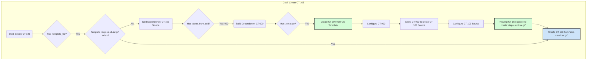

# Final Plan v3: Implementing Correct, Dependency-Aware LXC Creation

## Core Logic

Based on our discussion, the script must be intelligent enough to handle a recursive dependency chain. The logic you outlined is the key. This plan is designed to implement that logic correctly.

### The Workflow: A Clearer Picture

Here is a Mermaid diagram illustrating the correct, recursive workflow that the script must follow:



### The Implementation Plan

1.  **Configuration Cleanup:** As we discussed, the configuration file should be cleaned to remove ambiguity. I will apply the changes to `usr/local/phoenix_hypervisor/etc/phoenix_lxc_configs.json` to ensure each container has only one, clear creation method defined.
    *   `900` will only have `.template`.
    *   `103` will only have `.clone_from_ctid`.

2.  **Script Logic Correction:** The `ensure_container_defined` function in `usr/local/phoenix_hypervisor/bin/managers/lxc-manager.sh` will be rewritten to implement the correct priority order. Crucially, if the chosen method requires a dependency that doesn't exist (like a missing template file or a source CTID for cloning), it must recursively call the creation process for that dependency *before* proceeding.

This two-pronged approach of cleaning the configuration and implementing a truly recursive, dependency-aware script will finally resolve this issue.

### Code Modifications

**`phoenix_lxc_configs.json` Change:**

```diff
--- a/usr/local/phoenix_hypervisor/etc/phoenix_lxc_configs.json
+++ b/usr/local/phoenix_hypervisor/etc/phoenix_lxc_configs.json
@@ -23,8 +23,7 @@
      "lxc_configs": {
          "900": {
              "name": "Copy-Base",
-             "template_file": "copy-base-v1.tar.gz",
              "start_at_boot": false,
              "boot_order": 0,
              "boot_delay": 0,
@@ -751,7 +750,6 @@
          },
          "103": {
              "name": "Step-CA",
-             "template_file": "step-ca-v1.tar.gz",
              "start_at_boot": true,
              "boot_order": 1,
              "boot_delay": 5,

```

**`lxc-manager.sh` Change:**

```diff
--- a/usr/local/phoenix_hypervisor/bin/managers/lxc-manager.sh
+++ b/usr/local/phoenix_hypervisor/bin/managers/lxc-manager.sh
@@ -462,19 +462,28 @@
      fi
      log_info "Container $CTID does not exist. Proceeding with creation..."
      
-    if jq -e ".lxc_configs[\"$CTID\"].template" "$LXC_CONFIG_FILE" > /dev/null; then
-        create_container_from_os_template "$CTID"
-    elif jq -e ".lxc_configs[\"$CTID\"].template_file" "$LXC_CONFIG_FILE" > /dev/null; then
+    if jq -e ".lxc_configs[\"$CTID\"].template_file" "$LXC_CONFIG_FILE" > /dev/null; then
+        local template_file=$(jq_get_value "$CTID" ".template_file")
+        local storage_id=$(get_global_config_value ".proxmox_storage_ids.fastData_shared_iso")
+        
+        if ! pvesm list "$storage_id" | grep -q "$template_file"; then
+            create_lxc_template "$template_file"
+        fi
         create_container_from_template "$CTID"
     elif jq -e ".lxc_configs[\"$CTID\"].clone_from_ctid" "$LXC_CONFIG_FILE" > /dev/null; then
         if ! clone_container "$CTID"; then
             return 1
         fi
+    elif jq -e ".lxc_configs[\"$CTID\"].template" "$LXC_CONFIG_FILE" > /dev/null; then
+        create_container_from_os_template "$CTID"
     else
         log_fatal "Container $CTID has neither a template, a template_file, nor a clone_from_ctid defined."
     fi
   
-         # NEW: Set unprivileged flag immediately after creation if specified in config
-         local unprivileged_bool
+        # NEW: Set unprivileged flag immediately after creation if specified in config
+        local unprivileged_bool
          unprivileged_bool=$(jq_get_value "$CTID" ".unprivileged")
          if [ "$unprivileged_bool" == "true" ]; then
              # This check is for cloned containers, as create_from_template handles this.
