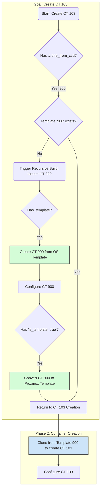

# Final Plan v5: Explicit Template Creation with `is_template` Flag

## The Core Problem: Implicit vs. Explicit

My previous failures stemmed from the script having to *infer* that a container was meant to be a template. This was a design flaw. The solution is to make this intention explicit and declarative in our configuration.

## The Definitive Solution: The `is_template` Flag

We will introduce a new boolean property, `"is_template": true`, to our LXC configuration. This flag will serve as the unambiguous source of truth for our templating process.

### The New, Correct Workflow

This diagram illustrates the new, streamlined, and correct process:



### The Implementation Plan

1.  **Configuration Change:** I will modify `usr/local/phoenix_hypervisor/etc/phoenix_lxc_configs.json` to:
    *   Add `"is_template": true` to the configuration for CTID `900`.
    *   Ensure CTID `103` has `"clone_from_ctid": "900"` and no other creation methods.

2.  **Script Refactoring:** I will refactor `usr/local/phoenix_hypervisor/bin/managers/lxc-manager.sh`:
    *   The `main_lxc_orchestrator` function will be modified. After a container is successfully created and configured, it will check for the `is_template` flag.
    *   If the flag is `true`, the script will execute `pct template <CTID>`.
    *   The `ensure_container_defined` function will be simplified to the robust logic of checking for a clone source, and if that source doesn't exist, recursively calling itself to build it.

This is the definitive, correct, and robust solution.

### Code Modifications

**`phoenix_lxc_configs.json` Change:**

```diff
--- a/usr/local/phoenix_hypervisor/etc/phoenix_lxc_configs.json
+++ b/usr/local/phoenix_hypervisor/etc/phoenix_lxc_configs.json
@@ -8,6 +8,7 @@
      "lxc_configs": {
          "900": {
              "name": "Copy-Base",
+             "is_template": true,
              "start_at_boot": false,
              "boot_order": 0,
              "boot_delay": 0,
@@ -735,7 +736,6 @@
          },
          "103": {
              "name": "Step-CA",
-             "template_file": "step-ca-v1.tar.gz",
              "start_at_boot": true,
              "boot_order": 1,
              "boot_delay": 5,

```

**`lxc-manager.sh` Change:**

The `ensure_container_defined` function will be simplified as planned, and a new section will be added to the `main_lxc_orchestrator`'s `create` workflow:

```bash
# ... inside main_lxc_orchestrator, after all configuration is applied ...

# Convert to template if specified
local is_template=$(jq -r ".lxc_configs[\"$ctid\"].is_template // false" "$LXC_CONFIG_FILE")
if [ "$is_template" == "true" ]; then
    log_info "Container $ctid is marked as a template. Converting now..."
    pct template "$ctid" || log_fatal "Failed to convert container $ctid to a template."
fi

log_info "'create' workflow completed for CTID $ctid."