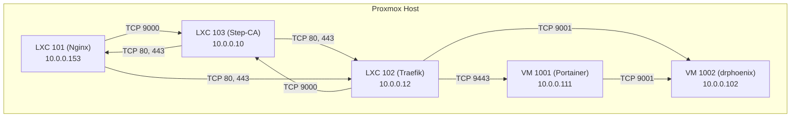

# Firewall and Network Analysis

## 1. Container and VM IP Addresses

*   **LXC 101 (Nginx):** 10.0.0.153
*   **LXC 102 (Traefik):** 10.0.0.12
*   **LXC 103 (Step-CA):** 10.0.0.10
*   **VM 1001 (Portainer):** 10.0.0.111
*   **VM 1002 (drphoenix):** 10.0.0.102

## 2. Required Communication Paths

Based on the application scripts and configurations, the following communication paths are required for the Step-CA integration and Docker management to function correctly:

*   **LXC 101 (Nginx) -> LXC 103 (Step-CA):** Nginx needs to connect to the Step-CA on port 9000 to obtain certificates.
*   **LXC 102 (Traefik) -> LXC 103 (Step-CA):** Traefik needs to connect to the Step-CA on port 9000 for ACME challenges.
*   **LXC 103 (Step-CA) -> LXC 101 (Nginx):** The Step-CA needs to connect to Nginx on ports 80 and 443 to perform ACME challenges.
*   **LXC 103 (Step-CA) -> LXC 102 (Traefik):** The Step-CA needs to connect to Traefik on ports 80 and 443 to perform ACME challenges.
*   **LXC 101 (Nginx) -> LXC 102 (Traefik):** Nginx acts as a reverse proxy for Traefik, so it needs to be able to connect to it on ports 80 and 443.
*   **LXC 102 (Traefik) -> VM 1001 (Portainer):** Traefik needs to connect to the Portainer UI on port 9443.
*   **LXC 102 (Traefik) -> VM 1002 (drphoenix):** Traefik needs to connect to the Portainer agent on port 9001 for ACME challenges.
*   **VM 1001 (Portainer) -> VM 1002 (drphoenix):** The Portainer server needs to connect to the agent on port 9001.

## 3. Current Firewall Rules

The following is a summary of the current firewall rules as defined in the configuration files:

### LXC 101 (Nginx)

*   **Inbound:**
    *   Allow HTTP (80) from anywhere
    *   Allow HTTPS (443) from anywhere
    *   Allow HTTPS (443) from Portainer VM (10.0.0.111)
    *   Allow ACME challenges from Step-CA (10.0.0.10) on ports 80 and 443
*   **Outbound:**
    *   Allow proxy to Traefik (10.0.0.12) on ports 80 and 443
    *   Allow communication with Step-CA (10.0.0.10) on port 9000

### LXC 102 (Traefik)

*   **Inbound:**
    *   Allow proxy from Nginx (10.0.0.153) on ports 80, 443, and 8443
    *   Allow ACME challenges from Step-CA (10.0.0.10) on ports 80 and 443
*   **Outbound:**
    *   Allow DNS queries to CoreDNS (10.0.0.13) on port 53
    *   Allow connection to Portainer API (10.0.0.111) on port 9443
    *   Allow communication with Step-CA (10.0.0.10) on port 9000
    *   Allow proxy to various backend services

### LXC 103 (Step-CA)

*   **Inbound:**
    *   Allow ACME challenges from Traefik (10.0.0.12) on port 9000
    *   Allow Nginx to proxy to Traefik's websecure entrypoint (10.0.0.153) on port 8443
    *   Allow Nginx to connect for certificates (10.0.0.153) on port 9000
*   **Outbound:**
    *   Allow ACME challenges to Nginx (10.0.0.153) on ports 80 and 443

### VM 1001 (Portainer)

*   **Inbound:**
    *   Allow Traefik (10.0.0.12) on port 9443
    *   Allow Proxmox host (10.0.0.13) on port 9443
*   **Outbound:**
    *   Allow access to Nginx gateway (10.0.0.153) on port 443

### VM 1002 (drphoenix)

*   **Inbound:**
    *   Allow Portainer server (10.0.0.111) on port 9001
    *   Allow Proxmox host (10.0.0.13) on port 9001
    *   Allow Traefik (10.0.0.12) on port 9001

## 4. Analysis and Gaps

*   **Missing Outbound Rule for Nginx:** The outbound rule for Nginx to connect to the Step-CA was missing.
*   **Redundant Rule in Step-CA:** The rule allowing Nginx to proxy to Traefik's websecure entrypoint on port 8443 is incorrect.
*   **Incomplete ACME Challenge Rules:** The rules for ACME challenges are not comprehensive.
*   **Missing Outbound Rule for Portainer:** The Portainer VM needs an outbound rule to connect to the agent on VM 1002.

## 5. Proposed Network Diagram

## 6. Next Steps

The next step is to formulate a complete set of firewall rules to address all the identified gaps and then create a new test plan.