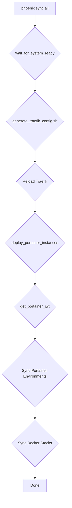

# Phoenix Hypervisor Remediation Plan

This document outlines the necessary steps to resolve the Portainer API health check failure by integrating Portainer with the Traefik internal mesh.

## 1. The Problem

The `portainer-manager.sh` script successfully deploys the Portainer server but does not update the Traefik dynamic configuration. As a result, the NGINX gateway forwards requests for `portainer.phoenix.thinkheads.ai` to Traefik, but Traefik has no routing rule to forward the request to the Portainer container, causing the request to fail.

## 2. The Solution

The solution involves three key steps:
1.  **Create a Centralized Traefik Configuration Generator**: A new script will be created to automatically generate Traefik's `dynamic_conf.yml` based on the services defined in the LXC and VM configuration files.
2.  **Integrate the Generator into the `sync_all` Workflow**: The `portainer-manager.sh` script will be modified to execute the new generator script, ensuring Traefik's configuration is updated whenever the system is synchronized.
3.  **Ensure Traefik Reloads on Configuration Change**: The Traefik service will be configured to automatically detect changes to its configuration file and reload without downtime.

---

## 3. Implementation Details

### Step 1: Create `generate_traefik_config.sh`

A new script, `generate_traefik_config.sh`, will be created in `/usr/local/phoenix_hypervisor/bin/`.

**File: `/usr/local/phoenix_hypervisor/bin/generate_traefik_config.sh`**
```bash
#!/bin/bash
#
# File: generate_traefik_config.sh
# Description: This script dynamically generates the Traefik dynamic configuration file
#              by reading the LXC and VM configuration files. It discovers all services
#              that need to be exposed via Traefik and creates the necessary routers
#              and services.
#

# --- SCRIPT INITIALIZATION ---
SCRIPT_DIR="$(cd "$(dirname "${BASH_SOURCE[0]}")" && pwd)"
PHOENIX_BASE_DIR=$(cd "${SCRIPT_DIR}/.." &> /dev/null && pwd)
source "$SCRIPT_DIR/phoenix_hypervisor_common_utils.sh"

# --- CONFIGURATION ---
LXC_CONFIG_FILE="${PHOENIX_BASE_DIR}/etc/phoenix_lxc_configs.json"
VM_CONFIG_FILE="${PHOENIX_BASE_DIR}/etc/phoenix_vm_configs.json"
OUTPUT_FILE="${PHOENIX_BASE_DIR}/etc/traefik/dynamic_conf.yml"
DOMAIN_NAME=$(get_global_config_value '.domain_name')
INTERNAL_DOMAIN_NAME="internal.${DOMAIN_NAME}"

# --- MAIN LOGIC ---
main() {
    log_info "--- Starting Traefik Dynamic Configuration Generation ---"

    # Start with a clean slate
    > "$OUTPUT_FILE"

    # Begin the YAML structure
    echo "http:" >> "$OUTPUT_FILE"
    echo "  routers:" >> "$OUTPUT_FILE"

    # --- Process VMs for Traefik Routers ---
    jq -c '.vms[] | select(.portainer_role == "primary")' "$VM_CONFIG_FILE" | while read -r vm; do
        local vm_name=$(echo "$vm" | jq -r '.name')
        local vm_ip=$(echo "$vm" | jq -r '.network_config.ip' | cut -d'/' -f1)
        local portainer_hostname=$(get_global_config_value '.portainer_api.portainer_hostname')
        local portainer_port=$(get_global_config_value '.network.portainer_server_port')

        log_info "Generating Traefik router for Portainer VM: ${vm_name}"
        cat <<-EOF >> "$OUTPUT_FILE"
    portainer-router:
      rule: "Host(\`${portainer_hostname}\`)"
      service: "portainer-service"
      entryPoints:
        - websecure
      tls:
        certResolver: myresolver
EOF
    done

    # --- Process LXCs for Traefik Routers ---
    jq -c '.lxc_configs | to_entries[] | .value | select(.ports != null)' "$LXC_CONFIG_FILE" | while read -r lxc; do
        local lxc_name=$(echo "$lxc" | jq -r '.name')
        local lxc_ip=$(echo "$lxc" | jq -r '.network_config.ip' | cut -d'/' -f1)
        local service_port=$(echo "$lxc" | jq -r '.ports[0]' | cut -d':' -f2) # Assumes first port is the service port

        log_info "Generating Traefik router for LXC: ${lxc_name}"
        cat <<-EOF >> "$OUTPUT_FILE"
    ${lxc_name}-router:
      rule: "Host(\`${lxc_name}.${INTERNAL_DOMAIN_NAME}\`)"
      service: "${lxc_name}-service"
      entryPoints:
        - websecure
      tls:
        certResolver: myresolver
EOF
    done

    # --- Add Services ---
    echo "" >> "$OUTPUT_FILE"
    echo "  services:" >> "$OUTPUT_FILE"

    # --- Process VMs for Traefik Services ---
    jq -c '.vms[] | select(.portainer_role == "primary")' "$VM_CONFIG_FILE" | while read -r vm; do
        local vm_ip=$(echo "$vm" | jq -r '.network_config.ip' | cut -d'/' -f1)
        local portainer_port=$(get_global_config_value '.network.portainer_server_port')

        log_info "Generating Traefik service for Portainer VM"
        cat <<-EOF >> "$OUTPUT_FILE"
    portainer-service:
      loadBalancer:
        servers:
          - url: "https://_vm_ip_:${portainer_port}"
        passHostHeader: true
EOF
        # Use sed to replace the placeholder IP to avoid shell interpretation issues
        sed -i "s|_vm_ip_|${vm_ip}|g" "$OUTPUT_FILE"
    done

    # --- Process LXCs for Traefik Services ---
    jq -c '.lxc_configs | to_entries[] | .value | select(.ports != null)' "$LXC_CONFIG_FILE" | while read -r lxc; do
        local lxc_name=$(echo "$lxc" | jq -r '.name')
        local lxc_ip=$(echo "$lxc" | jq -r '.network_config.ip' | cut -d'/' -f1)
        local service_port=$(echo "$lxc" | jq -r '.ports[0]' | cut -d':' -f2)

        log_info "Generating Traefik service for LXC: ${lxc_name}"
        cat <<-EOF >> "$OUTPUT_FILE"
    ${lxc_name}-service:
      loadBalancer:
        servers:
          - url: "http://_lxc_ip_:${service_port}"
EOF
        sed -i "s|_lxc_ip_|${lxc_ip}|g" "$OUTPUT_FILE"
    done

    log_success "Traefik dynamic configuration generated successfully at ${OUTPUT_FILE}"
    # --- Add a final check to ensure the file is not empty ---
    if [ ! -s "$OUTPUT_FILE" ]; then
        log_warn "Generated Traefik config is empty. Writing a placeholder to prevent Traefik from crashing."
        echo "http:" > "$OUTPUT_FILE"
    fi
}

main
```

### Step 2: Integrate into `portainer-manager.sh`

The `portainer-manager.sh` script will be modified to call the new generator script.

**File: `usr/local/phoenix_hypervisor/bin/managers/portainer-manager.sh`**

```diff
<<<<<<< SEARCH
:start_line:534
-------
    fi
    
    local SSL_DIR="/mnt/pve/quickOS/lxc-persistent-data/103/ssl"
    
    # --- BEGIN Single Source of Truth for Intermediate CA ---
=======
    fi

    # --- Generate Traefik dynamic configuration ---
    log_info "Generating Traefik dynamic configuration..."
    if ! "${PHOENIX_BASE_DIR}/bin/generate_traefik_config.sh"; then
        log_fatal "Failed to generate Traefik configuration. Aborting."
        exit 1
    fi
    log_success "Traefik configuration generated. Reloading Traefik service..."
    if ! pct exec 102 -- systemctl reload traefik; then
        log_warn "Failed to reload Traefik service. It may not pick up the new configuration immediately."
    fi
    
    local SSL_DIR="/mnt/pve/quickOS/lxc-persistent-data/103/ssl"
    
    # --- BEGIN Single Source of Truth for Intermediate CA ---
>>>>>>> REPLACE
```

### Step 3: Ensure Traefik Service Reloads

The Traefik service within the `102` LXC container needs a service definition that allows it to be reloaded. This is typically standard for services managed by `systemd`. The command `pct exec 102 -- systemctl reload traefik` assumes a `traefik.service` file exists in the container with a correctly defined `ExecReload` command. If this is not the case, the service file will need to be created or modified.

**Example `traefik.service` file:**
```ini
[Unit]
Description=Traefik Ingress Controller
After=network-online.target
Wants=network-online.target

[Service]
Type=simple
ExecStart=/usr/local/bin/traefik --configfile=/etc/traefik/traefik.yml
ExecReload=/bin/kill -HUP $MAINPID
Restart=always
RestartSec=5

[Install]
WantedBy=multi-user.target
```

---

## 4. Updated Workflow Diagram

This diagram illustrates the updated `sync all` workflow.



This plan provides a complete solution. I am now ready to hand this off for implementation.