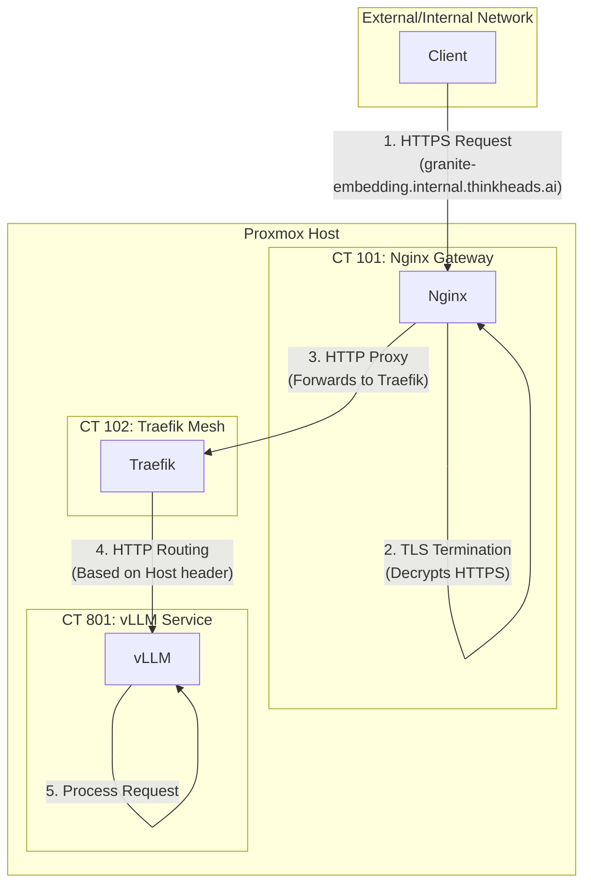

# LXC Service Mesh Traffic Flow

This diagram illustrates the traffic flow from an external or internal client to a vLLM service running in an LXC container.

## Explanation

1.  **Client Request:** An external or internal client sends an HTTPS request to the vLLM service's hostname (e.g., `granite-embedding.internal.thinkheads.ai`).
2.  **Nginx Gateway (CT 101):** Nginx receives the request, terminates the TLS encryption, and acts as the secure entry point to the internal network.
3.  **HTTP Proxy:** Nginx forwards the decrypted HTTP request to the Traefik service mesh.
4.  **Traefik Mesh (CT 102):** Traefik inspects the `Host` header of the request and routes it to the appropriate backend service, in this case, the vLLM container (CT 801).
5.  **vLLM Service (CT 801):** The vLLM container receives the request and processes the OpenAI-compatible API call.

This architecture provides a secure and scalable way to expose your vLLM services. Nginx handles the security, while Traefik provides the flexibility to add and remove services without reconfiguring the gateway.