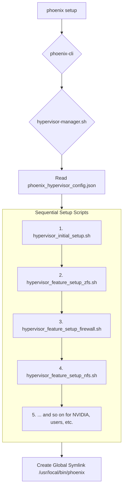
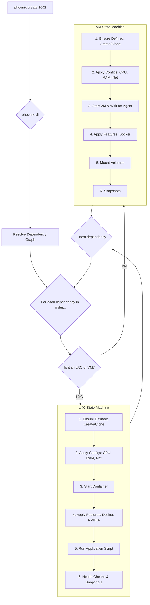
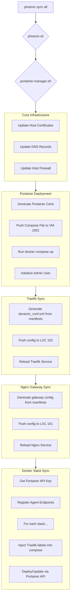

# Phoenix Hypervisor Workflow Documentation

This document provides a comprehensive overview of the refactored Phoenix Hypervisor CLI, detailing the `setup`, `create`, and `sync all` workflows.

## Core Philosophy

The Phoenix CLI is built on the principles of **idempotency** and **declarative configuration**. The system is designed to be driven by a set of JSON configuration files, and the CLI's responsibility is to ensure the live environment's state matches the state declared in these files. This allows for predictable, repeatable, and recoverable deployments.

---

## 1. The `phoenix setup` Workflow

The `phoenix setup` command is the entry point for bootstrapping a new Proxmox host. It's a one-time operation that prepares the hypervisor for guest provisioning.

### Execution Flow

### Key Stages

1.  **Dispatch**: The main `phoenix-cli` script recognizes the `setup` verb and passes control directly to `managers/hypervisor-manager.sh`.
2.  **Configuration**: The `hypervisor-manager.sh` script reads its instructions from `etc/phoenix_hypervisor_config.json`.
3.  **Sequential Execution**: It then executes a hardcoded sequence of scripts from the `bin/hypervisor_setup/` directory. This strict ordering is critical to ensure dependencies are met (e.g., ZFS pools must exist before NFS shares can be created on them).
4.  **Completion**: Once all setup scripts have run successfully, a symbolic link is created, making the `phoenix` command globally available.

---

## 2. The `phoenix create` Workflow

The `phoenix create [targets...]` command is the primary mechanism for creating and provisioning guests (LXC containers and VMs). It is fully idempotent.

### Execution Flow

### Key Stages

1.  **Dependency Resolution**: `phoenix-cli` reads `etc/phoenix_lxc_configs.json` and `etc/phoenix_vm_configs.json` to build a unified dependency graph for the requested targets. It then sorts this graph to determine the correct creation order.
2.  **Target Routing**: For each guest in the sorted list, the CLI determines if it's an LXC or a VM and calls the appropriate manager (`lxc-manager.sh` or `vm-manager.sh`).
3.  **State Machine**: Each manager acts as a state machine, executing a series of steps to bring the guest to its fully configured state. This includes creating the guest, applying hardware and network configurations, starting it, installing features, and running application-specific setup scripts.

---

## 3. The `phoenix sync all` Workflow

The `phoenix sync all` command is a high-level orchestration that harmonizes the entire system's state with the declarative configurations. It's the master command to ensure everything is running and configured correctly.

### Execution Flow

### Key Stages

1.  **Core Sync**: The process begins by synchronizing the foundational services on the Proxmox host itself: renewing certificates, updating DNS, and applying firewall rules.
2.  **Portainer Deployment**: It ensures the Portainer server and agents are deployed and running correctly. This is a prerequisite for the final stage.
3.  **Service Mesh & Gateway**: It dynamically generates configurations for Traefik (the internal service mesh) and Nginx (the external gateway) based on the `traefik_service` definitions found in the various `phoenix.json` stack manifests.
4.  **Stack Synchronization**: The final and most complex stage. It uses the Portainer API to deploy every Docker stack to its designated VM. During this process, it dynamically injects the correct Traefik routing labels into each `docker-compose.yml` file before sending it to the API, ensuring that all services are correctly exposed through the service mesh.

---

## 4. Case Study: Refactoring `phoenix sync all`

The following is a summary of the successful refactoring of the `phoenix sync all` command, which serves as an excellent example of the project's iterative and adaptive development process.

### The Problem: A Flawed Assumption
The core of the issue was a mismatch between our automation (`phoenix-cli`) and our environment. The `phoenix sync all` command was built with the assumption that we were using the Enterprise Edition of Portainer. It was attempting to create secure mTLS endpoints via the Portainer API, a feature that is simply not available in the Community Edition you are running. This caused the synchronization to fail, preventing the automated setup of our Docker environments.

### The Investigation: Understanding the "Why"
Our first step was to dive deep into the codebase. We analyzed the main `phoenix-cli` dispatcher, the `portainer-manager.sh` script responsible for the faulty logic, and the underlying `vm-manager.sh` that executes commands within the guest VMs. This confirmed that the `sync_portainer_endpoints` function was the point of failure.

### The Turning Point: Expert Consultation
Your decision to bring in a consultant was pivotal. Their "battle-tested" advice transformed our plan from a good idea into a production-grade solution. The key insights were:

*   **The NGINX Gateway was a Red Herring**: The API calls were failing intermittently not just because of the CE/EE mismatch, but because they were being routed through the NGINX gateway. The consultant correctly identified that for this internal, script-to-service communication, we should bypass the gateway and communicate directly with the Portainer container's IP and port (`http://10.0.0.111:9000`).
*   **The `tcp://` Nuance**: Portainer CE requires that agent endpoints be registered using a `tcp://` URL, even if the agent itself is running with TLS enabled. This is a critical, non-obvious detail.
*   **API Key over JWT**: For automation, a persistent API key is far more reliable than a short-lived JWT.

### The Solution: A Multi-Faceted Refactoring
Armed with this new knowledge, we executed a comprehensive refactoring of the `portainer-manager.sh` script:

1.  **Automated API Key Management**: We built a new, idempotent function (`get_or_create_portainer_api_key`) that automatically generates a persistent API key using the admin credentials, saves it to the `phoenix_hypervisor_config.json` file, and uses it for all subsequent authentication. This is a "set it and forget it" solution.
2.  **Direct-to-Container API Calls**: We purged all references to the NGINX gateway URL (`https://portainer.internal.thinkheads.ai`) from our API calls and replaced them with the direct, internal URL (`http://10.0.0.111:9000`).
3.  **Correct Agent Deployment**: We restored the logic to deploy the Portainer agent with TLS enabled via environment variables, ensuring the agent itself is secure.
4.  **Correct Endpoint Registration**: We rewrote the `sync_portainer_endpoints` function to register the agents using the required `tcp://` URL and a simplified API payload, making it fully compatible with Portainer Community Edition.

### The Verification: Trust but Verify
Finally, to ensure our solution was robust and to avoid any reliance on manual UI checks, we created a comprehensive, CLI-based verification plan. This plan provides a runnable script that uses the Portainer API to confirm that the server is healthy, the correct number of agents are connected, they are using the correct `tcp://` protocol, and all expected Docker stacks are deployed and running.

In short, we have transformed a failing, brittle piece of automation into a resilient, production-ready system that correctly matches the reality of your environment. The `phoenix-cli` is now a tool you can trust.
