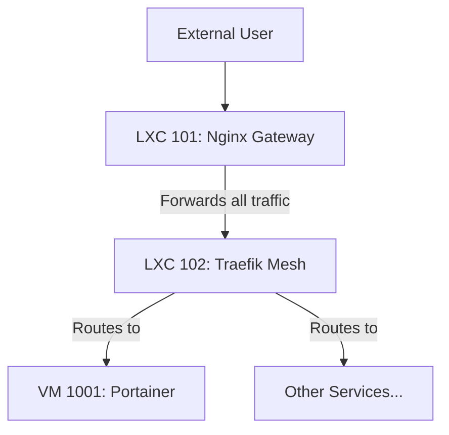

# Nginx Gateway (LXC 101) Health Check Enhancement Plan

## 1. Objective

To create a comprehensive health check script for the Nginx gateway that goes beyond basic process and port checks. This script will validate the gateway's configuration, certificates, and critical operational paths based on its specific role in the architecture.

## 2. Architectural Context

Based on the system design, the Nginx gateway (LXC 101) serves as the primary ingress point. It forwards all application traffic to the Traefik service mesh (LXC 102). Traefik then handles the routing to backend services like Portainer.

Therefore, Nginx does **not** connect directly to Portainer or other application services. Its health check should focus on its own internal configuration and its ability to hand off traffic to Traefik.

## 3. Proposed Health Checks

The new `check_nginx_gateway.sh` script will perform the following self-contained checks from within the LXC 101 container:

### Check 1: Nginx Configuration Syntax
- **Action:** Run `nginx -t`.
- **Purpose:** To catch any syntax errors in the Nginx configuration files before the service is started or restarted.

### Check 2: TLS Certificate and Key Validation
- **Action:**
    - Verify the existence of the certificate and key files.
    - Use `openssl` to check that the certificate and key match.
    - Use `openssl` to check that the certificate is not expired.
- **Purpose:** To ensure the TLS configuration is valid and will not cause errors when Nginx starts.

### Check 3: Service Status and Port Listening
- **Action:**
    - Verify the `nginx` service is active with `systemctl`.
    - Verify that Nginx is listening on ports 80 and 443.
- **Purpose:** To confirm that the Nginx process has started successfully and bound to the correct network ports.

## 4. Implementation Plan

1.  Create a new, more comprehensive `check_nginx_gateway.sh` script that incorporates the self-contained checks listed above.
2.  Update the `lxc-manager.sh` script to use this new health check after the `phoenix create 101` command is run.