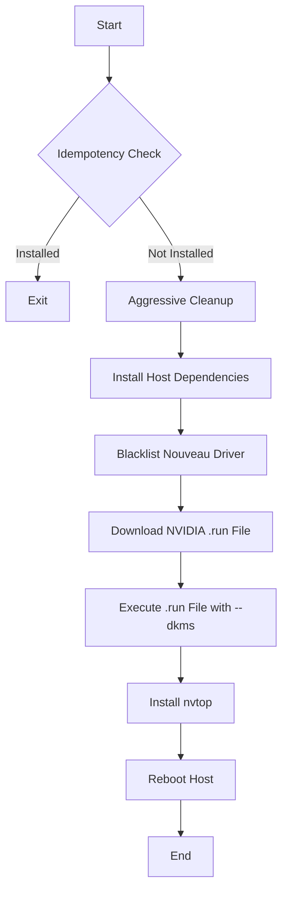
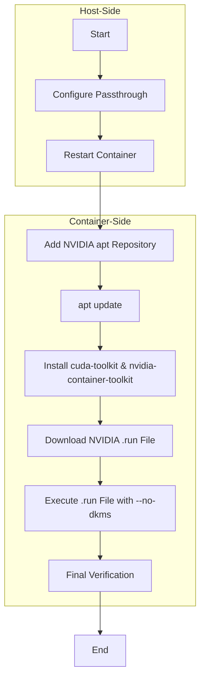

# NVIDIA Installation Comparison: Hypervisor vs. LXC

This document provides a detailed breakdown of the NVIDIA driver installation processes for the Proxmox hypervisor and for LXC containers, including package differences, order of operations, and Mermaid diagrams.

---

## 1. Package and `apt` Installation Differences

### Proxmox Hypervisor (`hypervisor_feature_install_nvidia.sh`)
-   **`pve-headers`**: Installs the specific kernel headers for the running Proxmox kernel. This is essential for compiling the kernel module.
-   **`build-essential`**: A meta-package that installs `gcc`, `g++`, `make`, and other tools required for compilation.
-   **`dkms`**: Dynamic Kernel Module Support. Used to automatically recompile the NVIDIA kernel module when the host kernel is updated.
-   **`pkg-config`**: A helper tool used to find information about installed libraries.
-   **`wget`**: Used to download the NVIDIA `.run` file.
-   **`nvtop`**: A command-line tool for monitoring GPU usage.

### LXC Container (`phoenix_hypervisor_feature_install_nvidia.sh`)
-   **`cuda-keyring`**: A `.deb` package that adds the official NVIDIA CUDA `apt` repository to the system.
-   **`cuda-toolkit`**: Installs the CUDA Toolkit, including the compiler (`nvcc`), libraries (`cuBLAS`, `cuDNN`, etc.), and development tools. This package **does not** install the user-space driver components like `nvidia-smi`.
-   **`nvidia-container-toolkit`**: Provides utilities required to run GPU-accelerated Docker containers.

**Summary:** The hypervisor focuses on packages needed to **build and install the kernel driver**, while the container focuses on packages that provide the **CUDA development environment and container utilities**, relying on the host for the kernel driver.

---

## 2. Order of Operations & Mermaid Diagrams

### Proxmox Hypervisor Workflow



### LXC Container Workflow



**Key Differences in Order:**
-   The hypervisor installation is a single, linear process on one machine.
-   The LXC installation is a two-stage process: first, configure the host for passthrough, then perform the installation inside the container.
-   The hypervisor installation concludes with a mandatory reboot, which is not required for the container.

---

## 3. Driver Versions and `.run` File Usage

-   **Are versions the same?**
    -   Yes, both scripts are designed to use the **exact same driver version**. The `nvidia_runfile_url` is sourced from the same central configuration (`phoenix_lxc_configs.json`), ensuring that the host kernel driver and the container's user-space libraries are perfectly aligned. This is critical for stability.

-   **Are both the run file for driver?**
    -   Yes, both processes use the official NVIDIA `.run` file as the authoritative source for the driver components.

---

## 4. `.run` File Execution Settings

This is the most critical difference:

### Proxmox Hypervisor Execution
```bash
"$runfile_path" --silent --no-x-check --no-nouveau-check --no-opengl-files --accept-license --dkms
```
-   **`--dkms`**: This is the key flag. It tells the installer to register the kernel module with DKMS, so it will be automatically rebuilt if the Proxmox kernel is updated. This is essential for maintaining a working driver across system updates.

### LXC Container Execution
```bash
"$runfile_path" --no-kernel-module --no-x-check --no-nouveau-check --no-nvidia-modprobe --silent --no-dkms
```
-   **`--no-kernel-module`**: This flag is crucial. It tells the installer **not** to build or install the kernel module, as the container will be using the one already running on the host.
-   **`--no-dkms`**: This is also critical. The container does not manage the kernel, so attempting to use DKMS would be incorrect and would fail.
-   **`--no-nvidia-modprobe`**: Prevents the installer from trying to load the kernel module, which is the host's responsibility.

This separation of concerns—kernel module on the host, user-space libraries in the container—is the fundamental principle of NVIDIA GPU passthrough for LXC.