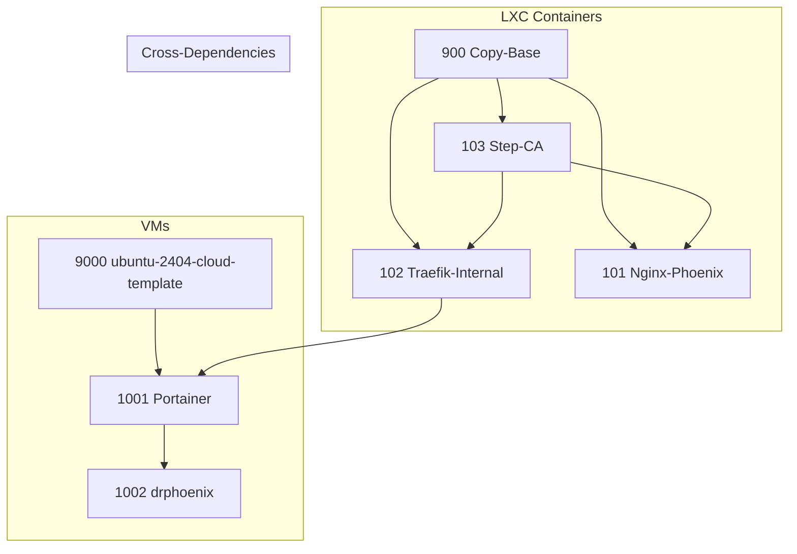

# Phoenix Create Command Summary

## 1. Overview

The `phoenix create` command is the primary entry point for creating new LXC containers and QEMU/KVM virtual machines. It is a powerful and flexible command that encapsulates the entire lifecycle of a virtualized resource, from creation and configuration to feature application and snapshotting.

## 2. Workflow

The `create` workflow is a stateful, idempotent process that is driven by the JSON configuration files. The following is a high-level overview of the steps involved in creating a new virtualized resource:

1.  **Parse Command**: The `phoenix-cli` script parses the `create` command and its arguments, identifying the target resources to be created.
2.  **Resolve Dependencies**: The script resolves all dependencies for the target resources, building a directed acyclic graph (DAG) of all the resources that need to be created.
3.  **Topological Sort**: The DAG is topologically sorted to determine the correct order of creation.
4.  **Dispatch to Manager**: The `phoenix-cli` script dispatches the creation task to the appropriate manager script (`lxc-manager.sh` or `vm-manager.sh`) for each resource.
5.  **Execute Creation Workflow**: The manager script executes the creation workflow for the target resource.

## 3. Dependency Graph for `phoenix create 900 103 101 102 9000 1001 1002`

The following Mermaid diagram illustrates the dependency graph for the specified resources. The `phoenix-cli` script will automatically determine the correct creation order based on these dependencies.

Based on this graph, a valid creation order would be: `900`, `9000`, `103`, `102`, `101`, `1001`, `1002`.