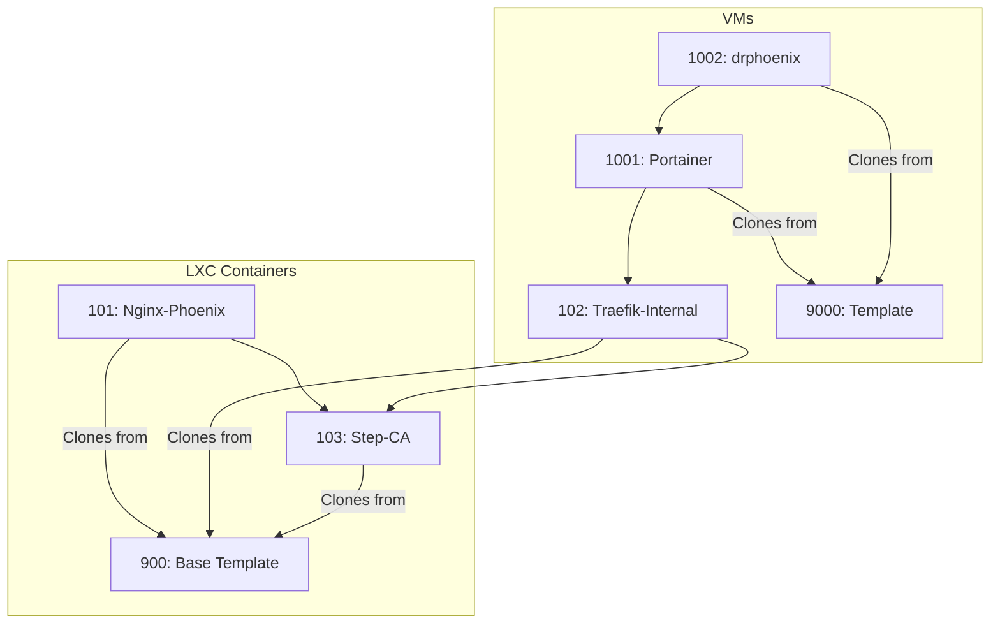

# Phoenix Create Command Workflow Summary

This document outlines the predicted workflow for the command `phoenix create 900 103 101 102 9000 1001 1002`.

## 1. Dependency Analysis and Execution Order

The `phoenix-cli` script will first identify the type of each guest (LXC or VM) and resolve all dependencies to determine the correct creation sequence.

### Guest Identification:

- **LXC Containers**: 900, 101, 102, 103
- **Virtual Machines**: 9000, 1001, 1002

### Dependency Graph:

The relationships between the specified guests are as follows:

### Predicted Execution Order:

Based on a topological sort of the dependency graph, the `phoenix-cli` script will orchestrate the creation in an order similar to this:

1.  **9000** (VM Template) - No dependencies.
2.  **900** (LXC Template) - No dependencies.
3.  **103** (Step-CA LXC) - Clones from 900.
4.  **101** (Nginx-Phoenix LXC) - Depends on 103, clones from 900.
5.  **102** (Traefik-Internal LXC) - Depends on 103, clones from 900.
6.  **1001** (Portainer VM) - Depends on 102, clones from 9000.
7.  **1002** (drphoenix VM) - Depends on 1001, clones from 9000.

## 2. Manager Script Orchestration

For each guest in the sorted list, `phoenix-cli` will invoke the appropriate manager script to handle the creation and configuration workflow.

### For LXC Containers (via `lxc-manager.sh`):

1.  **Creation**: The container is either created from a base template image (for CTID 900) or cloned from an existing container (e.g., 101, 102, 103 clone from 900).
2.  **Configuration**: Core settings (memory, CPU), network parameters, and firewall rules are applied.
3.  **Storage**: Disks are resized, and any specified ZFS volumes or host-path mount points are attached.
4.  **Startup**: The container is started.
5.  **Provisioning**: A series of idempotent "feature" scripts (e.g., `base_setup`, `step_ca`, `traefik`) are executed inside the container to install and configure software.
6.  **Application Setup**: A final, application-specific script is run to complete the setup (e.g., configuring Traefik to find other services).
7.  **Snapshotting**: Lifecycle snapshots (`pre-configured`, `final-form`) are taken to preserve the state of the container.

### For VMs (via `vm-manager.sh`):

1.  **Creation**: The VM is either created from a cloud image (for VMID 9000) or cloned from an existing template (1001 and 1002 clone from 9000).
2.  **Configuration**: Core settings (memory, CPU), network parameters, and cloud-init configurations (user, IP address) are applied.
3.  **Startup**: The VM is started, and the manager waits for the QEMU guest agent to become responsive.
4.  **Storage**: NFS volumes are mounted into the guest filesystem.
5.  **Provisioning**: Feature scripts (e.g., `docker`, `trusted_ca`) are executed inside the VM to install and configure software.
6.  **Snapshotting**: Lifecycle snapshots are taken at pre- and post-feature application stages.