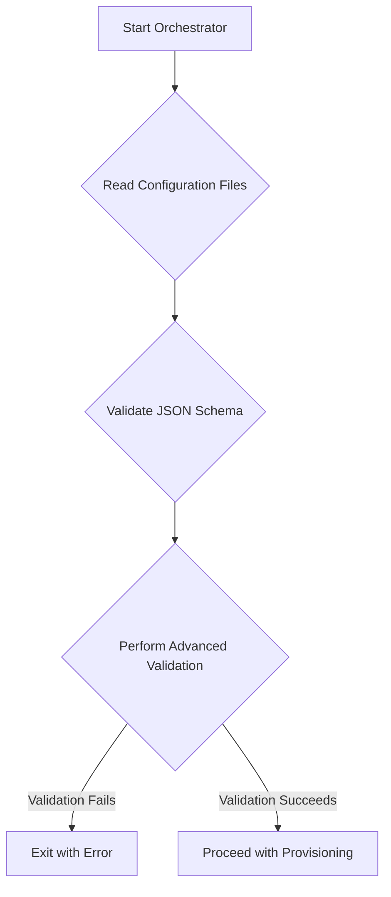

# Advanced Configuration Validation

## 1. Introduction

This document outlines the design for an advanced configuration validation system for the Phoenix Hypervisor. The goal is to supplement the existing JSON schema validation with more sophisticated logical checks to prevent common configuration errors and improve the robustness of the container provisioning process.

## 2. Problem Statement

The current configuration validation relies on JSON schemas, which are effective for verifying the structure and data types of the configuration files. However, they cannot detect logical inconsistencies or invalid combinations of parameters. This can lead to failed container deployments that are difficult to diagnose.

Examples of issues not caught by JSON schema validation include:
*   Assigning a GPU to a container that does not have the `nvidia` feature enabled.
*   Inconsistent network configurations, such as a static IP address outside the specified subnet.
*   Missing dependencies between features (e.g., a feature that requires another feature to be installed first).
*   Allocation of resources (CPU, memory) that exceed the hypervisor's capacity.

## 3. Proposed Solution

We propose the implementation of an advanced validation module within the `phoenix_orchestrator.sh` script. This module will execute a series of logical checks against the configuration files before any provisioning actions are taken. If any validation check fails, the orchestrator will exit with a descriptive error message, preventing the system from entering an inconsistent state.

## 4. Validation Rules

The following logical validation rules will be implemented:

*   **GPU Assignment Validation**: If a container is configured with GPU resources, the validation module will ensure that the `nvidia` feature is also enabled for that container.
*   **Network Configuration Validation**: The module will verify that any static IP addresses are within the defined subnet and do not conflict with the gateway or other reserved addresses.
*   **Feature Dependency Validation**: The system will check for any explicit dependencies between features and ensure they are met. For example, if a `vllm` feature requires the `nvidia` feature, this dependency will be enforced.
*   **Resource Allocation Validation**: The module will check that the total requested resources (CPU cores, memory) for all containers do not exceed the available resources on the hypervisor.

## 5. Implementation Details

The advanced validation logic will be encapsulated in a new function within the `phoenix_orchestrator.sh` script, to be called after the initial JSON schema validation. This function will parse the configuration files and systematically apply the validation rules.

## 6. Questions to be Answered

*   What is the desired behavior on validation failure? Should the system halt immediately, or should it log warnings and continue?
*   Should the validation rules be configurable or extensible? For instance, should users be able to define their own custom validation rules?
*   What other specific logical errors or inconsistencies should be included in the validation checks?