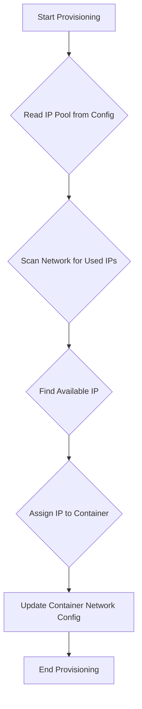

# Dynamic IP Address Management

## 1. Introduction

This document outlines a proposal for integrating dynamic IP address management into the Phoenix Hypervisor system. The current IP address assignment is static and requires manual configuration, which can be inefficient and prone to error. This enhancement will automate the allocation and management of IP addresses for newly provisioned LXC containers.

## 2. Problem Statement

Currently, the `phoenix_hypervisor_config.json` file requires a static IP address to be defined for each container. This manual process has several drawbacks:

*   **Administrative Overhead**: Administrators must manually track and assign IP addresses, which is cumbersome in a dynamic environment.
*   **Risk of IP Conflicts**: Manual assignment increases the risk of IP address conflicts, which can lead to network connectivity issues that are difficult to troubleshoot.
*   **Scalability Challenges**: As the number of containers grows, the complexity of managing a static IP address scheme becomes unmanageable.

## 3. Proposed Solution

To address these challenges, we propose to implement a dynamic IP address management system. The orchestrator will be responsible for automatically assigning an available IP address from a predefined pool to each new container. This will eliminate the need for manual IP address assignment in the configuration files.

The proposed workflow is as follows:

1.  **Define IP Address Pool**: A range of available IP addresses will be defined in the `hypervisor_config.json` file.
2.  **IP Address Allocation**: When a new container is provisioned, the orchestrator will query the network to identify an available IP address from the pool.
3.  **IP Address Assignment**: The orchestrator will assign the first available IP address to the container.
4.  **Configuration Update**: The assigned IP address will be recorded, and the container's network configuration will be updated accordingly.

## 4. Implementation Details

The IP address allocation logic will be implemented as a new function within the `phoenix_orchestrator.sh` script. This function will use network scanning tools (e.g., `nmap` or `fping`) to identify which IP addresses in the defined range are already in use.

## 5. Questions to be Answered

*   Which network scanning tool is most appropriate for this use case? Should we consider dependencies and performance?
*   How should the system handle IP address leases? Should there be a mechanism for reclaiming and reusing IP addresses from decommissioned containers?
*   What is the best way to store the state of IP address assignments to prevent conflicts in a multi-orchestrator environment?
*   Should the system support a hybrid approach, allowing for both static and dynamic IP address assignments?