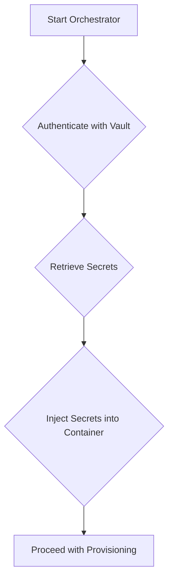

# Secret Management

## 1. Introduction

This document describes the design for a secret management system for the Phoenix Hypervisor. The current approach of storing sensitive information, such as API tokens and credentials, in configuration files poses a security risk. This enhancement will introduce a secure and centralized solution for managing secrets.

## 2. Problem Statement

Storing secrets in plaintext configuration files is a significant security vulnerability. This practice exposes sensitive information to anyone with access to the file system and makes secret rotation and auditing difficult. The key issues with the current approach are:

*   **Security Risk**: Secrets are stored in an insecure manner, increasing the risk of unauthorized access.
*   **Lack of Auditing**: There is no way to audit who has accessed or modified secrets.
*   **Difficult Secret Rotation**: Changing a secret requires manually updating configuration files, which is error-prone and difficult to manage at scale.

## 3. Proposed Solution

We propose to integrate the Phoenix Hypervisor with a dedicated secret management solution, such as HashiCorp Vault. This will provide a centralized and secure repository for all secrets. The `phoenix_orchestrator.sh` script will be modified to retrieve secrets from the vault at runtime, rather than reading them from configuration files.

The proposed workflow is as follows:

1.  **Store Secrets in Vault**: All sensitive information will be stored securely in HashiCorp Vault.
2.  **Authentication**: The orchestrator will authenticate with Vault using a secure method (e.g., AppRole).
3.  **Retrieve Secrets**: Once authenticated, the orchestrator will retrieve the necessary secrets from Vault.
4.  **Inject Secrets**: The retrieved secrets will be securely injected into the container's environment at runtime.

## 4. Implementation Details

The integration with HashiCorp Vault will require the installation of the Vault client on the hypervisor. The `phoenix_orchestrator.sh` script will be updated to include functions for authenticating with Vault and reading secrets.

## 5. Questions to be Answered

*   What is the most appropriate authentication method for the orchestrator to use with Vault?
*   How should we design the secret paths in Vault to ensure a logical and scalable structure?
*   What is the best practice for injecting secrets into the container environment? Should we use environment variables, files, or another method?
*   What is the plan for migrating existing secrets from configuration files to Vault?
