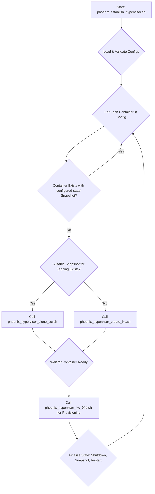

This document outlines a revised architectural workflow for the LXC container creation process within the Phoenix Hypervisor system. The primary goal is to refactor the existing logic to address a critical segmentation fault in `phoenix_establish_hypervisor.sh` by delegating responsibilities to specialized helper scripts. This new design simplifies the main orchestrator, improves modularity, and enhances maintainability.

## 1. Introduction

This document outlines a revised architectural workflow for the LXC container creation process within the Phoenix Hypervisor system. The primary goal is to refactor the existing logic to address a critical segmentation fault in `phoenix_establish_hypervisor.sh` by delegating responsibilities to specialized helper scripts. This new design simplifies the main orchestrator, improves modularity, and enhances maintainability.

## 2. Proposed High-Level Workflow

The `phoenix_establish_hypervisor.sh` script will be repurposed as a lean orchestrator. Its sole responsibility will be to iterate through the container configurations and make high-level decisions, delegating the actual work of creation, cloning, and provisioning to other scripts.

The revised, step-by-step process is as follows:

1.  **Initialization**: The orchestrator loads and validates all necessary configuration files.
2.  **Iteration**: It iterates through each container defined in `phoenix_lxc_configs.json`, ordered by CTID.
3.  **Identify**: For each container, it determines the required state.
4.  **Check Existence**: It verifies if the container (LXC) already exists and has a `configured-state` snapshot. If so, it skips to the next container.
5.  **Check for Clone Source**: If the container does not exist, it checks if a suitable snapshot is available to be cloned from. This is determined by the `clone_from_template_ctid` or by an intelligent selection based on required features (GPU, Docker, etc.).
6.  **Delegate Creation/Cloning**:
    *   If a suitable snapshot exists, it calls the `phoenix_hypervisor_clone_lxc.sh` script.
    *   If no suitable snapshot exists (i.e., it's a base template), it calls the `phoenix_hypervisor_create_lxc.sh` script.
7.  **Delegate Provisioning**: After the container is successfully created or cloned and is running, the orchestrator executes the corresponding `phoenix_hypervisor_lxc_9##.sh` script to apply its specific configuration.
8.  **Finalize State**: The orchestrator calls a utility function to shut down the container, create a `configured-state` snapshot, and restart it.

## 3. Visual Representation (Mermaid Diagram)



## 4. Script Responsibilities and Modifications

### 4.1. `phoenix_establish_hypervisor.sh` (Orchestrator)

This script will be significantly simplified. Its primary loop will contain the logic to call the other scripts.

**Key Responsibilities:**

*   Load and validate `phoenix_hypervisor_config.json` and `phoenix_lxc_configs.json`.
*   Iterate through all defined LXC containers.
*   For each container, perform the checks (existence, clone source) and then call the appropriate helper script.

**Proposed Function Calls:**

```bash
# Inside the main loop for each CTID
if ! container_is_configured "$ctid"; then
    if should_clone "$ctid" "$config_block"; then
        # Call the clone script
        /usr/local/phoenix_hypervisor/bin/phoenix_hypervisor_clone_lxc.sh "$source_ctid" "$source_snapshot" "$ctid" "$LXC_CONFIG_FILE" "$config_block"
    else
        # Call the create script
        /usr/local/phoenix_hypervisor/bin/phoenix_hypervisor_create_lxc.sh "$ctid"
    fi

    # Wait for container to be ready
    wait_for_lxc_ready "$ctid"

    # Call the provisioning script
    /usr/local/phoenix_hypervisor/bin/phoenix_hypervisor_lxc_${ctid}.sh "$ctid"

    # Finalize the container state
    finalize_container_state "$ctid"
fi
```

### 4.2. `phoenix_hypervisor_clone_lxc.sh` (Cloning Script)

This script will be responsible for cloning an LXC container from a ZFS snapshot.

**No major modifications are required** to this script's core logic, as it already accepts the necessary parameters. However, it must be robust and provide clear exit codes to the orchestrator.

**Function Signature (as called by orchestrator):**

```bash
./phoenix_hypervisor_clone_lxc.sh <SOURCE_CTID> <SOURCE_SNAPSHOT_NAME> <TARGET_CTID> <LXC_CONFIG_FILE> <TARGET_CONFIG_BLOCK_JSON>
```

### 4.3. `phoenix_hypervisor_create_lxc.sh` (Creation Script)

This script will be responsible for creating a new LXC container from a base image.

**No major modifications are required** to this script's core logic. It should remain idempotent, exiting gracefully if the container already exists.

**Function Signature (as called by orchestrator):**

```bash
LXC_CONFIG_FILE="/path/to/config.json" ./phoenix_hypervisor_create_lxc.sh <CTID>
```

### 4.4. `phoenix_hypervisor_lxc_9##.sh` (Provisioning Scripts)

These scripts will handle the specific setup for each container *after* it has been created or cloned. This includes installing packages, configuring services, and for templates, creating their specific template snapshots (e.g., `base-snapshot`, `gpu-snapshot`).

**Required Modifications:**

*   These scripts must be idempotent. If a `configured-state` snapshot does not exist but the template-specific snapshot *does* (e.g., `base-snapshot`), the script should recognize this and exit gracefully.
*   They should focus solely on their specific provisioning tasks. Any logic related to container creation or cloning should be removed.

**Function Signature (as called by orchestrator):**

```bash
./phoenix_hypervisor_lxc_9##.sh <CTID>
```

## 5. Conclusion

This revised architecture decouples the main orchestration logic from the implementation details of container creation, cloning, and provisioning. This will make the system more robust, easier to debug, and simpler to maintain. The `phoenix_establish_hypervisor.sh` script will become a true orchestrator, leading to a more stable and predictable container creation process.
