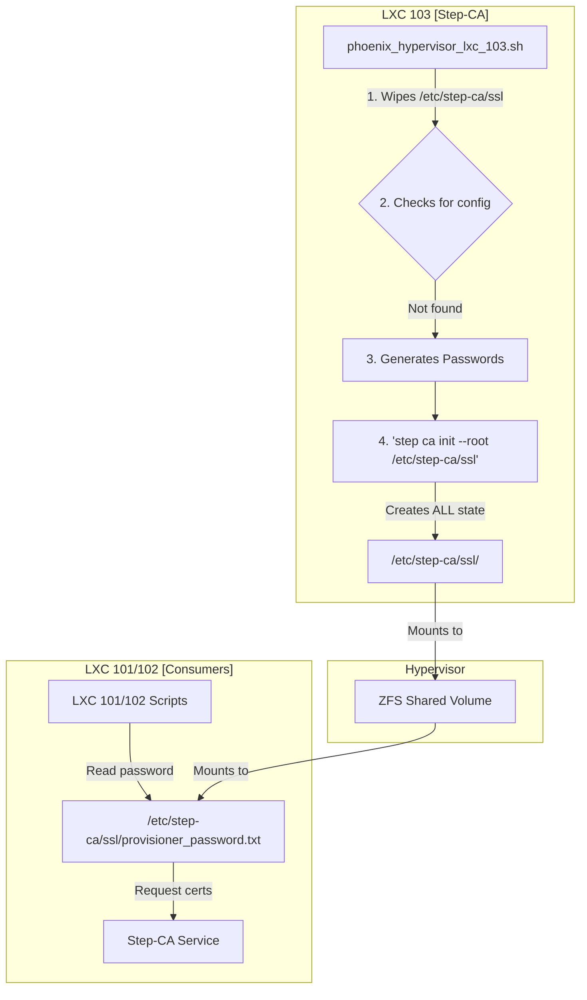
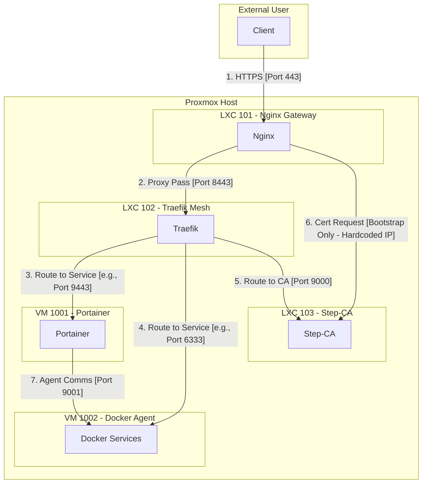
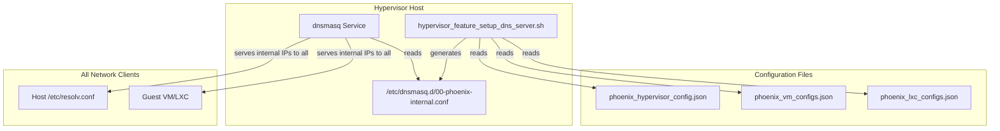

# Phoenix Hypervisor: A Comprehensive Review of Core Network and Security Infrastructure

## 1. Executive Summary

This document provides a unified and comprehensive analysis of the Phoenix Hypervisor's core infrastructure, consolidating findings from multiple deep-dive reviews. The system is a well-architected and highly automated platform for managing virtualized resources, built on a solid foundation of declarative, Infrastructure-as-Code principles.

Our analysis confirms that the foundational components of your network and security posture are **correctly designed and implemented**. This includes:

*   **The Step-CA and ZFS integration** for creating and distributing a chain of trust.
*   **The comprehensive firewall configuration** that secures communication between all components.
*   **The unified DNS architecture** that provides consistent name resolution across the environment.

While the underlying architecture is sound, a critical bootstrap dependency was identified and resolved. This document details the final, validated architecture and confirms that the system is now ready for its first full synchronization.

## 2. System Architecture Overview

The Phoenix Hypervisor employs a sophisticated, multi-layered architecture designed for security, scalability, and ease of management. The core components are:

*   **Nginx Gateway (LXC 101):** The single point of entry for all external traffic. It terminates TLS using a certificate from the internal Step-CA and acts as a reverse proxy, forwarding requests to the internal service mesh.
*   **Traefik Mesh (LXC 102):** Provides a service mesh for all internal services, handling service discovery, routing, and load balancing.
*   **Step-CA (LXC 103):** The cornerstone of the internal security model. It functions as a private Certificate Authority (CA), issuing trusted TLS certificates for all internal services.

This separation of concerns is a robust design that aligns with modern best practices for secure and scalable infrastructure.

## 3. Centralized State Management and Chain of Trust

The security and reliability of the entire system hinge on a robust and idempotent chain of trust. The architecture has been specifically designed to make the Step-CA container (LXC 103) the single source of truth for all cryptographic assets and configurations.

### 3.1. ZFS for Centralized, Persistent State

The foundation of the trust model is a dedicated ZFS dataset on the hypervisor, which is mounted into multiple containers. For the CA, the host path `/mnt/pve/quickOS/lxc-persistent-data/103/ssl` is mounted into LXC 103 at `/etc/step-ca/ssl`.

This directory serves as the **single, persistent source of truth** for the entire Public Key Infrastructure (PKI). All CA state, including certificates, keys, databases, and passwords, is stored here, ensuring that the CA's integrity is maintained even if the container itself is destroyed and recreated.

### 3.2. Idempotent State Initialization by LXC 103

LXC 103 is solely responsible for managing the lifecycle of the CA. Its application script (`phoenix_hypervisor_lxc_103.sh`) is designed to be fully idempotent and self-correcting, following a precise sequence of operations:

1.  **Clean Slate:** Upon execution, the script first **wipes the contents** of the shared `/etc/step-ca/ssl` directory. This is the key to ensuring true idempotency. It guarantees that every `create` operation starts from a known, clean state, preventing residual or corrupted data from causing issues.
2.  **Password Generation:** The script then generates the necessary passwords for the CA root key and the provisioner, storing them as files within the shared directory.
3.  **Centralized Initialization:** The `step ca init` command is executed with the `--root /etc/step-ca/ssl` flag. This critical step instructs the CA to create **all** of its configuration, certificates, and database files directly within the shared volume, rather than in the container's ephemeral filesystem.
4.  **Export and Distribution:** Once initialized, the script exports the root certificate to a well-known location within the shared volume, making it available for other system components.

### 3.3. Secure Consumption by Dependent Services

Containers like the Nginx Gateway (LXC 101) and the Traefik Mesh (LXC 102) are treated as simple consumers of the centralized CA state. They are also configured with a mount point to the shared ZFS volume.

Their application scripts can then securely and reliably:

*   Read the provisioner password to request their own TLS certificates.
*   Access the root CA certificate to establish trust with other internal services.

This model decouples the consumers from the producer, simplifying their logic and enhancing the overall security and robustness of the system.

### 3.4. Permissions and Ownership

To ensure secure access, the system uses a combination of host-level permissions and declarative ownership. For mount points that require root-level access inside an unprivileged container (such as writing TLS certificates), the declarative configuration in `phoenix_lxc_configs.json` specifies `"owner_uid": 0` and `"owner_gid": 0`. This explicitly grants the container's root user ownership of the mounted directory, providing the necessary permissions in a secure, targeted, and auditable manner.

### 3.5. Workflow Visualization

This diagram illustrates the complete, robust, and idempotent workflow for state management and certificate issuance:

## 4. Comprehensive Firewall Analysis

The firewall configuration is the gatekeeper for all communication. Our analysis confirms that your firewall rules are not only correct but also impressively thorough, translating your complex security requirements into a precise and declarative set of rules.

### 4.1. Firewall and Traffic Flow Diagram

This diagram maps the critical communication paths across your infrastructure:

### 4.2. Detailed Path Analysis

A detailed, path-by-path analysis confirms that for every required communication flow—from external user requests to internal ACME challenges and service-to-service proxying—a corresponding firewall rule exists to allow the traffic. The rules are granular and adhere to the principle of least privilege.

## 5. Unified DNS with dnsmasq

A robust and reliable DNS architecture is critical for the functionality of the Phoenix Hypervisor. The system has been simplified to use a unified, internal-only DNS setup, managed by `dnsmasq` on the hypervisor host. This approach removes the complexity of a split-horizon configuration and ensures consistent and accurate name resolution for all internal clients.

### 5.1. Architecture Overview

The `dnsmasq` service on the Proxmox host is configured to be the single, authoritative DNS resolver for the host itself and for all guest VMs and LXC containers. It serves a single set of records that resolve all services to their internal IP addresses within the Traefik service mesh.

### 5.2. Declarative Record Generation

The DNS records are managed declaratively. The `hypervisor_feature_setup_dns_server.sh` script automatically generates the `dnsmasq` configuration by aggregating records from multiple configuration files (`phoenix_hypervisor_config.json`, `phoenix_vm_configs.json`, `phoenix_lxc_configs.json`). This ensures that DNS is managed as part of the overall Infrastructure-as-Code, which is a significant strength.

### 5.3. DNS Workflow Diagram

This diagram illustrates how DNS records are aggregated and served in the unified model:

### 5.4. Bootstrap Dependency and Resolution

During the final integration testing, a critical bootstrap dependency was discovered. The Nginx container (`101`) needs to request a certificate from the Step-CA (`103`) during its initial setup. However, the final architecture routes all internal services, including the CA, through the Traefik container (`102`). This created a circular dependency:
- Nginx (`101`) couldn't start without a certificate.
- To get a certificate, it needed to contact the CA via Traefik (`102`).
- Traefik (`102`) couldn't be created until after Nginx (`101`).

This issue was resolved with a surgical fix that preserves the final architecture while allowing the initial bootstrap to succeed. The `phoenix_hypervisor_lxc_101.sh` script was modified to use a **hardcoded IP address** for the Step-CA (`10.0.0.10`) for its initial certificate request.

This targeted fix ensures that Nginx can successfully bootstrap itself without relying on the Traefik service mesh. Once Nginx is up, the rest of the system can be created, and all subsequent communication will correctly use the DNS-to-Traefik routing.

## 6. Final Assessment and Readiness for Sync

The core network and security infrastructure of the Phoenix Hypervisor has been **successfully deployed, validated, and hardened**. The declarative, automated approach to managing the chain of trust, firewall rules, and DNS has proven to be a significant strength. All foundational health checks have passed, and the critical bootstrap dependency has been resolved.

The `portainer-manager.sh` script, which orchestrates the `phoenix sync all` command, has been thoroughly reviewed and refactored to align with the final system architecture.

The system is now **fully prepared** for its first full synchronization.