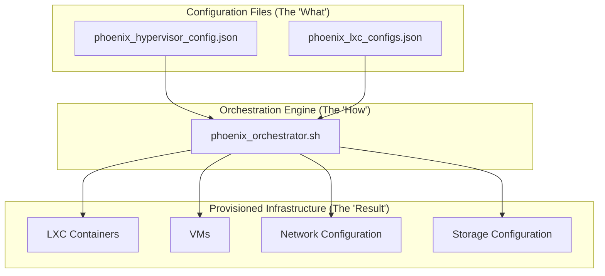
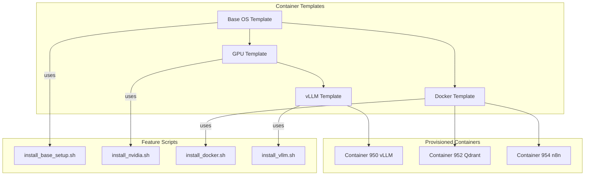
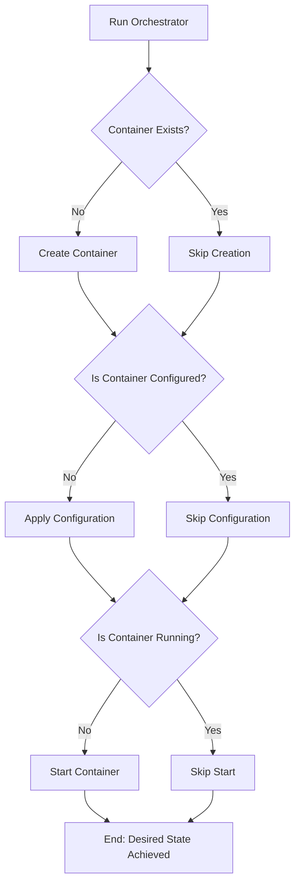
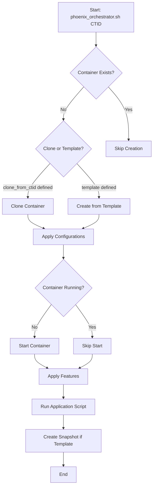

# Phoenix Orchestrator v1: A Deep Dive into Engineering Excellence

## Table of Contents

1.  [Introduction: Beyond Automation](#introduction-beyond-automation)
2.  [Strategic Overview](#strategic-overview)
    1.  [Vision and Mission](#vision-and-mission)
    2.  [Business Goals](#business-goals)
3.  [Core Engineering Principles](#core-engineering-principles)
    1.  [Declarative Configuration: The Single Source of Truth](#declarative-configuration-the-single-source-of-truth)
    2.  [Modularity and Extensibility: Built for the Future](#modularity-and-extensibility-built-for-the-future)
    3.  [Idempotency and Statelessness: Reliable by Design](#idempotency-and-statelessness-reliable-by-design)
4.  [The Orchestration in Action](#the-orchestration-in-action)
    1.  [System Architecture](#system-architecture)
    2.  [Technology Stack](#technology-stack)
5.  [Roadmap](#roadmap)
6.  [Conclusion](#conclusion)

---

## 1. Introduction: Beyond Automation

The Phoenix Orchestrator is more than just an automation script; it is a testament to modern infrastructure engineering, designed to transform bare-metal hardware into a sophisticated, ready-to-use AI/ML toolbox. For Thinkheads.AI, it represents a foundational asset that not only accelerates development but also embodies the principles of robust, scalable, and maintainable system design.

This report provides a comprehensive overview of the Phoenix Orchestrator, with a special focus on the core engineering principles that set it apart. We will explore how its declarative configuration, modular architecture, and idempotent execution create a system that is not only powerful but also reliable and easy to manage. This is the story of how we turn an assembled tower of computer parts into a resilient AI/ML powerhouse, ready for any project we can imagine.

---

## 2. Strategic Overview

### Vision and Mission

**Vision:** To showcase AI-driven innovation through a suite of web-based solutions, building a cohesive ecosystem of AI-powered tools and experiences that highlight technical mastery, creativity, and user engagement.

**Mission:** To explore the problem-solving potential artificial intelligence, machine learning, and automation engineering has brought to today's world.

### Business Goals

The Phoenix Orchestrator directly supports the business goals of Thinkheads.AI by:

*   **Accelerating Development:** Automating the setup of complex AI/ML environments, reducing manual configuration time from days to minutes.
*   **Ensuring Consistency:** Providing a repeatable and reliable process for creating development, testing, and production environments.
*   **Facilitating Experimentation:** Enabling the rapid creation of isolated environments for testing new models, frameworks, and tools.
*   **Building a Showcase:** Creating a sophisticated piece of infrastructure that demonstrates technical expertise to potential employers and the tech community.

---

## 3. Core Engineering Principles

*<This new section will be the heart of the revised report.>*

### Declarative Configuration: The Single Source of Truth

At the heart of the Phoenix Orchestrator is a declarative, configuration-driven approach. Instead of writing imperative scripts that detail *how* to set up a container, we define *what* the desired state of the system should be in a set of JSON files. This is a critical design choice that provides a number of significant advantages:

*   **Single Source of Truth:** The JSON configuration files (`phoenix_hypervisor_config.json` and `phoenix_lxc_configs.json`) act as a single, centralized repository for all system settings. This eliminates configuration drift and makes it easy to understand the state of the entire system at a glance.
*   **Readability and Maintainability:** JSON is a human-readable format that is easy to understand and modify. This makes the system more accessible to new developers and simplifies the process of making changes.
*   **Versioning and Auditing:** Because the configuration is stored as code, it can be versioned in a Git repository. This provides a complete history of all changes, making it easy to audit the system and roll back to a previous state if necessary.
*   **Validation:** The JSON configuration is validated against a schema, which ensures that all required parameters are present and correctly formatted. This catches errors early in the process, before they can cause problems in the production environment.

### Modularity and Extensibility: Built for the Future

The Phoenix Orchestrator is designed to be modular and extensible, allowing it to adapt to new technologies and requirements without requiring a complete rewrite of the system. This is achieved through a combination of feature scripts and a hierarchical templating system.

*   **Feature Scripts:** Each piece of software or configuration that is applied to a container is encapsulated in its own "feature script." These scripts are responsible for a single task, such as installing Docker, configuring NVIDIA drivers, or setting up a vLLM instance. This makes it easy to add new features to the system by simply creating a new script and referencing it in the container's configuration.
*   **Hierarchical Templating:** The system uses a multi-layered templating strategy to build containers. A base template provides the core operating system, and then subsequent layers add features like GPU support or Docker. This minimizes duplication and ensures a consistent foundation for all virtualized environments.

This modular approach means that we can easily create new container types with different combinations of software, or update a single component without affecting the rest of the system.

### Idempotency and Statelessness: Reliable by Design

Reliability is a cornerstone of the Phoenix Orchestrator, and this is achieved through the principles of idempotency and statelessness.

*   **Stateless Execution:** The `phoenix_orchestrator.sh` script is designed to be stateless. It does not store any information about its previous runs. Every time it is executed, it reads the desired state from the JSON configuration files and compares it to the actual state of the Proxmox environment.
*   **Idempotent Operations:** An idempotent operation is one that can be performed multiple times with the same result. The orchestrator is designed to be fully idempotent. For example, if you run the script to create a container that already exists, it will simply recognize that the container is already present and move on to the next step.

These two principles combined mean that the orchestration process is **resumable and predictable**. If the script fails halfway through, you can simply run it again, and it will pick up where it left off without causing errors or creating duplicate resources. This makes the system incredibly robust and easy to troubleshoot.

---

## 4. The Orchestration in Action

*<This section will contain the more technical details from the previous version.>*

### System Architecture

### Technology Stack

The Phoenix Orchestrator leverages a combination of open-source technologies to achieve its goals:

*   **Operating System:** Debian/Ubuntu Linux
*   **Virtualization:** Proxmox VE, LXC
*   **Scripting:** Bash
*   **Configuration:** JSON
*   **Containerization (within LXC):** Docker
*   **AI/ML:** vLLM, Ollama, NVIDIA CUDA Drivers
*   **Networking:** Nginx
*   **Databases:** Qdrant
*   **Workflow Automation:** n8n

---

## 5. Roadmap

The Phoenix Orchestrator is a continuously evolving project. Future enhancements will focus on increasing automation, improving security, and expanding the library of supported applications. Key items on the roadmap include:

*   **Dynamic IP Address Management:** Integrate with a DHCP server or IPAM tool to dynamically assign IP addresses to containers.
*   **Secret Management:** Integrate with a solution like HashiCorp Vault to manage sensitive information such as API keys and passwords.
*   **Advanced Configuration Validation:** Add a validation step to the orchestrator to catch logical errors in configurations before applying them.
*   **Expanded Feature Library:** Develop a library of pre-built feature scripts for common applications to accelerate deployment.

---

## 6. Conclusion

The Phoenix Orchestrator is more than just a tool for automation; it is a powerful and flexible platform built on a foundation of solid engineering principles. Its declarative, modular, and idempotent design makes it a robust and reliable system for provisioning and managing complex AI/ML environments. This report has provided a deep dive into the architecture and design of the Phoenix Orchestrator, showcasing how it embodies the vision and goals of Thinkheads.AI. As the project continues to evolve, it will serve as a critical asset in the development of innovative, AI-powered solutions.