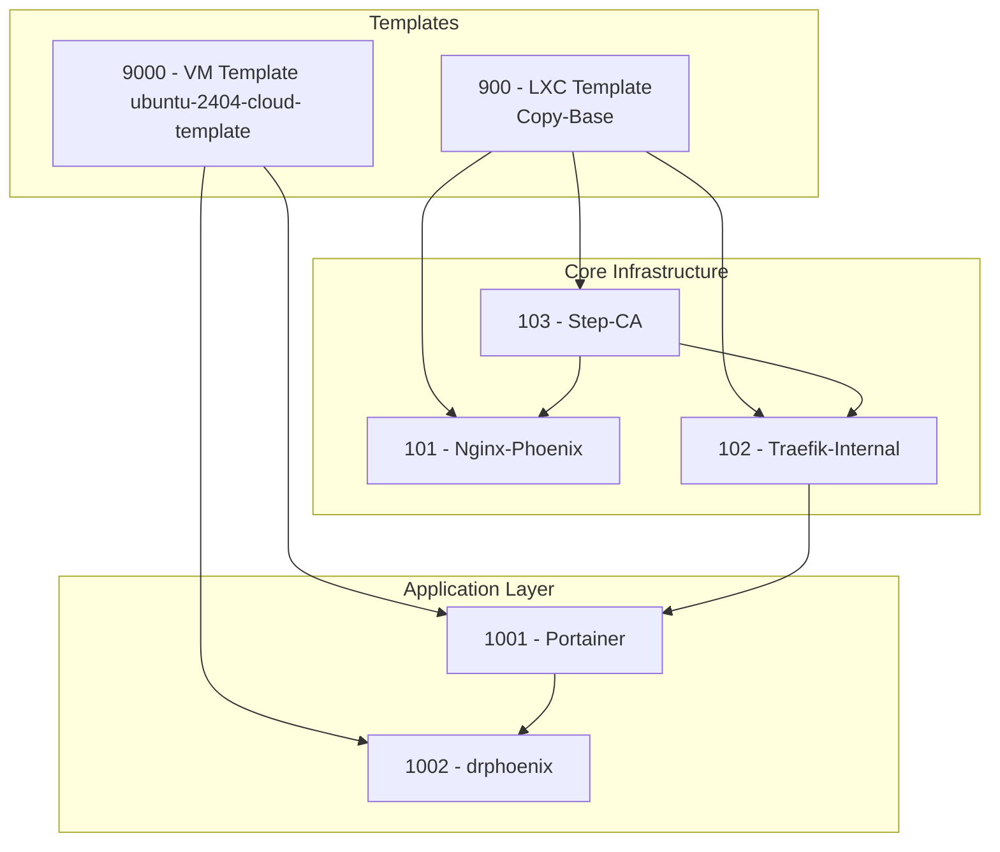

# Phoenix Hypervisor: Setup and Create Process

## 1. Phoenix Hypervisor Setup Process

The Phoenix Hypervisor environment is a sophisticated, multi-layered architecture designed for security, scalability, and ease of management. The setup process is declarative and idempotent, managed through a series of configuration files and scripts.

### Core Components:

*   **Nginx Gateway (LXC 101):** The single point of entry for all external traffic. It terminates TLS using a certificate from the internal Step-CA and acts as a reverse proxy.
*   **Traefik Mesh (LXC 102):** Provides a service mesh for all internal services, handling service discovery, routing, and load balancing.
*   **Step-CA (LXC 103):** A private Certificate Authority that issues trusted TLS certificates for all internal services, forming the cornerstone of the internal security model.

### State and Configuration Management:

*   **Centralized State:** The system uses a dedicated ZFS dataset on the hypervisor for centralized and persistent state management, ensuring the integrity of the CA and other critical components.
*   **Declarative DNS:** DNS is managed by `dnsmasq` on the hypervisor, with records generated declaratively from the core configuration files.

## 2. The `phoenix create` Command Workflow

The `phoenix create` command is the primary mechanism for provisioning new resources within the hypervisor. It is designed to be idempotent and dependency-aware, ensuring that components are created in the correct order.

### Command Syntax:

```bash
phoenix create [TARGET_IDs...]
```

### Example Command:

```bash
phoenix create 900 103 101 102 9000 1001 1002
```

### Target ID Breakdown:

*   **Templates**:
    *   `900`: A base LXC container template (`Copy-Base`).
    *   `9000`: A base VM template (`ubuntu-2404-cloud-template`).
*   **Core Infrastructure (LXC Containers)**:
    *   `103`: `Step-CA`, the Certificate Authority.
    *   `101`: `Nginx-Phoenix`, the Nginx gateway.
    *   `102`: `Traefik-Internal`, the service mesh.
*   **Application Layer (Virtual Machines)**:
    *   `1001`: `Portainer`, the container management UI.
    *   `1002`: `drphoenix`, a Docker host managed by Portainer.

### Execution Flow:

When the `phoenix create` command is executed, the `phoenix-cli` script performs the following actions:

1.  **Parses Arguments:** The script identifies the `create` verb and the list of target IDs.
2.  **Resolves Dependencies:** It reads the `phoenix_lxc_configs.json` and `phoenix_vm_configs.json` files to build a complete dependency graph for all specified targets.
3.  **Topological Sort:** The script performs a topological sort on the dependency graph to determine the correct creation order.
4.  **Dispatches to Managers:** It iterates through the sorted list of targets and calls the appropriate manager script (`lxc-manager.sh` or `vm-manager.sh`) to create each component.

This process ensures that all dependencies are met before a component is created, resulting in a reliable and repeatable provisioning workflow.

## 3. Creation Process and Dependency Diagram

The following diagram illustrates the dependency graph for the `phoenix create` command. The arrows indicate that a component must be created before the component that points to it.

