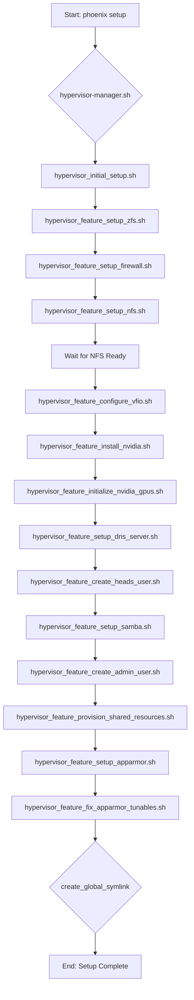

# Phoenix Setup Command Workflow Summary

This document outlines the sequence of operations performed by the `phoenix setup` command.

## 1. Initial Dispatch

- The main `phoenix-cli` script receives the `setup` verb.
- It recognizes this as a special command that operates on the hypervisor itself.
- The command and all its arguments (e.g., `--wipe-disks`) are forwarded directly to the `hypervisor-manager.sh` script for execution.

## 2. Hypervisor Manager Orchestration

The `hypervisor-manager.sh` script orchestrates the entire setup process by executing a series of modular scripts in a specific, hardcoded order. This ensures a consistent and reliable setup.

The sequence of execution is as follows:

## 3. Key Steps and Logic

- **ZFS Setup**: The `hypervisor_feature_setup_zfs.sh` script is called with a `--mode` argument. This is `safe` by default, but changes to `force-destructive` if the `--wipe-disks` flag is used with the initial `phoenix setup` command.
- **NFS Synchronization**: After the NFS server is configured, the manager script pauses and waits for the NFS shares to become available before proceeding. This prevents race conditions with subsequent scripts that might depend on those shares.
- **Finalization**: Once all setup scripts have completed successfully, the `create_global_symlink` function is called. This creates a symbolic link at `/usr/local/bin/phoenix`, making the command globally accessible in the system's PATH.

This structured and sequential process ensures that all dependencies are met at each stage of the hypervisor configuration.