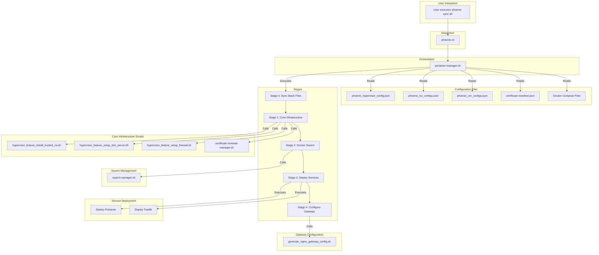

# Phoenix Sync Feature: Progress and Status Report

## 1. Executive Summary

The `phoenix sync` command is the central orchestration engine of the Phoenix Hypervisor platform. It is a highly sophisticated and critical feature designed to automate the configuration and synchronization of the entire hypervisor environment. Our analysis reveals a robust, configuration-driven system that is both powerful and idempotent, ensuring that the environment can be reliably and repeatedly brought to a known, desired state.

The feature operates on a declarative model, reading the desired system state from a series of well-structured JSON files. This approach minimizes manual intervention and ensures consistency across deployments. The sync process is executed in a series of well-defined stages, from synchronizing core infrastructure like DNS and firewall rules to deploying and configuring complex services within a Docker Swarm cluster.

The current implementation is mature and well-designed, demonstrating a strong architectural foundation. However, our deep dive has also identified several opportunities for enhancement, particularly around the now-deprecated Portainer API integration and the potential for more advanced state management.

This report provides a detailed breakdown of the `phoenix sync` workflow, an analysis of its current strengths, and a set of actionable recommendations for its future development.

## 2. Detailed Multi-Stage Workflow

The `phoenix sync` command orchestrates the hypervisor's configuration through a sequence of well-defined stages. The process is initiated by the `phoenix-cli` dispatcher, which hands off control to the `portainer-manager.sh` script. This script then executes the following stages in order:

### Stage 0: Synchronize Stack Files

- **Objective:** Ensure the Docker Swarm manager has the latest application definitions.
- **Action:** The process begins by using `rsync` to copy all Docker Compose files and `phoenix.json` manifests from the local Git repository to a shared ZFS dataset. This ensures that the declarative configurations for all containerized applications are up-to-date and accessible to the Swarm manager.

### Stage 1: Core Infrastructure Synchronization

- **Objective:** Configure and synchronize foundational networking and security services.
- **Actions:**
    1.  **Install Trusted CA:** The root CA certificate from the Step-CA container is copied to the Proxmox host's trust store, enabling the hypervisor to trust internal TLS certificates.
    2.  **Setup DNS Server:** A unified DNS view is created by aggregating DNS records from all LXC, VM, and stack configurations into a single `dnsmasq` configuration.
    3.  **Setup Firewall:** A global firewall ruleset is generated and applied by aggregating rules from the main hypervisor configuration and individual guest definitions.
    4.  **Renew Certificates:** The `certificate-renewal-manager.sh` script checks all certificates defined in `certificate-manifest.json` for impending expiration, renews them via Step-CA if necessary, and executes any post-renewal commands.

### Stage 2: Docker Swarm Cluster Management

- **Objective:** Ensure the Docker Swarm cluster is active and correctly configured.
- **Action:** The `swarm-manager.sh` script is invoked to manage the Swarm cluster declaratively. It initializes the Swarm if it's not already active, joins worker nodes as defined in the configuration, and applies any necessary node labels for service placement.

### Stage 3: Deploy Upstream Services

- **Objective:** Deploy the core services required for the platform to function.
- **Action:** The `portainer-manager.sh` script deploys the Portainer server and agent, as well as the Traefik reverse proxy. This stage ensures that the core management and routing services are operational.

### Stage 4: Configure NGINX Gateway

- **Objective:** Configure the main entry point for all external traffic.
- **Action:** A dynamic NGINX configuration is generated and pushed to the NGINX container. This gateway routes all external traffic to the Traefik reverse proxy, which then directs it to the appropriate backend service.

### Stage 5: Synchronize Portainer Stacks (Deprecated)

- **Objective:** Deploy all application stacks via the Portainer API.
- **Current Status:** This stage is now deprecated. The system has transitioned to a manual deployment workflow through the Portainer UI, which leverages the synchronized stack files from Stage 0.

## 3. Strengths of the Current Implementation

The `phoenix sync` feature is built on a solid architectural foundation that provides a high degree of reliability and maintainability. The following are the key strengths of the current implementation:

- **Declarative, Configuration-Driven Model:** The entire state of the hypervisor is defined in a set of version-controlled JSON files. This "infrastructure-as-code" approach is a significant strength, as it makes the system's configuration transparent, reproducible, and easy to manage.

- **Idempotent by Design:** The orchestration scripts are written to be idempotent, meaning they can be run multiple times without causing unintended side effects. The system always converges towards the desired state defined in the configuration files, making it safe to run the `sync` command at any time.

- **Modular and Extensible Architecture:** The use of a central dispatcher (`phoenix-cli`) and specialized manager scripts (`portainer-manager.sh`, `swarm-manager.sh`, etc.) creates a modular and extensible system. This design makes it easy to add new functionality or modify existing stages without impacting the entire workflow.

- **Automated Certificate Management:** The integration with Step-CA and the `certificate-renewal-manager.sh` script provide a fully automated solution for managing the lifecycle of internal TLS certificates. This is a critical feature for maintaining a secure and stable environment.

- **Centralized DNS and Firewall Management:** The dynamic generation of DNS records and firewall rules from a single source of truth (the JSON configuration files) simplifies network and security management. This centralized approach ensures consistency and reduces the risk of misconfiguration.

## 4. Areas for Improvement and Future Development

While the `phoenix sync` feature is already very powerful, there are several areas where it could be enhanced to provide even greater functionality and robustness. The following are our key recommendations for future development:

- **Re-introduce Automated Stack Deployment:** The deprecation of the Portainer API integration for stack deployment (Stage 5) represents a step back from a fully automated, "git-to-production" workflow. We recommend re-introducing this capability, perhaps by leveraging the `docker stack deploy` command directly on the Swarm manager. This would restore the system's ability to automatically deploy and update applications based on changes in the Git repository.

- **Implement State Management and Drift Detection:** The current system is idempotent, but it does not actively detect or report on "drift" (i.e., manual changes made to the system that deviate from the declarative configuration). Implementing a state management system would allow `phoenix sync` to not only enforce the desired state but also to report on any discrepancies, providing greater visibility into the health and integrity of the environment.

- **Enhance Dependency Resolution:** The current dependency resolution is effective, but it could be enhanced to support more complex scenarios, such as conditional or optional dependencies. This would provide greater flexibility in defining the relationships between different components of the system.

- **Introduce a "Dry Run" Mode:** A "dry run" mode that simulates the changes that would be made by `phoenix sync` without actually applying them would be an invaluable feature. This would allow operators to review and validate the planned changes before they are executed, reducing the risk of unintended consequences.

- **Improve Error Handling and Rollback:** While the system is robust, it could benefit from more sophisticated error handling and automated rollback capabilities. If a stage of the sync process fails, the system could be configured to automatically roll back to the last known good state, minimizing downtime and ensuring a more resilient environment.

## 5. End-to-End Process Visualization

The following Mermaid diagram provides a comprehensive, end-to-end visualization of the `phoenix sync` workflow. It illustrates the flow of control from the initial command execution to the final configuration of all services, highlighting the interactions between the various scripts and configuration files.

