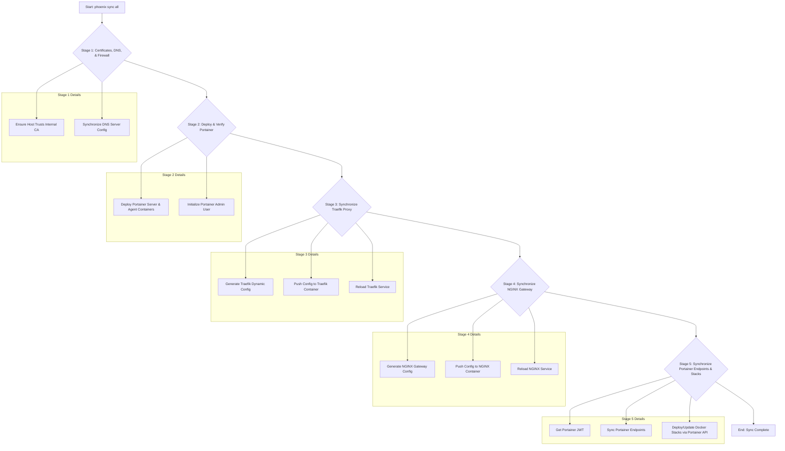

# Phoenix Sync Command Workflow Summary

This document provides a detailed breakdown of the `phoenix sync all` command, which orchestrates the state of the entire hypervisor ecosystem, including networking, security, and service deployment.

## High-Level Objective

The primary goal of `phoenix sync all` is to bring the system into a consistent, known-good state. It achieves this by executing a multi-stage process that configures everything from the foundational security layer (CA and certificates) up to the application layer (Docker stacks).

## Detailed Workflow

The process is executed by the `portainer-manager.sh` script and can be broken down into five distinct stages:

### Stage 1: Certificates, DNS, & Firewall

This foundational stage ensures the underlying infrastructure is ready.

1.  **Host Trust**: The script ensures the Proxmox hypervisor trusts the internal Certificate Authority (CA) from the Step-CA container (103) by installing its root certificate. This is critical for all subsequent secure communication.
2.  **DNS Synchronization**: The DNS server configuration is updated to ensure all newly created services can be resolved correctly across the internal network.

### Stage 2: Deploy & Verify Portainer

This stage bootstraps the container management platform.

1.  **Deploy Instances**: The script deploys the Portainer server (on VM 1001) and any Portainer agents (e.g., on VM 1002) by running their respective Docker containers.
2.  **Initialize Admin**: It then waits for the Portainer API to become available and initializes the admin user, making the API ready for subsequent operations.

### Stage 3: Synchronize Traefik Proxy (CTID 102)

Here, the internal service mesh is configured.

1.  **Generate Config**: The `generate_traefik_config.sh` script is executed. It scans the LXC and VM configuration files for any guest that has a `traefik_service` definition.
2.  **Discover Services**: For each discovered service, it generates the necessary routers and services in a `dynamic_conf.yml` file. This file maps hostnames (e.g., `portainer.internal.thinkheads.ai`) to the internal IP and port of the target service.
3.  **Apply Config**: The generated configuration is pushed into the Traefik container, and the service is reloaded to apply the new routing rules.

### Stage 4: Synchronize NGINX Gateway (CTID 101)

This stage configures the public-facing entry point.

1.  **Generate Config**: The `generate_nginx_gateway_config.sh` script runs. It creates a static configuration with two primary functions:
    *   **TLS Termination**: It listens on port 443, terminates TLS using the certificate generated by Step-CA, and proxies all traffic to the internal Traefik service (10.0.0.12).
    *   **ACME Challenge Proxy**: It listens on port 80 and specifically proxies ACME challenge requests (`/.well-known/acme-challenge/`) to Traefik, allowing for automated certificate management. All other port 80 traffic is redirected to HTTPS.
2.  **Apply Config**: The new configuration is pushed to the NGINX container, and the service is reloaded.

### Stage 5: Synchronize Portainer Endpoints & Stacks

This is the application deployment stage.

1.  **Authentication**: The script authenticates with the Portainer API to obtain a JSON Web Token (JWT).
2.  **Endpoint Sync**: It ensures that all VMs with a `portainer_role` of `agent` are registered as endpoints in the Portainer server.
3.  **Stack Deployment**:
    *   The script iterates through all VMs that have `docker_stacks` defined.
    *   For each stack, it reads the corresponding configuration from `phoenix_stacks_config.json`.
    *   It prepares the Docker Compose file on the VM's persistent storage.
    *   It injects any required environment variables and Traefik labels directly into the compose file.
    *   Finally, it uses the Portainer API to create or update the stack, pointing to the compose file on the agent's filesystem.

This comprehensive, multi-stage process ensures that the entire system, from the hypervisor to the application containers, is consistently and correctly configured.