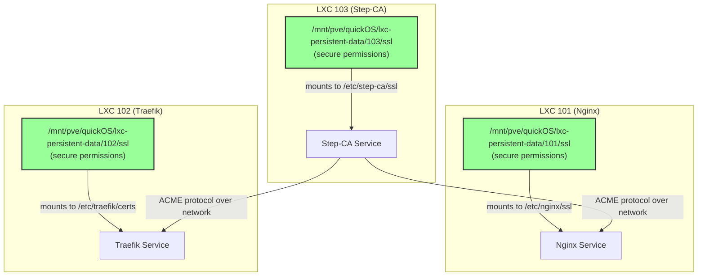

# Step-CA Integration Remediation Plan

## 1. Introduction

This document outlines a remediation plan to address the issues identified in the `assessment.md` document. The goal is to create a more secure, robust, and manageable Step-CA integration within the Phoenix Hypervisor environment.

## 2. Proposed Architecture

The new architecture will decouple the containers and eliminate the need for a shared SSL directory. Each container will have its own dedicated directory for SSL assets, and communication with the CA will be done over the network.

### 2.1. Key Changes

*   **Dedicated SSL Directories:** Each container (101, 102, and 103) will have its own dedicated directory for SSL assets on the hypervisor. This will be managed through ZFS volumes to ensure proper isolation.
*   **Secure Permissions:** The permissions for these directories will be strictly controlled, following the principle of least privilege.
*   **Network-Based Communication:** The Nginx and Traefik containers will communicate with the Step-CA container over the network to obtain certificates.
*   **Idempotent Workflow:** The entire workflow will be redesigned to be fully idempotent, with automatic remediation in case of failures.

### 2.2. Mermaid Diagram of Proposed State



## 3. Remediation Steps

The following steps will be taken to implement the new architecture:

### 3.1. Update `phoenix_lxc_configs.json`

*   **Remove Shared Mounts:** The existing `mount_points` for the shared SSL directory will be removed from the configurations for containers 101, 102, and 103.
*   **Add Dedicated ZFS Volumes:** Each container will be configured with a dedicated ZFS volume for its SSL assets.
*   **Simplify Traefik Configuration:** The redundant mount point in the Traefik container's configuration will be removed.

### 3.2. Update `lxc-manager.sh`

*   **Remove Insecure Permission Handling:** The code that sets the ownership of the shared SSL directory to `nobody:nogroup` will be removed.
*   **Add Secure Permission Handling:** New logic will be added to set secure permissions for the new dedicated ZFS volumes.

### 3.3. Update Application Scripts

*   **`phoenix_hypervisor_lxc_103.sh`:** This script will be updated to work with the new dedicated SSL directory.
*   **`phoenix_hypervisor_lxc_101.sh`:** This script will be updated to obtain certificates from the Step-CA over the network using the ACME protocol.
*   **`phoenix_hypervisor_lxc_102.sh`:** This script will be updated to obtain certificates from the Step-CA over the network using the ACME protocol.

## 4. Todo List for Implementation

The following is a detailed todo list for implementing the remediation plan. This list will be managed using the `update_todo_list` tool.

```
[ ] **Phase 1: Configuration Changes**
    [ ] Modify `phoenix_lxc_configs.json` to remove shared mounts
    [ ] Add dedicated ZFS volumes for SSL assets in `phoenix_lxc_configs.json`
    [ ] Remove redundant mount point from Traefik configuration in `phoenix_lxc_configs.json`
[ ] **Phase 2: Scripting Changes**
    [ ] Update `lxc-manager.sh` to remove insecure permission handling
    [ ] Update `lxc-manager.sh` to add secure permission handling for dedicated volumes
    [ ] Update `phoenix_hypervisor_lxc_103.sh` to use the new dedicated SSL directory
    [ ] Update `phoenix_hypervisor_lxc_101.sh` to use ACME for certificate acquisition
    [ ] Update `phoenix_hypervisor_lxc_102.sh` to use ACME for certificate acquisition
[ ] **Phase 3: Testing and Validation**
    [ ] Run `phoenix create 103` and verify the Step-CA container is working correctly
    [ ] Run `phoenix create 101` and verify the Nginx container obtains a certificate
    [ ] Run `phoenix create 102` and verify the Traefik container obtains a certificate
    [ ] Perform a full system health check
```

## 5. Next Steps

Once you approve this plan, I will begin the implementation by creating a detailed todo list with the `update_todo_list` tool. I will then request to switch to "Code" mode to make the necessary changes.