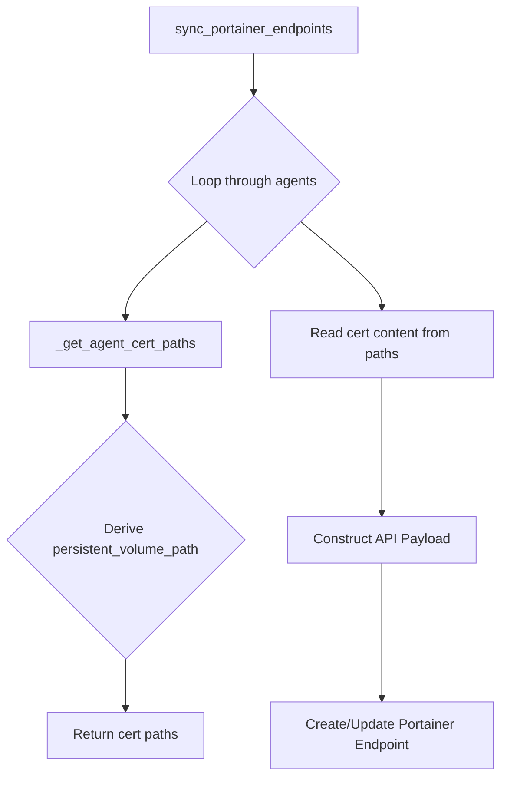

# Phoenix Portainer Sync Remediation Plan v3

## 1. Introduction

This document outlines the final, comprehensive plan to resolve the `phoenix sync all` failures. Previous attempts have revealed two distinct issues: an invalid environment name in the configuration and a fragile, implicit certificate handling process. This plan addresses both root causes.

## 2. Problem Analysis

1.  **Invalid Environment Name:** The Portainer API is rejecting the environment name "drphoenix" with a `400 Bad Request`. This was corrected by changing the name to "dr-phoenix" in `phoenix_vm_configs.json`. This change will be kept.
2.  **Fragile Certificate Handling:** The process for locating the Portainer agent's TLS certificates is implicit and spread across the `sync_portainer_endpoints` function. This makes the script difficult to debug and prone to errors, as demonstrated by the confusion during manual testing.

## 3. Proposed Solution

### 3.1. Centralize Certificate Path Logic

To improve robustness and clarity, I will refactor the `sync_portainer_endpoints` function in `portainer-manager.sh`. A new helper function, `_get_agent_cert_paths`, will be created. This function will take an agent's configuration as input and return the precise paths for its `ca.pem`, `cert.pem`, and `key.pem` files.

The main loop will then call this function to retrieve the paths, ensuring that the certificate reading logic is centralized and unambiguous.

### 3.2. Workflow Diagram

## 4. Implementation Steps

1.  **Switch to `code` mode.**
2.  **Modify `portainer-manager.sh`:**
    *   Create the new `_get_agent_cert_paths` helper function.
    *   Refactor the `sync_portainer_endpoints` loop to use this new function.
3.  **User Verification:** The user will re-run `phoenix sync all` to confirm that all issues are resolved.

## 5. Expected Outcome

With these changes, the `phoenix sync all` command will complete successfully. The codebase will be more robust, maintainable, and easier to debug in the future.