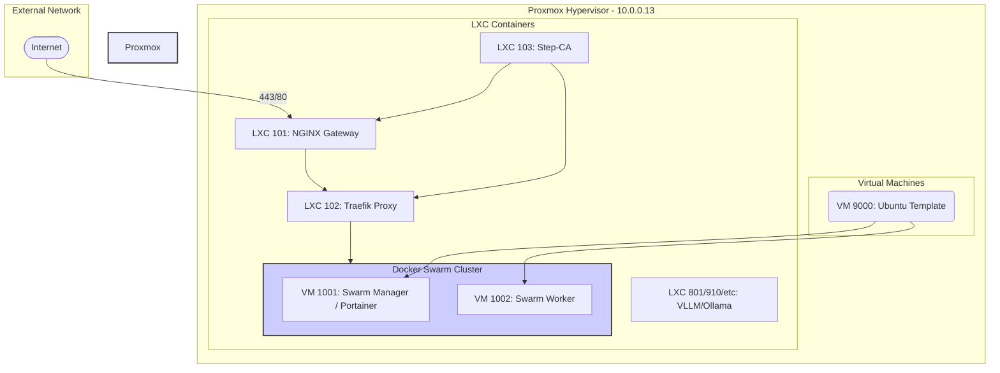

# Phoenix Hypervisor Platform Architecture

This document outlines the current architecture of the Phoenix Hypervisor platform, based on an analysis of the CLI scripts and configuration files.

## Architecture Diagram

The following diagram illustrates the relationships between the Proxmox hypervisor, the infrastructure LXC containers, the application VMs, and the Docker Swarm cluster.

## Component Roles & Purpose

Here is a summary of the purpose of each layer of your architecture:

*   **Proxmox Hypervisor (The Foundation)**: The bare-metal foundation hosting all virtualized resources, using ZFS for storage and NFS for shared volumes.
*   **LXC Containers (Infrastructure Services)**: Lightweight, single-purpose containers for essential services like Step-CA (security), NGINX (ingress), Traefik (service mesh), and GPU-accelerated AI model serving.
*   **Virtual Machines (Application Platform)**: An isolated environment for the core application platform, built from a golden image (VM 9000) to form a Docker Swarm cluster (VMs 1001 & 1002).
*   **Docker Containers (The Applications)**: The applications themselves (Qdrant, Portainer, etc.), packaged and orchestrated by Docker Swarm for portability and scalability.

---

## Detailed Specifications

### Virtual Machine Specifications

| VMID | Name | Role | Cores | Memory | IP Address | Software & Provisioning |
| :--- | :--- | :--- | :--- | :--- | :--- | :--- |
| 9000 | ubuntu-2404-cloud-template | Base Template | 2 | 4GB | DHCP | Base Ubuntu 24.04 cloud image. |
| 1001 | Portainer | Swarm Manager | 4 | 8GB | 10.0.0.111/24 | Installs Docker, `step-cli`, and `trusted_ca`. Configures Docker daemon for mTLS. Runs Portainer server. |
| 1002 | drphoenix | Swarm Worker | 4 | 4GB | 10.0.0.102/24 | Installs Docker, `step-cli`, and `trusted_ca`. Configures Docker daemon for mTLS. Runs Portainer agent and application stacks. |

### LXC Container Specifications

| CTID | Name | Role | Cores | Memory | IP Address | Software & Provisioning |
| :--- | :--- | :--- | :--- | :--- | :--- | :--- |
| 900 | Copy-Base | Base Template | 2 | 2GB | 10.0.0.200/24 | Installs `base_setup` (updates, common packages). |
| 101 | Nginx-Phoenix | Ingress Gateway | 4 | 4GB | 10.0.0.153/24 | Installs NGINX, `step-cli`, `trusted_ca`. Starts with a placeholder config; final config applied by `phoenix sync`. |
| 102 | Traefik-Internal | Internal Proxy | 2 | 2GB | 10.0.0.12/24 | Installs Traefik, `step-cli`, `trusted_ca`. Requests its own TLS cert from Step-CA. |
| 103 | Step-CA | Certificate Authority | 2 | 1GB | 10.0.0.10/24 | Installs and initializes a Step-CA server with an ACME provisioner for automated certificate issuance. |
| 801 | granite-embedding | VLLM Service | 6 | 70GB | 10.0.0.141/24 | Installs `vllm`, `nvidia`. Dynamically generates and starts a systemd service based on JSON config. Gets its own TLS cert. |
| 914 | ollama-gpu0 | Ollama Service | 6 | 32GB | 10.0.0.155/24 | Installs `ollama`, `nvidia`. Provisions the Ollama service. |

---

Now that we have a complete and detailed picture of the architecture, from the hardware specs to the software provisioning, are you satisfied with this representation? This will serve as our shared understanding for the rest of the discussion.